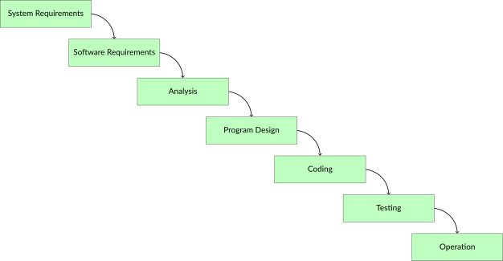
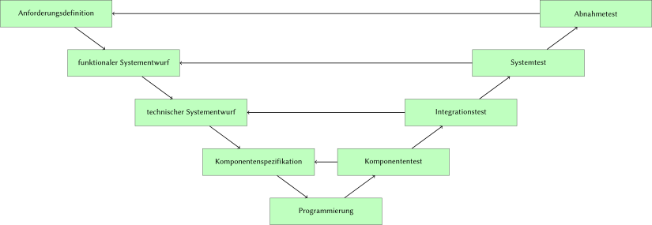
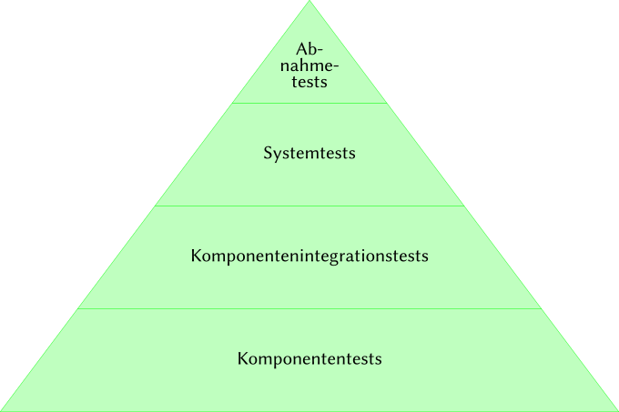
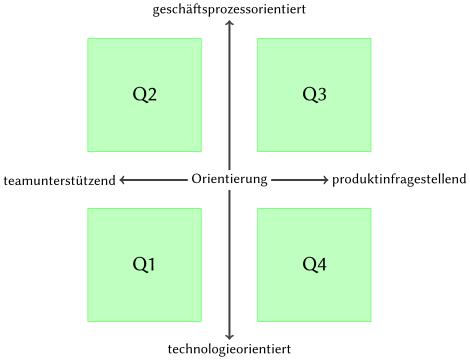

# Einleitung

Software ist heutzutage allgegenwärtig und sie trägt nicht nur zum Funktionieren unserer Welt bei, von ihr hängt auch immer mehr unsere Sicherheit ab. Nicht nur die Abwicklung von Geschäftsprozessen hängt von Software ab, sondern ihre Erweiterbarkeit gibt auch vor, wie schnell eine Firma ihre Geschäftstätigkeit ausbauen kann. Die Qualität von Software ist ein entscheidender Faktor für den Erfolg von Produkten und Firmen.

Systematisches Testen von Software hilft Unternehmen dabei, die Qualität ihrer Softwaresysteme zu erhöhen. Das vorliegende Buch stellt das hierzu notwendige Grundlagenwissen bereit. Es richtet sich an Tester und Entwickler ‒ sowie an alle, die im Rahmen der agilen Softwareentwicklung Testaufgaben übernehmen. Es richtet sich an Lehrende und Lernende gleichermassen.

Das _International Software Testing Qualifications Board_ (ISTQB) koordiniert die Zertifizierung im Bereich Software-Qualitätssicherung im Rahmen des ISTQB-Schemas und wird durch länderspezifische Gremien (wie z.B. durch das _Swiss Testing Board_) ergänzt. Die drei Ausbildungsstufen _Foundation_, _Advanced_ und _Expert_ werden dabei um zusätzliche Spezialistenmodule (u.a. fürs Testen im agilen Kontxt) ergänzt.

## Kapitelübersicht

Das vorliegende Buch deckt den Stoff bis zur ersten Stufe (_Foundation_) ab und behandelt in den folgenden Kapiteln diese Themen:

- **Kapitel 2** erörtert die Grundlagen des Softwaretests. Neben dem _Warum_, dem _Wann_, dem _Wozu_ und dem _Wie_ wird auf das Konzept des Testprozesses und auf die notwendigen Kompetenzen beim Testen eingegangen.
- **Kapitel 3** erläutert die Rolle des Testens in verschiedenen Entwicklungsmodellen (sequentiell, agil), die verschiedenen Teststufen und -arten, die Unterschiede zwischen funktionalen und nicht-funktionalen Tests, Regressionstests und Ansätze zur Verbesserung der Testautomatisierung.
- **Kapitel 4** behandelt statische Testverfahren, bei denen das Testobjekt nicht ausgeführt wird.
- **Kapitel 5** erörtert dynamische Tests und deren Einordnung in _Blackbox_- und _Whitebox_-Verfahren mit den dazugehörigen Testverfahren und -methoden.
- **Kapitel 6** behandelt die Organisation des Testprozesses und die dazu notwendigen Qualifikationen der involvierten Mitarbeiter. Nebst den Elementen einer Teststrategie werden auch Verfahren zur Aufwands- und Kostenschätzung des Softwaretests erläutert. Risikobasiertes Testen, Fehler- und Konfigurationsmanagement und Wirtschaftlichkeit sind ebenfalls Themen dieses Kapitels.
- **Kapitel 7** stellt verschiedene Arten von Testwerkzeugen vor und gibt Hinweise zu deren Auswahl und Einführung.

# Grundlagen des Softwaretestens

In diesem Kapitel werden die Grundbegriffe des Softwaretestens eingeführt, etablierte Grundsätze des Testens vorgestellt und die Aktivitäten des Testprozesses erläutert.

## Begriffe und Motivation

Industriell hergestellte Produkte werden zumeist durch Stichproben geprüft, was bei Softwareprodukten, die immateriell sind, nicht gleich funktioniert. Fehler in Software kosten nicht nur Zeit und Geld, sondern können auch den Ruf einer Organsiation schädigen oder im Extremfall sogar zum Tod von Menschen führen.

Durch das Testen von Software kann deren Qualität eingeschätzt werden, und das Risiko unentdeckter Fehler, die sonst erst im Produktiveinsatz der Software zutage treten würden, kann minimiert werden. Beim Testen von Software sollen alle Beteiligten des Projekts involviert sein. Beim ‒ statischen und dynamischen ‒ Testen von Softwarekomponenten werden deren Fehler (genauer: Fehlerzustände bzw. Fehlerwirkungen) erkannt.

Beim _dynamischen_ Testen kommt das _Testobjekt_ (d.h. die Software) zur stichprobenartigen Ausführung, wozu das Testobjekt mit _Testdaten_ versehen und einzelne Testfälle darauf ausgeführt werden, wonach geprüft wird, ob das beobachtete Ergebnis den Anforderungen entspricht.

Der gesamte Testprozess umfasst jedoch noch viele weitere Aktivitäten wie z.B. das Planen des Testvorgangs; das Abschätzen des Testaufwands; Analyse, Design und Umsetzung der Tests; das Erstellen von Berichten über Testfortschritt, Testergebnisse, Qualitätsbeurteilung und Risikobewertung.

Die Aktivitäten und Dokumentationen werden i.d.R. zwischen Auftraggeber und -nehmer ausgehandelt und unterliegen teilweise gesetzlichen Vorgaben oder Standards. Die Testaktivitäten unterscheiden sich im Lebenszyklus der Software; oftmals markieren Tests den Übergang von einer Phase in die nächste (z.B. die Freigabe einer neuen Version).

Obwohl Testaktivitäten von Werkzeugen abhängen, ist das Testen v.a. eine intellektuelle Tätigkeit, die Fachwissen und verschiedene Fähigkeiten erfordert. Neben der ausführbaren Software können im Rahmen von statischen Tests auch andere Artefakte wie z.B. Dokumentation, Anforderungen und Quellcode Testobjekte sein.

Je früher Fehler gefunden werden (z.B. bereits in den Anforderungen), desto besser ist das für den weiteren Entwicklungsprozess. Beim Testen wird auch geprüft, ob sich das System gemäss den Wünschen und Vorstellungen der Benutzer verhält. Es ist sinnvoll aber nicht immer machbar, die Benutzer im Rahmen einer Validierung möglichst im gesamten Entwicklungszyklus zu involvieren.

Ab einer gewissen Komplexität gibt es praktisch keine Softwaresysteme, die völlig fehlerfrei wären, da bei diesen oft Ausnahmen, Randbedingungen und Eingabekonstellationen nicht vollständig berücksichtigt werden können. Dennoch gibt es Software, die über eine lange Zeit zuverlässig funktioniert. Selbst wenn beim Testen keine Fehler mehr zu Tage treten, heisst das noch nicht, dass die Softwre tatsächlich fehlerfrei sei.

### Fehlerbegriff

Anhand der Anforderungen und weiteren Informationen wird die _Testbasis_ bestimmt, welche das erwartete Verhalten beschreiben und als Grundlage für die Entscheidung dient, ob korrektes oder fehlerhaftes Verhalten vorliegt.

Ein _Fehler_ ist somit eine festgestellte Abweichung zwischen dem festgelegten Sollverhalten und dem beobachteten Istverhalten. Solche Fehler entstehen nicht durch Alterung oder Verschliess, sondern sind vom Zeitpunkt der Entwicklung an Teil der Software, auch wenn sie erst später entdeckt werden.

Wird die Fehlfunktion für den Anwender oder Tester sichtbar, spricht man von einer _Fehlerwirkung_ (engl. _failure_). Zwischen Ursache, die ihren Ursprung im _Fehlerzustand_ (engl. _fault_) der Software hat, und dem Auftreten der Fehlerwirkung muss unterschieden werden.

Ein Fehlerzustand kann durch andere Fehlerzustände in der Software kompensiert werden, was als _Fehlermaskierung_ bezeichnet wird. Durch die Korrektur eines maskierenden Fehlers können bisher verborgene Fehlerzustände an den Tag treten. Ein Fehlerzustand kann erst verspätet oder andernorts in der Software zu einer Fehlerwirkung führen, etwa bei der Verfälschung gespeicherter Daten.

Fehlerzustände entstehen durch die _Fehlhandlung_ einer Person (engl. _error_) und können verschiedene Gründe haben:

- Unvollkommenheit des Menschen
- hohe Komplexität von Aufgaben, Architektur, Design und Code
- hoher Zeitdruck
- Missverständnisse und Fehlinterpretationen der Anforderungen
- mangelnde Erfahrung oder Ausbildung der Beteiligten
- Ablenkung, Unkonzentriertheit und Müdigkeit

Eine Fehlhandlung einer Person führt zu einem Fehlerzustand im Programmcode, der zu einer Fehlerwirkung in der Software führt, die durch das Testen aufgezeigt werden soll.

Wird beim Testen eine Fehlerwirkung festgestellt, ohne dass ein Fehlerzustand im Testobjekt vorliegt, spricht man von einem _falsch positiven Ergebnis_ (engl. _false positive result_). Wird bei vorhandenem Fehlerzustand keine entsprechende Fehlerwirkung entdeckt, liegt ein _falsch negatives Ergebnis_ (engl. _false negative result_) vor. Wird der Fehlerzustand durch eine Fehlerwirkung erkannt, ist das Ergebnis _richtig positiv_; liegt kein Fehlerzustand vor und wird auch keine Fehlerwirkung erkannt, ist das Ergebnis _richtig negativ_.

Durch die Analyse der zugrundeliegenden Fehlhandlungen zu aufgedeckten Fehlerzuständen können Erkenntnisse gewonnen werden, womit der Entwicklungsprozess verbessert und die Wiederholung der Fehlhandlung vermieden werden kann.

Da zunächst nur die Fehlerwirkung und nicht der ihr zugrundeliegende Fehlerzustand bekannt ist, muss die fehlerhafte Stelle in der Software zuerst lokalisiert werden. Diesen Vorgang bezeichnet man als _Debugging_. Beim Testen werden also Fehlerwirkungen aufgedeckt, beim Debugging werden die zugrundeliegenden Fehlerzustände lokalisiert.

Durch die Behebung des Fehlerzustands wird die Qualität der Software verbessert ‒ sofern bei dieser Korrektur keine neuen Fehlerzustände eingebaut werden. Ein erneuter Test nach der Fehlerkorrektur wird als _Fehlernachtest_ bezeichnet. Da bei der Fehlerkorrektur aber auch neue Fehler eingebaut werden können, die unter anderen Eingabekonstellationen eine Fehlerwirkung erzeugen, müssen noch weitere Tests durchgeführt werden, und nicht nur derjenige, der die Fehlerwirkung ursprünglich provozierte.

### Testbegriff

Beim Testen werden verschiedene Ziele verfolgt:

- qualitative Bewertung von Arbeitsergebnissen
- Nachweis der Anforderungserfüllung
- Bereitstellen von Informationen zur Einschätzung der Qualität des Testobjekts
- Verringerung der Risiken durch Aufdeckung und Beschreibung von Fehlerwirkungen
- Analyse der Artefakte zur Vermeidung und Erkennung von Fehlerwirkungen
- Erhalten von Informationen zum Testabdeckungsgrad

Diese Ziele unterscheiden sich je nach Entwicklungsmodell (klassisch, agil) und Teststufe. Geht es etwa beim Komponententest um das Aufdecken von Fehlerwirkungen, steht beim Abnahmetest die Erfüllung der Nutzererwartungen im Vordergrund, und ob das Produkt zur Nutzung freigegeben werden kann.

Die _Testbasis_ legt das Sollverhalten des Testobjekts fest und umfasst neben Anforderungsdokumenten, User-Stories oder Spezifikationen auch voraussetzbares Fachwissen und den gesunden Menschenverstand. Das Ausführen des Testobjekts mit bestimmten Testdaten bezeichnet man als _Testfall_. Nach einem solchen _Testlauf_ wird geprüft, ob eine Fehlerwirkung ‒ eine Abweichung des beobachteten vom erwarteten Ergebnis ‒ vorliegt. Aus einer Testbasis werden _Testbedingungen_ abgeleitet, welche je von einem oder mehreren Testfällen überprüft werden.

Ein Testobjekt kann nicht als Ganzes sondern nur unterteilt in verschiedene Testelemente geprüft werden. (Testfälle prüfen einzelne Testelemente.) Testfälle werden in _Testsuiten_ zusammengefasst und so in einem _Testzyklus_ ausgeführt. Der _Testausführungsplan_ legt die zeitliche Ausführung der Testsuiten fest. Ein _Testskript_ automatisiert die Ausführung einer Testsuite und kümmert sich dabei um die Einhaltung der Vor- und Nachbedingungen bzw. Vorbereitungs- und Aufräumarbeiten. Bei manuellen Tests wird ein entsprechender schriftlicher Testablauf zur Verfügung gestellt.

Die Ergebnisse der Testläufe werden im _Testprotokoll_ gesammelt und im _Testbericht_ zusammenfassend dokumentiert. Zu Beginn werden Auswahl von Testobjekten und -verfahren sowie Teilziele und Testberichtserstattung im _Testkonzept_; die Koordination der Testaktivitäten im _Testzeitplan_ festgelegt.

Je nach Art des Projekts kann der Aufwand für das Testen einen mehr oder weniger grossen Anteil am Gesamtaufwand ausmachen. Konnte man bei klassischen Projekten das Verhältnis von Testern zu Entwicklern zur Einschätzung des Testaufwands beiziehen, fällt dies in agilen Projekten mit weniger starren Rollenverteilung schwer und kann höchstens anhand der Backlog-Aktivitäten grob abgeschätzt werden. Der Testaufwand muss ins Verhältnis zum Schadensausmass nicht gefundener Fehlerwirkungen und deren Eintretenswahrscheinlichkeit gestellt werden. (_Fehlerkosten = Auftretenswahrscheinlichkeit × Schadensausmass_)

Ans Testen sollte in einem Projekt so früh wie möglich gedacht werden (_Shift-Left_-Ansatz: die Testaktivitäten werden auf der Zeitachse nach links verlegt). Bereits beim Überprüfen von Anforderungen und beim Refinement von User Stories können beteiligte Personen mit Testwissen früh mögliche Fehler erkennen und so vermeiden.

Das Risiko grundsätzlicher Konstruktionsfehler kann durch Beteiligung von Testern in der Designphase reduziert werden. In der Umsetzungsphase können Tester beim Vermeiden fehlerhafter Testfälle behilflich sein. Durch die Verifikation vor der Freigabe kann die Wahrscheinlichkeit erhöht werden, dass der Kunde ein Produkt erhält, das seinen Anforderungen entspricht.

### Grundsätze des Testens

Beim Testen haben sich in den letzten Jahrzehnten die folgenden Grundsätze etabliert:

1. Das Testen zeigt die Anwesenheit von Fehlerzuständen, kann aber nicht deren Abwesenheit beweisen, selbst wenn keine Fehlerwirkungen gefunden werden.
2. Ein vollständiges Testen ist nicht bzw. nur bei den trivialsten Testobjekten möglich; Tests sind immer nur Stichproben.
3. Frühes Testen spart Zeit und Geld, da früh erkannte Fehler oft einfacher zu beheben sind als solche, die sich erst etwa im Produktivbetrieb auswirken.
4. Fehler sind nicht gleichmässig über das ganze System verteilt sondern treten gehäuft in wenigen Komponenten auf.
5. Testfälle müssen laufend erweitert werden, um neue Fehlerwirkungen erkennen zu können. Wiederholtes Ausführen bestehender Testfälle kann nur Regressionsfehler aufdecken.
6. Testen ist kontextabhängig und muss dem zu prüfenden System angepasst werden. Keine zwei Systeme können genau gleich geprüft werden.
7. Ein System kann unbrauchbar sein, selbst wenn keine Fehler darin gefunden werden. Es müssen auch Benutzbarkeit und Akzeptanz des Benutzers gegeben sein, am besten indem man diese früh in die Entwicklung miteinbezieht.

## Softwarequalität: Qualitätsmanagement und Qualitätssicherung

Das _Qualitätsmanagement_ umfasst organisatorische Tätigkeiten und Massnahmen der Lenkung und Leitung einer Organsiation in Qualitätsfragen. Das Qualitätsmanagement ist Sache des Managements. Dieses legt Arbeitsprozesse fest, deren Einhaltung im Rahmen der _Qualitätssicherung_ durch die jeweiligen Projektbeteiligten geprüft wird.

Testen wird oft mit Qualitätssicherung gleichgesetzt, ist aber nur eine Massnahme davon. Die Qualitätssicherung umfasst alle Tätigkeiten, womit die Qualität einer Komponente oder eines Systems bewertet wird.

Zur _Qualitätssteuerung_ gehört auch die Analyse der Ursachen von Fehlern. In der Qualitätssicherung dienen Testergebnisse dazu, Verbesserungspozential im Prozess zu ermitteln; in der Qualitätssteuerung dienen sie zur Behebung von Fehlerzuständen.

## Der Testprozess

Unabhängig vom gewählten Entwicklungsmodell müssen Testarbeiten in kleinere Arbeitsschritte gegliedert werden. Ein Testprozess besteht aus verschiedenen _Testaktivitäten_, welche unabhängig vom konkreten Projekt in einer _Teststrategie_ festgelegt werden.

Die im folgenden beschriebenen Testaktivitäten müssen nicht streng sequenziell aufeinander folgen, sondern können sich zeitlich überlappen. Die Testüberwachung und -steuerung findet parallel zu den anderen sechs Testaktivitäten statt. In der agilen Softwareentwicklung finden diese Testaktivitäten kontinuierlich und iterativ statt.

### Testplanung

Die Testarbeiten werden von Beginn des Softwareentwicklungsprojekts an geplant und im weiteren Verlauf regelmässig überprüft und wenn nötig angepasst. Auf Basis einer Teststrategie wird ein _Testkonzept_ erarbeitet, welches den _Testprozess_ beschreibt.

Neben den Testobjekten und den nachzuweisenden Qualitätsmerkmalen wird festgehalten, welche Testaktivitäten welche Testziele nachweisen sollen. Auch benötigte Ressourcen und eine Zeitplanung sind Teil der Testplanung. Es werden Kriterien festgelegt, wann mit dem Testen angefangen werden kann (_Definition of Ready_) und wann eine Testaktivitäten als abgeschlossen gilt (_Definition of Done_).

Wie in jedem Konzept müssen auch mögliche Risiken aufgeführt werden. Informationen über die Testbasis und wie Änderungen daran sich auf die Testaktivitäten auswirken, gehören auch ins Testkonzept. Für die verschiedenen Tests sind die jeweiligen Teststufen aufzuführen. Im _Testzeitplan_ werden Akivitäten mit Start- und Endtermin sowie mögliche Abhängigkeiten zwischen diesen Tätigkeiten festgehalten.

### Testüberwachung und Teststeuerung

Die laufenden Testaktivitäten werden kontinuierlich im Vergleich zur Planung beobachtet. Abweichungen werden gemeldet, damit Gegenmassnahmen ergriffen werden können um das Erreichen der Testziele zu gewährleisten. Die Testplanung wird dabei aktualisiert.

Die Überwachung orientiert sich an den festgelegten Endkriterien zu den einzelnen Testaktivitäten. Können die durchgeführten Tests die Endkriterien nicht erfüllen, müssen zusätzliche Tests entworfen und durchgeführt werden.

Im _Testfortschrittsbericht_ wird der Testfortschritt im Vergleich zur Planung an die Stakeholder gemeldet. Beim Erreichen von Meilensteinen können auch _Testabschlussberichte_ angefertigt werden. Alle Testberichte sollen zielgruppengerecht über den Testfortschritt mit allen relevanten Details informieren, wobei auch geplante und tatsächliche Aufwände und Ressourcennutzung ausgewiesen werden. Als Grundlage hierzu dienen Berichte von Mitarbeitern aber auch erhobene Zahlen sowie durch Werkzeuge erstellte Auswertungen.

### Testanalyse

Hier wird ermittelt, _was_ zu testen ist. Dazu werden aus der Testbasis testbare Merkmale des Testobjekts ermittelt und daraus _Testbedingungen_ abgeleitet. Dabei orientiert man sich am gefordeten _Überdeckungsgrad_ (_Wie viel muss abgedeckt werden?_) und an den Risiken (_Wie soll priorisiert werden?_).

Die Testbasis soll hierzu genau überprüft werden, denn aus einer fehlerhaften oder widersprüchlichen Testbasis können keine sinnvollen Testbedingungen abgeleitet werden. Die durchzuführenden Tests müssen dann nachweisen, ob das Testobjekt diese Bedingungen erfüllt. Das Testobjekt muss über eine diesen Tests zugängliche Schnittstelle verfügen.

Es muss zwecks Nachverfolgbarkeit _bidirektional_ festgehalten werden, welche Testbedingungen welche Anforderungen prüft bzw. welche Anforderungen durch welche Testbedingungen geprüft werden. Gedanken über zu verwendende Testverfahren können in dieser Phase auch hilfreich sein.

### Testentwurf

In dieser Phase wird ermittelt, _wie_ zu testen ist. Aus den Testbedingungen werden _Testfälle_ abgeleitet. Ein _abstrakter Testfall_ verwendet dazu Bedingungen, denen die Eingabewerte genügen müssen (z.B. $1000 \le x < 1500$), während ein _konkreter Testfall_ exakte Eingabewerte festlegt (z.B. $x=1250$). Abstrakte Testfälle müssen vor der Testdurchführung konkretisiert werden, sind dafür aber besser für spätere Testzyklen wiederverwendbar.

Pro Testfall sind Ausgangssituation (Vorbedingung), einzuhaltende Randbedingungen (Invariante) und erwartete Ergebnisse (Endbedingung) inkl. erwarteter Seiteneffekte, wie z.B. veränderte persistente Daten, zu definieren. Für Testdaten müssen Anforderungen festgelegt werden. Die Sollwerte können aus der Testbasis abgeleitet oder teilweise auch anhand einer Umkehrfunktion (z.B. Test der Verschlüsselung durch Entschlüsselung) festgelegt werden.

Die Priorisierung und Verfolgbarkeit aus der Testanalyse kann nun auf einzelne Testfälle heruntergebrochen werden. Die _Testinfrastruktur_ bestehend aus Testumgebung, Testwerkzeugen und evtl. Testarbeitsplätzen muss ermittelt und bereitgestellt werden. Die _Testumgebung_ umfasst neben dem Testobjekt auch die dazu notwendige Hardware und teilweise auch weitere Hilfsmittel.

Anhand von _Überdeckungselementen_ ‒ aus Testbedingungen abgeleitete Eigenschaften unter Verwendung eines Testverfahrens ‒ werden Kriterien festgelegt, ab wann ausreichend getestet worden ist ‒ z.B. mindestens 50% durch Unit Tests abgedeckte Codezeilen.

### Testrealisierung

Diese Phase wird oft mit dem Testentwurf kombiniert. Hier sind alle Aktivitäten soweit vorzubereiten, dass die Testfälle in der nächsten Phase ausgeführt werden können.

Testmittel und Testinfrastruktur müssen bereitgestellt und geprüft werden. Testdaten müssen in die Testumgebung übernommen und ebenfalls überprüft werden. Testfälle müssen konkretisiert, zu Testsuiten gruppiert und in eine sinnvolle Reihenfolge gebracht werden, sodass die Nachbedingung eines Testfalls möglichst als Vorbedingung seines Nachfolgers genutzt werden kann. Auch die Priorisierung der Testfälle ist dabei zu beachten.

Eine Testsuite soll auch die Aufräumarbeiten nach den durchgeführten Testfällen berücksichtigen. Testskripte können diese Schritte automatisieren. Im Testausführungsplan werden die definierten Abläufe festgehalten.

### Testdurchführung

Nun gelangen die Testfälle gemäss _Testausführungsplan_ zur Ausführung. Zunächst empfiehlt es sich, die Hauptfunktionen des Testobjekts im Rahmen eines _Smoke-Tests_ zu überprüfen; sind diese bereits fehlerhaft, lohnt sich ein Weitertesten i.d.R. nicht.

Die ausgeführten Testfälle sind zu protokollieren, wozu folgende Angaben festgehalten werden: Testergebnis (bestanden, fehlgeschlagen oder blockiert, d.h. kann nicht ausgeführt werden), Tester, Testzeitpunkt und allenfalls Gründe für das Auslassen eines Testfalls.

Durch dieses Protokoll wird der Testvorgang für andere Parteien nachvollziehbar und die Umsetzung der gewählten Teststrategie kann damit nachgewiesen werden. Abweichungen zwischen erwarteten und tatsächlichen Testergebnissen werden ebenfalls protokolliert. Bei der Auswertung des Protokolls kann dann entschieden werden, ob eine Fehlerwirkung vorliegt. Beim Testen sollen auch die _Überdeckungsgrade_ gemessen und protokolliert werden; bei Bedarf auch der Zeitverbrauch.

Mithilfe der Verfolgbarkeit ‒ Testbasis, Testbedingungen, Testfälle, Testergebnisse ‒ kann nun nachvollzogen werden, welche Anforderungen erfüllt, teilweise erfüllt oder nicht erfüllt sind.

### Testabschluss

Der Zeitpunkt des Testabschlusses hängt vom verwendeten Entwicklungsmodell ab und kann auf die Freigabe einer Software oder eines Wartungsreleases, auf das Ende einer Iteration, auf den Abschluss eines Testprojekts oder auf einen sonstigen Meilenstein fallen.

Daten werden zusammengetragen, Erfahrungen ausgewertet und Testmittel zur Ablage gesichert (z.B. als Container-Images). Offene Fehler sind vollständig als Fehlerberichte gemeldet und werden in die nächste Iteration übernommen.

Die Testaktivitäten und deren Ergebnisse werden im _Testabschlussbericht_ zusammengefasst und so den Stakeholdern zur Verfügung gestellt. Je nach Branche muss von Gesetzes wegen ein Nachweis über die durchgeführten Tests erbracht werden.

In den Testaktivitäten gemachte Erfahrungen (z.B. Abweichungen zwischen Plan und Umsetzung) werden zwecks Erkenntnisgewinn für spätere Iterationen oder andere Projekte analysiert, wodurch der Testprozess an Reife gewinnt.

# Testen im Softwareentwicklungslebenszyklus

Ein Softwareentwicklungsprojekt orientiert sich an einem im Voraus festgelegten Vorgehensmodell. Damit werden die Aufgaben in eine logische Reihenfolge gebracht und auf Phasen oder Iterationen verteilt. Auch werden die Arbeiten auf verschiedene Rollen verteilt.

Verschiedene Vorgehensmodelle machen unterschiedliche Vorgaben zum Testen. Grundsätzlich unterscheidet man zwischen sequenziellen, iterativ-inkrementellen und agilen Entwicklungsmodellen.

## Sequenzielle Entwicklungsmodelle

Der Prozess wird als ein sequenzieller Ablauf von Aktivitäten verstanden, nach deren Durchlauf am Ende das gewünschte Produkt in der geforderten Qualität fertig bereitsteht. Ein zeitliches Überschneiden der einzelnen Aktivitäten ist nicht vorgesehen. Zwischen Projektstart und Auslieferung können Monate oder Jahre vergehen.

### Das Wasserfallmodell

Nach diesem Modell sind die einzelnen Phasen ‒ _System Requirements_, _Software Requirements_, _Analysis_, _Program Design_, _Testing_ und _Operation_ ‒ zeitlich streng voneinander getrennt. Das Testen wird als einmalige und den Entwicklungsarbeiten nachgelagerte Aktivität verstanden, nicht als projektbegleitende Tätigkeit.

{width=100%}

### Das V-Modell

Hier wird das Wasserfallmodell um ein erweitertes Verständnis der Testaktivitäten ergänzt. Zu jeder Entwicklungsarbeit ‒ _Anforderungsdefinition_, _funktionaler Systementwurf_, _technischer Systementwurf_, _Komponentenspezifikation_ ‒ gibt es eine korrespondierende Testaktivität ‒ _Abnahmetest_, _Systemtest_, _Integrationstest_, _Komponententest_.

{width=100%}

Die Entwicklungsarbeiten bilden die absteigende Flanke, die Testarbeiten die aufsteigende ‒ und unten in der Mitte steht das _Programmieren_. Geht man bei den Entwicklungsarbeiten vom Groben ins Feine («top-down»), setzt man bei den Testaktivitäten die einzelnen Teile wieder zu einem Ganzen zusammen («bottom-up»). Die Ergebnisse aus den Entwicklungsarbeiten werden dabei sukzessive integriert und folgendermassen getestet:

- _Komponententest_: Erfüllt der Baustein seine Spezifikation?
- _Integrationstest_: Spielen die Komponenten wie gewünscht zusammen?
- _Systemtest_: Erfüllt das System als Ganzes die spezifizierten Anforderungen?
- _Abnahmetest_: Erfüllt das System aus Kundensicht die vereinbarten Leistungsmerkmale?

Diese Testaktivitäten sind nicht als eine blosse zeitliche Unterteilung zu verstehen, sondern verfolgen unterschiedliche Testziele auf verschiedenen Abstraktionsebenen. Dabei werden unterschiedliche Testmethoden und Testwerkzeuge von für die jeweilige Testaktivität spezialisiertem Personal angewendet.

Die Testaktivitäten sind von unterschiedlichem Charakter:

- _Verifizierende_ Tests prüfen, ob ein Testobjekt seine Aufgabe gemäss Spezifikation erfüllt.
- _Validierende_ Tests prüfen, ob ein Testobjekt für seinen Einsatzzweck geeignet ist.

Mit steigender Teststufe nimmt der verifizierende Charakter der Testaktivitäten ab und der validierende zu.

Die vorbereitenden Testaktivitäten (Testplanung, Testanalyse, Testentwurf) können im V-Modell parallel zu den Entwicklungsarbeiten in der absteigenden Flanke erfolgen. Entwicklungs- und Testarbeiten werden einander in diesem Modell als gleichwertig gegenübergestellt. Auf jeder Teststufe wird gegen die korrespondierende Entwicklungsstufe getestet.

## Iterativ-inkrementelle Entwicklung

In der Praxis trifft man kaum rein sequenzielle Entwicklungsprojekte an, die etwa nach einem Durchlauf des V-Modells abgeschlossen wären. Stattdessen werden solche Vorgehensmodelle oder Teile davon iterativ durchlaufen, woraus ein Produkt inkrementell entsteht.

### Klassische iterativ-inkrementelle Entwicklung

Das Produkt wird schrittweise verbessert, wobei man sich auf Rückmeldungen des Kunden abstützt, dessen Bedürfnisse nach jeder Iteration besser erfüllt werden sollen. Erfahrungen aus vorhergehenden Iterationen dienen ebenfalls zur Verbesserung des Produkts.

Durch das schrittweise Vorgehen mit häufigen Releases wird die _Time to Market_ verkürzt und vermieden, an den Bedürfnissen des Kunden vorbei zu entwickeln. Klassisch iterativ-inkrementelle Modelle wie z.B. der _Rational Unified Process_ (RUP) sind heute nur noch sehr wenig verbreitet.

### Agile Softwareentwicklung

In der agilen Softwareentwicklung wird das vorausplanende Projektmanagement durch eine adaptive Projektsteuerung ersetzt, womit schnell auf angepasste oder neue Kundenwünsche reagiert werden kann, ohne dabei Zeit zum Nachtragen der Projektdokumentation zu verlieren.

In Abgrenzung zu den klassischen schwergewichtigen und dokumentlastigen Modellen gelten agile Methoden wie _Extreme Programming_, _Kanban_ und das am meisten verbreitete _Scrum_ als leichtgewichtig, wobei Projekt- und Prozessdokumentation minimiert werden. Scrum zeichnet sich aus durch:

- _Sprints_: kurze Iterationen fester Länge
- _Product- & Sprint Backlog_: Priorisierungen der Kundenanforderungen
- _Timeboxing_: begrenzte Zeitfenster für Aufgaben und Besprechungen
- _Transparenz_: Offensichtlichmachung des Sprint-Fortschritts durch regelmässige Besprechungen (_Daily Scrum_) und jederzeit einsehbare Taskboards

Auf Basis des «Whole Team»-Ansatzes werden Aufgaben und Probleme bevorzugt gemeinsam von mehreren Teammitgliedern angegangen, wobei jedes Mitglied seine Stärken und sein Fachwissen einbringen kann. Anstelle einer starren Rolleineinteilung ‒ Programmierer, Tester ‒ unterstützen sich die Teammitglieder gegenseitig, auch bei Testaufgaben.

Für die Qualität des resultierenden Produkts sind alle im Team gleichermassen verantwortlich. Es gibt jedoch Projekte, in denen dieser Ansatz beispielsweise aus regulatorischen Gründen nicht gangbar ist, etwa wenn Entwicklungs- und Testteam aus sicherheitstechnischen Überlegungen voneinander getrennt agieren müssen.

Freigaben können mehrmals pro Jahr bis im Extremfall mehrmals täglich erfolgen. Damit eine so hohe Taktung der Releases mit der notwendigen Qualität überhaupt möglich ist, müssen die Testfälle grösstenteils automatisch bereitgestellt werden, sodass die Inkremente früherer Releases automatisch durch Regressionstests mitgeprüft werden können.

Dadurch nimmt die Anzahl der Testfälle von Iteration zu Iteration laufend zu. Nur dank hoher Testautomatisierung kann die wachsende Testmenge bei gleichbleibender Sprintdauer konsequent durchgeführt werden. Zur Beschleunigung der Testdurchläufe können Tests geringerer Priorität auch von der Ausführung ausgenommen werden.

In einem agilen Projekt werden die Anforderungen in einem iterativ-inkrementellen Prozess aufgenommen. Dabei steigt nicht nur die Menge der Anforderungen mit jeder Iteration an, sondern auch deren Detailgrad. Durch eine enge Zusammenarbeit der Stakeholder untereinander wird sichergestellt, dass beim Verständnis der Anforderungen keine Missverständnisse auftreten.

Dieses gemeinsame Verständnis soll über die Form der _User Story_ erreicht werden, mit welcher Anforderungen folgendermassen beschrieben werden. (In der Praxis sind leicht unterschiedliche Satzschablonen in Gebrauch):

> Als _ROLLE_ möchte ich, dass _ZU ERREICHENDES ZIEL_, damit _RESULTIERENDER NUTZEN_.

Die Qualität der User Stories wird mit den sogenannten _INVEST_-Kriterien sichergestellt. Demnach soll eine User Story folgendes sein:

- **I**ndependent: _unabhängig_ von anderen User Stories
- **N**egotiable: _verhandelbar_ durch Spielraum bei der Umsetzung
- **V**aluable: _wertvoll_/_nützlich_ für den Anwender bzw. Kunden
- **E**stimable: _abschätzbar_ im Aufwand durch ausreichende Beschreibung
- **S**mall: _klein_ genug für eine Umsetzung ohne weitere Aufteilung
- **T**estable: _testbar_ durch hinreichende Akzeptanzkriterien

Teammitglieder mit Testwissen können durch die Erfüllung des letztgenannten Kriteriums viel dazu beitragen, die Testkosten für eine Story tief zu halten.

Beim Erstellen einer User Story empfiehlt sich das _3C-Schema_:

1. **C**ard: Die User Story wird auf einer physischen oder virtuellen Story-Karte festgehalten.
2. **C**onversation: In einem Dialog, der von Releaseplanung bis zur Umsetzung andauern kann, klären die Stakeholder die User Story inhaltlich.
3. **C**onfirmation: Die korrekte Umsetzung der User Story wird explizit aufgrund der festgelegten Abnahmekriterien bestätigt.

_Abnahmekriterien_ sind nichts weiteres als Testbedingungen, die beim Abnahmetest einer User Story zur Anwendung kommen. Diese tragen dazu bei, dass

- bei den Stakeholdern Konsens über die Interpretation der User Story herrscht,
- der Umfang der User Story klar eingegrenzt ist, und
- der Arbeitsaufwand einschätzbar und planbar ist.

Bei der _abnahmetestgetriebenen Entwicklung_ (ATDD: engl. _acceptance test-driven development_) werden die Abnahmetestfälle bereits vor der Implementierung umgesetzt. Zuerst werden die Abnahmekriterien an einem Spezifikations-Workshop gemeinsam unter den Stakeholdern geklärt. Anschliessend setzt das Team daraus die Abnahmetestfälle um.

Die Testfälle sollten dabei nicht über die jeweilige User Story hinaus gehen und auch keine Überschneidungen untereinander haben, aber nicht nur den Normalfall, sondern alle möglichen Sonderfälle behandeln. Schwierigkeiten bei der Erarbeitung der Abnahmekriterien deuten auf eine unklare User Story hin. Das Team ist selber dafür verantwortlich, zusätzliche nicht-funktionale Test umzusetzen, wenn es diese als angebracht sieht.

### Softwareentwicklung im Projekt- und Produktkontext

Je nach umzusetzendem Produkt oder Projekt unterscheiden sich die Anforderungen an Nachvollziehbarkeit und Planung, was einen Einfluss auf das auszuwählende Entwicklungsmodell hat. Hierbei können verschiedene Kriterien eine Rolle spielen:

- die angestrebte _Time to Market_
- das Einsatzgebiet (intern, bei Kunden) und die geplante Lebensdauer (vorübergehend, langfristiges Kundenangebot)
- das technische Umfeld (zentrale Web-Anwendungen, auf Offline-Geräten vorinstallierte Software)
- identifizierte Produktrisiken (geringe bei Unterhaltungsanwendungen, sehr hohe bei Medizinalsoftware)
- organisatorische und kulturelle Aspekte (eingespieltes lokales Team, geografisch verteilte Einzelkämpfer)

Vorgehensmodelle können miteinander kombiniert und auf die jeweiligen Bedürfnisse zugeschnitten werden (engl. «Tailoring»). Dies kann auch die Testaktivitäten betreffen, welche aber in jedem Fall folgenden Anforderungen genügen sollten:

- Testaktivitäten sollen schon früh im Projekt angegangen werden (Spezifikation von Testfällen, Aufbau der Testumgebung).
- Für jede Entwicklungsaktivität muss eine passende Testaktivität vorgesehen sein.
- Die Testaktivitäten müssen auf jeder Teststufe den Testzielen entsprechend ausgerichtet sein (z.B. mehr oder weniger Fokus auf die Validierung oder Verifizierung).
- Testanalyse und Testentwurf erfolgen bereits während der Entwicklung und nicht nachgelagert.
- Tester sind bereits beim Aufnehmen der Anforderungen und bei deren Prüfung (Review) involviert.

# Statischer Test

TODO

# Dynamischer Test

TODO

# Testmanagement

In diesem Kapitel geht es um die organisatorischen Voraussetzungen für effizientes Testen.

## Testorganisation

Es ist zwar verlockend einfach, die Entwickler ihre Software gleich selber testen zu lassen. Durch eine personelle Trennung von Umsetzung und Testen kann jedoch die «Blindheit gegenüber eigenen Fehlhandlungen» vermieden werden.

Ein unabhängiger Tester ist dem Testobjekt gegenüber weniger voreingenommen und findet dadurch mehr oder andersartige Fehlerwirkungen. Auch ist ein unabhängiger Testen weniger von impliziten Annahmen befangen, die ein Programmierer womöglich bei der Umsetzung trifft.

Andererseits kann eine solche Trennung die Zusammenarbeit und Kommunikation zwischen Testern und Entwicklern erschweren. Tester sind teilweise mit dem Testobjekt wenig vertraut und werden aufgrund knapper Ressourcen oft als Flaschenhals wahrgenommen. Ausserdem kann das Qualitätsbewusstsein der Entwickler leiden, wenn das Auffinden von Fehlerwirkungen an Tester abdelegiert wird.

Die folgenden fünf Modelle, angeordnet nach ansteigender Unabhängigkeit der Tester, soll obengenannte Vorteile mitbringen und dabei die genannten Nachteile reduzieren:

1. _Entwicklertest_: Ähnlich wie beim _Pair Programming_ arbeiten zwei Entwickler zusammen, indem sie ihre Umsetzungen wechselseitig testen, wodurch die Blindheit gegenüber eigener Fehlhandlungen entfällt.
2. _Unabhängige Tester_: Es gibt separate, spezialisierte Tester im Team, welche die Testarbeiten ausführen.
3. _Unabhängige Testteams_: Die Organisation verfügt über dedizierte Testteams, die von Mitarbeitern anderer Teams zeitweise verstärkt werden können.
4. _Testspezialisten_: Aus einem Pool von Mitarbeitern mit spezialisiertem Testwissen kann von Projekten zeitweise Unterstützung angefordert werden.
5. _Testdienstleister_: Die Testarbeiten werden von einem externen Dienstleiter ausserhalb (Outsourcing) oder innerhalb (Insourcing) des Unternehmens ausgeführt.

Die Wahl des Modells ist dabei je nach Teststufe zu beurteilen: Bei Komponententests sollte entwicklungsnah nach den Modellen 1 oder 2 gearbeitet werden. Bei Integrations- und Systemtests ist eine höhere Perspektive sinnvoll, die man nach den Modellen 3, 4 und 5 erhält. Diese Modelle eignen sich auch beim V-Modell, nach welchem Entwicklungs- und Testarbeiten voneinander getrennt sind.

Bei agilen Vorgehensweisen wird oft Modell 1 bevorzugt. Andere Modelle gelten dort gar als der Agilität abträglich, was jedoch ein Trugschluss ist: Auf Testautomatisierung spezialisierte Teammitglieder oder Dienstleister können dabei helfen, die ständig wachsenden Anforderungen an die Testautomatisierung (etwa durch verbesserte _Continuous Integration_-Pipelines) besser zu bewältigen. Externe Spezialisten können als Coaches für Testaufgaben fungieren. Der Product Owner, unterstützt durch Mitarbeiter aus Fachabteilungen, kann als Spezialist für Abnahmetests angesehen werden.

Die Ausführung der Testarbeiten erfordert verschiedene Rollen mit Spezialwissen:

- Der _Testmanager_ ist für die Testaktivitäten von Entwicklungsprojekten verantwortlich. In kleinen agilen Projekten kann das ein Teammitglied mit dem entsprechenden Testwissen sein. In grösseren Projekten und Organisationen ist dies ein Testexperte, teilweise mit Personal- und Führungsverantwortung. Ein Testmanager erarbeitet eine Teststrategie, fördert und entwickelt Tester, unterstützt Entwicklungsteams bei Testaufgaben, erstellt Testkonzepte in Zusammenarbeit mit Projekt-Stakeholdern, bereitet Tests vor und stellt die dazu nötigen Ressourcen zur Verfügung; realisiert, überwacht und steuert Testaktivitäten; unterstützt bei der Beschaffung und Einführung von Testwerkzeugen und führt unterstützende Prozesse zu den Testaktivitäten ein und begleitet diese.
- Der _Tester_ ist für Testtätigkeiten zuständig und führt diese aus. Je nach Teststufe ist diese Rolle anders ausgeprägt: Als Entwickler für Komponenten- und Integrationstests oder als Business Analyst für Abnahmetests. Neben IT-Fachwissen ist auch Vertrautheit mit dem Testobjekt und Wissen über Testwerkzeuge erforderlich. Tester führen Reviews von Testdokumenten und -artefakten durch, stellen Testdaten bereit, wenden Testwerkzeuge an, führen manuelle Tests durch, protokollieren Testergebnisse und verfassen Fehlerberichte. Dazu benötigen Tester auch soziale Kompetenz und zahlreiche weitere «Soft Skills» wie etwa eine gute Kommunikationsfähigkeit.

Testteams müssen oft (zeitweise) durch weitere Spezialisten für Datenbanken, Netzwerke oder durch bestimmte Fachexperten ergänzt werden. Fehlen solche Ressourcen intern, können auch externe Dienstleister beigezogen werden.

## Teststrategie

Ein Softwareprojekt erfordert eine darauf zugeschnittene Teststrategie. Hierzu muss der Testmanager folgende Aufgaben durchführen, indem er Antworten auf die entsprechenden Fragen findet:

- Testobjekte festlegen: Aus welchen Teilsystemen, Komponenten und Schnittstellen besteht das zu testende System, und welche davon müssen getestet werden?
- Testziele formulieren: Für welche Testobjekte und für das Gesamtsystem sind welche Qualitätskriterien zu prüfen?
- Testprozess anpassen: Welche zu den Testzielen und Testobjekten passenden Teststufen soll es geben? Wie erfolgt das Zusammenspiel mit den anderen Projektaktivitäten?
- Testverfahren auswählen: Welche Testverfahren sollen zum Erreichen der Testziele zum Einsatz kommen? Müssen Mitarbeitende allenfalls noch in diesen Testverfahren ausgebildet werden?
- Testinfrastruktur festlegen: Welche Testumgebungen und Testwerkzeuge werden benötigt? Welche davon sind bereits vorhanden?
- Testmetriken definieren: Welche Metriken sollen wie erhoben und ausgewertet werden? Wie soll auf die Testergebnisse reagiert werden, und wie lauten die Kriterien für den Testabschluss?
- Berichtswesen festlegen: Welche Dokumente und Berichte sollen bei welchen Ereignissen durch wen erstellt werden? An wen müssen die (Zwischen)ergebnisse gemeldet und wie sollen die Berichte archiviert werden?
- Kosten und Aufwand planen: Wie hoch ist der voraussichtliche Testaufwand und wann müssen welche Ressourcen bereitgestellt werden?

Diese strategischen Überlegungen werden im _Testkonzept_ festgehalten. Die Entscheidungen sollen darin zwecks Nachvollziehbarkeit gut begründet werden. Das Testkonzept wird im Verlauf des Projekts ergänzt und präzisiert. Basierend auf den damit gemachten Erfahrungen kann das Konzept ‒ mit den nötigen Anpassungen ‒ für weitere Projekte wiederverwendet werden.

Beim Finden einer Teststrategie unterscheidet man zwischen verschiedenen grundlegenden Ansätzen. In der zeitlichen Dimension unterscheidet man zwischen:

1. _vorbeugend_: Tester sind ab Projektbeginn involviert und wirken bereits bei den Anforderungen (im Rahmen vom Testentwurf) mit. Bereits Zwischenergebnisse werden getestet und Fehlerwirkungen dadurch früh erkannt.
2. _reaktiv_: Tester werden erst zu einem späteren Zeitpunkt im Projekt involviert und müssen auf die vorgefundene Situation reagieren. Oftmals wird das Testobjekt _explorativ_ getestet, d.h. Tester erkunden es interaktiv, wobei Entwurf, Durchführung und Auswertung der Tests in die gleiche zeitliche Phase fallen.

Der vorbeugende Ansatz ist in jedem Fall empfehlenswert, meist kostengünstiger und je nach Projekt (z.B. bei sicherheitskritischer Software) sogar verbindlich.

Eine weitere Dimension betrifft die verfügbaren Informationen und das vorhandene Wissen. Hier unterscheidet man ebenfalls zwischen zwei verschiedenen Ansätzen:

1. _analytisch_: Die Strategie wird aufgrund von Daten und deren Analyse festgelegt. Relevante Einflusskriterien werden ermittelt und mathematisch modelliert.
2. _heuristisch_: Man stützt sich auf Erfahrungswissen und auf Faustregeln, weil keine belastbaren Daten vorhanden sind bzw. das Entwickeln mathematischer Modelle nicht praktikabel ist (zu aufwändig, kein entsprechendes Wissen vorhanden).

Diese Ansätze können gemischt und zu verschiedenen konkreten Strategien kombiniert werden:

- _kostenorientiert_: Testverfahren werden auf Kosten optimiert; Tests, die mit wenig Aufwand viel abdecken werden bevorzugt. Es wird eher in die Breite als in die Tiefe getestet.
- _risikobasiert_: Tests werden anhand ihres Risikos bzw. anhand des Risikos ihrer Anforderungen priorisiert.
- _modellbasiert_: Tests werden anhand abstrakter Modelle für das jeweilige Testobjekt organisiert, z.B. mithilfe von Zustandsautomaten, anhand statistischer Modelle für die Fehlerverteilung oder basierend auf der Häufigkeit der Anwendungsfälle.
- _methodisch_: Es wird mit vordefinierten Sets von Testbedingungen gearbeitet, womit wahrscheinliche Fehlerwirkungen provoziert werden sollen.
- _wiederverwendungsorientiert_: Testfälle und Testinfrastruktur sollen so weit wie möglich von einem vorherigen Projekt übernommen werden.
- _checklistenorientiert_: Es werden Fehlerlisten aus früheren Projekten/Iterationen und Listen potenzieller Fehler und Risiken abgearbeitet.
- _prozess- und standardkonform_: Man orientiert sich an branchenspezifischen Vorgaben oder an sonstigen Standards und testet dabei «nach Rezept».
- _expertenorientiert_: Es werden Experten zum Testen beigezogen, welche das Testobjekt auf Basis ihres Fachwissens und «Bauchgefühls» überprüfen.
- _leistungserhaltend_: Ein Rückgang der bestehenden Leistung soll durch das erneute Ausführen bestehender Testfälle überprüft und vermieden werden, z.B. mittels Regressions- und Performancetests.

### Risiken

Risiko, definiert als Schadensausmass multipliziert mit Schadenswahrscheinlichkeit, ist ein wichtiges Kriterium zur Auswahl und Priorisierung von Testzielen, Testverfahren und Testfällen. Die Schadenswahrscheinlichkeit ist davon abhängig, wie die jeweilige Software genutzt wird.

Da eine exakte numerische Beurteilung von Schadensausmass und Schadenswahrscheinlichkeit in der Praxis schwer zu ermitteln ist, begnügt man sich oft mit Risikoklassen wie «gering», «mittel», «hoch» und evtl. «sehr hoch». Die Kombination der Risikofaktoren von Schadensausmass und Schadenswahrscheinlichkeit erlaubt eine zweidimensionale Einteilung in Risikostufen, etwa nach «A», «B» und «C».

{width=60%}

Grundsätzlich unterscheidet man zwischen zwei Arten von Risiken:

1. _Projektrisiken_: Risiken, die den Projekterfolg beeinträchtigen oder verhindern
    - _organisatorische_: mangelnde Ressourcen, Verzögerungen aufgrund zu optimistischer Schätzungen, mangelnde Zusammenarbeit zwischen Involvierten
    - _personalbezogene_: fehlendes Fachwissen, Ausfälle durch Krankheit, geringe Produktivität aufgrund von Konflikten
    - _technische_: Leistungsmerkmale aufgrund Änderungen des Projektumfangs (engl. _scope creep_) nicht erreicht, schlechte Qualität von Zwischenergebnissen aufgrund unzureichender Prozesse, unerwartet komplizierte Lösungen aufgrund veralteter/ungeeigneter Werkzeuge und Bibliotheken, Testmittel mangelhaft oder verzögert bereitgestellt
    - _lieferantenseitige_: schlechte Leistungen, Ausfälle, Streitigkeiten
2. _Produktrisiken_: Risiken, die aus dem ausgelieferten Produkt entstehen; auch als «Qualitätsrisiken» bezeichnet
    - _verfehlte Erwartungen_: Erwartungen von Markt und Anwendern nicht erfüllt, Produkt unbrauchbar
    - _mangelnde Leistungsmerkmale_: Features funktionieren nicht oder fehlen ganz
    - _schlechte nicht-funktionale Eigenschaften_: schwere Bedienbarkeit, schlechte Performanz, fehlende Skalierbarkeit, mangelhafte Kompatibilität
    - _schlechte Datenqualität_: aufgrund fehlerhafter Migration oder Konvertierung
    - _verletzte Regularien/Gesetze_: Datenschutz und Sicherheit mangelhaft, Zulassungskriterien nicht erfüllt
    - _mangelnde Produktsicherheit (Safety)_: Schäden an Mensch und Material beim Produkteinsatz

Das Eintreten von Produktrisiken kann für den Hersteller gravierende Folgen haben: von unzufriedenen Kunden über verminderte Einnahmen und höheren Wartungskosten bis zu Schäden an dritten und straftrechtlichen Sanktionen.

### Risikomanagement

Schäden können vermieden oder vermindert werden, indem man ein professionelles Risikomanagement betreibt. Dieser Prozess sieht die folgenden Aktivitäten vor:

1. _Risikoanalyse_: Risiken identifizieren und bewerten
2. _Risikosteuerung_: Risiken mindern und überwachen

Zu den im ersten Schritt ermittelten Risiken sind im zweiten Schritt passende Massnahmen zu definieren, umzusetzen und auf deren Wirksamkeit zu überprüfen. Mit der Risikoanalyse soll möglichst früh im Projekt begonnen werden. Im agilen Vorgehen ist der Prozess für jede Iteration zu wiederholen. Es müssen dabei sowohl Projektrisiken als auch Produktrisiken berücksichtigt werden.

Bei der Risikosteuerung gibt es verschiedene Möglichkeiten:

- _Akzeptanz_: Das Risiko wird samt Auswirkung hingenommen.
- _Transfer_: Das Risiko wird an den Kunden oder an Dritte abgewälzt.
- _Notfallplan_: Für das Risiko werden keine vorbeugenden Massnahmen definiert, dafür wird aber ein Plan erarbeitet, was beim Eintreten des Risikos passieren soll.
- _Testen_: Das Risiko wird durch Testen minimiert, indem Fehler bereits vor dem Produktiveinsatz gefunden werden.

Testen erlaubt eine bessere Risikobeurteilung, indem es Risiken sichtbar macht und die Wahrscheinlichkeit unentdeckter Fehler vermindert. Durch das Testen werden einerseits Produktrisiken minimiert, andererseits Projektrisiken kompensiert.

Beim risikobasierten Testen wird die Teststrategie entlang der identifizierten und bewerteten Risiken festgelegt. Kritische Programmteile werden dabei intensiver (tiefer) und umfassender (breiter) getestet als weniger kritische.

### Testkosten und Fehlerkosten

Zwecks Budgetierung der Testkosten müssen die Aufwände der geplanten Testaktivitäten vorab geschätzt werden. Testkosten und Fehlerkosten müssen dabei in einem Verhältnis stehen, das durch die Risikoabschätzung gerechtfertigt wird: Wo hohe Risiken zu vermeiden sind, soll ausführlicher getestet werden. Die Testkosten hängen von verschiedenen Faktoren ab:

- Reifegrad des Entwicklungsprozesses: Änderungs- und Fehlerrate, Stabilität, Planbarkeit
- Qualität und Testbarkeit der Software: Anzahl und Schwere der Fehlerwirkungen
- Testinfrastruktur: Verfügbarkeit, Vertrautheit, Anschaffungs- und Unterhaltskosten
- Team und Mitarbeiter: Erfahrung, Können, Zusammenarbeit
- Qualitätsziele: angestrebte Testabdeckung und Zuverlässigkeit, zulässige Fehlermenge
- Teststrategie: Testziele, Testumfang, Testverfahren, Planung

Die Schätzung der Aufwände kann auf verschiedenen Verfahren basieren:

1. _metrikbasiert_: Der Aufwand wird aufgrund aus anderen Projekten gemachter Erfahrungen geschätzt, etwa auf Basis eines ermittelten Verhältnis von Entwicklungs- zu Testaufwand.
2. _expertenorientiert_: Der Aufwand wird in einem Dialog einer Expertengruppe abgeschätzt, bis daraus ein Konsens entsteht (z.B. Breitband-Delphi, Planungspoker). Bei der Drei-Punkt-Schätzung wird ein schlechtester (pessimistisch), bester (optimistisch) und daraus gemittelter Normalfall (realistisch) geschätzt.

Je grösser die einzuschätzende Aufgabe ist, desto ungenauer fällt in der Regel deren Schätzung aus. Da Schätzfehler unvermeidbar sind, sollen Annahmen möglichst gut dokumentiert werden, womit die Schätzungsmethodik in Zukunft verfeinert werden kann.

Fehlen Erfahrungswerte und Expertenwissen, kann man von eine Testaufwand im Umfang von ca. 25%-50% der Entwicklungskosten ausgehen.

Durch reduzierte Testaktivitäten eingespartes Geld wirkt sich oftmals durch höhere Folgekosten aus:

- _direkte Fehlerkosten_: Mehrkosten, die beim Kunden durch Fehlerwirkungen entstehen
- _indirekte Folgekosten_: Umsatzeinbussen und Mehrkosten, die beim Hersteller aufgrund des geschädigten Rufs bzw. durch höhere Supportaufwände entstehen
- _Fehlerkorrekturkosten_: Kosten, die bei der Fehleranalyse, Fehlerkorrektur und beim Ausliefern der aktualisierten Version entstehen

Je früher ein Fehler erkannt wird, desto günstiger fällt seine Korrektur in der Regel aus.

## Testplanung, Teststeuerung und Testüberwachung

Das Testmanagement ist ein Prozess, der sich in vier Schritte gliedert:

1. Teststrategie festlegen und anpassen
2. Testausführung planen
3. Testausführung initiieren und steuern
4. Testergebnisse auswerten und berichten

Dieser Prozess wird für jede neue zu testende Softwareversion, für jede zu durchlaufende Teststufe (teilweise parallel) und für jede Iteration (im agilen Vorgehen) wiederholt durchlaufen.

### Testplanung

In der Testplanung konkretisiert der Testmanager die projektunabhängige Teststrategie für das vorliegende Projekt. In agilen Projekten unterscheidet man zwischen Iterationen, die nur einen internen Release zum Ziel haben, und solchen, deren Ergebnisse an den Kunden ausgeliefert werden sollen.

Bei der Releaseplanung legt der Product Owner im Product Backlog fest, welche User Stories in welcher Priorität umzusetzen sind. Die Risiken der einzelnen User Stories werden von den Testern eingeschätzt. Im Testkonzept legen diese dann fest, wie die einzelnen User Stories angemessen zu testen sind (passende Teststufen, Anzahl Testfälle, voraussichtlicher Testaufwand). Die Anzahl der Iterationen bis zu einem Release kann vorgegeben sein, muss aber je nach Fortschritt möglicherweise angepasst werden.

In der Iterationsplanung legt das Team im Sprint Backlog fest, welche User Stories mit welcher Priorität umzusetzen sind. Die Abnahmekriterien für die umzusetzenden Stories müssen spätestens jetzt festgelegt werden. Nun können die Testaufgaben (erforderliche funktionale und nicht-funktionale Tests; notwendige Regressionstests) anhand der Risiken der einzelnen User Stories geplant werden. Dadurch entsteht für jede Iteration ein massgeschneiderter Testansatz.

Das Testen findet in jeder Iteration statt, nicht nur bei Release-Iterationen, wo es naturgemäss noch umfassender vorgenommen wird. Der Testplan muss dabei für jede Iteration aktualisiert werden, sodass er den tatsächlichen Entwicklungsstand, die ermittelten Testergebnisse und auch die jeweils verfügbaren Ressourcen berücksichtigt.

Je nach Testfortschritt können geplante Tests niederer Priorität oder Regressionstests an unveränderten Komponenten weggelassen werden. Der Fokus der Tests kann sich im Verlauf eines Releasezyklus auch verschieben: von automatisierten Komponententests über Integrationstests bis zu manuellen Abnahmetests; und von funktionalen zu nicht-funktionalen Tests. Häufig durchgeführte manuelle Tests können allmählich automatisiert werden.

Bei der Ausführungsreihenfolge der Tests sind neben deren Vor- und Nachbedingungen auch deren Prioritäten zu berücksichtigen. Hierbei können folgende Aspekte relevant sein:

- Produktrisiko: Wie schlimm wäre ein Schaden beim Kunden aufgrund einer Fehlerwirkung?
- Testabdeckung: Welche Tests decken den grössten Teil der Software mit dem geringsten Testaufwand ab?
- Anforderungspriorität: Welche Tests beziehen sich auf wichtige Anforderungen?
- Nutzungshäufigkeit: Welche Funktionen werden häufig benutzt, sodass deren Fehlerwirkungen sehr grosse Auswirkungen hätten?
- Wahrnehmung: Welche (möglicherweise geringfügigen) Fehlerwirkungen könnten Benutzer verunsichern?
- Nicht-funktionale Qualitätsmerkmale: Legt der Kunde besonderen Wert auf Performance, Barrierefreiheit oder Optik?
- Systemarchitektur: Gibt es Komponenten, deren Ausfall die Funktionalität des Gesamtsystems gefährden könnten?
- Komplexität: Bei welchen Komponenten sind aufgrund ihrer Komplexität Fehlerzustände wahrscheinlich?
- Korrekturaufwand: Welche Fehlerwirkungen müssen möglichst früh erkannt werden, damit sie bis zum Release noch korrigiert werden könnten?

Welche dieser Kriterien berücksichtigt werden, legt der Testmanager im Testkonzept fest. Die Testfälle sollen auf jeden Fall so priorisiert werden, dass bei einem vorzeitigen Abbruch der Testdurchführung das bestmögliche Ergebnis für das Projekt erreicht wird.

Die Testfälle sollten so auf die verschiedenen Teststufen verteilt werden, dass eine _Testpyramide_ entsteht: Eine breite Basis automatischer und schneller Komponententests (Unit Tests), darüber ebenfalls automatisierte aber etwas aufwändigere Komponentenintegrationstests, dazu einige automatische und manuelle Systemtests und schliesslich eine dünne Spitze manueller Abnahmetests.

{width=80%}

Neben der Testpyramide kann die Verteilung der Testfälle auf die verschiedenen Testarten anhand der agilen _Testquadranten_ erfolgen. Auf zwei Achsen ‒ teamunterstützende und produkthinterfragende Tests auf der x-Achse, technologieorientierte und geschäftsprozessorientierte Tests auf der y-Achse ‒ werden die Testarten in den folgenden Quadranten angeordnet:

- Q1 (teamunterstützend/technologieorientiert): automatische Unit Tests und Integrationstests
- Q2 (teamunterstützend/geschäftsprozessorientiert): manuelle und automatische Tests auf Systemebene
- Q3 (produkthinterfragend/geschäftsprozessorientiert): manuelle explorative, Usability- und Abnahmetests
- Q4 (produkthinterfragend/technologieorientiert): Performance-, Sicherheits-, Migrations- und Infrastrukturtests

{width=80%}

Ähnlich zur Definition of Ready und Definition of Done, die bei einer User Story die Kriterien für den Anfang und das Ende der Implementierung festlegen, gibt es auch bei der Testdurchführung _Eingangs-_ und _Endkriterien_.

Mit der Testausführung wird begonnen, wenn:

1. die notwendigen Ressourcen (Personal, Infrastruktur, Budget),
2. die Testbasis sowie Testentwürfe,
3. die Testmittel wie Testfälle und Testdaten
4. sowie die Informationen zum Testobjekt und dessen Qualität vorhanden sind.

Sind die Eingangskriterien nicht erfüllt, dürfte die Testdurchführung die angestrebten Testziele wohl nicht oder nur teilweise erreichen können.

Die Testdurchführung sollte nicht vorzeitig aufgrund Zeitmangels, sondern erst nach dem Eintreten der Endkriterien als abgeschlossen gelten. Dies ist der Fall, sobald:

1. Tests zu einem bestimmten Mindestumfang (Anzahl Testfälle, verwendete Teststufen und Testarten, angestrebter Automatisierungsgrad) durchgeführt und Test- sowie Fehlerberichte dazu ausgestellt worden sind.
2. Ein bestimmter Mindestabdeckungsgrad (durch Testfälle abgedeckte Anforderungen, durch automatische Tests ausgeführte Codezeilen) erreicht worden ist.
3. Bestimmte Produktqualitätskriterien erreicht worden sind, z.B. Anzahl gefundener aber nicht behobener Fehler; Fehlerdichte (Anzahl Fehlerzustände nach Codemenge); Zuverlässigkeit (Anzahl Fehlerwirkungen nach Betriebsdauer); Anzahl fehlgeschlagener Testfälle.
4. Das Restrisiko aufgrund nicht durchgeführter Testfälle tolerierbar ist.

Diese Kriterien müssen im Projektverlauf anhand gemessener Metriken eingeschätzt und womöglich an geänderte Anforderungen angepasst werden. Die Entscheidung über die Freigabe trifft der Projektleiter bzw. Product Owner anhand dieser Einschätzung. Je nach Kritikalität der Software kann ein Release auch erfolgen, wenn einige dieser Kriterien nicht erfüllt sind.

### Teststeuerung

Die Teststeuerung umfasst Massnahmen, die unternommen werden um die vorgesehenen Testaktivitäten für einen Testzyklus vorzunehmen. Diese Steuerungsmassnahmen können einzelne Tests oder übergeordnete Aktivitäten der Entwicklung betreffen:

- geplante Testaufgaben an Mitarbeiter übertragen und deren Ausführung überprüfen
- auf geänderte Situationen reagieren, etwa durch das Bereitstellen weiterer Ressourcen
- die eingeleiteten Korrekturmassnahmen bzw. deren Erfolg überprüfen

Die Korrekturmassnahmen müssen teilweise während eines laufenden Testzyklus umgesetzt werden oder können gar zusätzliche Testzyklen zur Folge haben, was bis zu einer Verschiebung von Releaseterminen führen kann. Stösst ein Testmanager auf Risiken und Probleme, die er nicht selber tragen bzw. lösen kann, muss er diese entsprechend dokumentieren und dem Projektverantwortlichen melden.

### Testüberwachung

Bei der Testüberwachung werden ‒ automatisch und manuell ‒ Informationen zu den Testaktivitäten gesammelt und ausgewertet. Damit kann das Erreichen der Testziele, der Testfortschritt und das Eintreten der Testendkriterien überprüft werden.

Hierbei orientiert man sich an den Testmetriken, die im Testkonzept festgelegt worden sind; etwa zur angestrebten Produktqualität, zur tolerierbaren Fehlermenge und -schwere, zum erwarteten Testfortschritt, zu einzuhaltenden Kosten und vertretbarem Risiko. Dabei sollte sich der Testmaanger auf aussagekräftige und mit vertretbarem Aufwand korrekt erhebbare Metriken begrenzen.

### Testberichte

Mithilfe von Testberichten informiert der Testmanager verschiedene Stakeholder des Projekts zusammenfassend über den Verlauf, den Fortschritt und die Ergebnisse der Testaktivitäten. Dies geschieht beim Abschluss eines Testzyklus oder einer Iteration, kann aber auch als Reaktion auf bestimmte Ereignisse (z.B. bei unvorhergesehenen Problemen) geschehen.

Dabei wird oft zwischen _Teststatusbericht_, der knapp ist und sich meist auf eine bestimmte Iteration bezieht, und _Testabschlussbericht_, der als Grundlage für die Entscheidung zu einer Freigabe dient, unterschieden. In letzterer gibt der Testmanager seine subjektive Einschätzung als Experte ab, ob ein Release mit vertretbarem Risiko erfolgen kann.

Ein Testbericht führt i.d.R. die folgenden Informationen auf:

- Testobjekte: _was_ wurde getestet?
- Zeitraum: _wann_ wurde getestet?
- Zusammenfassung: _wie_ (Teststufen & -arten) wurde getestet?
- Testfortschritt: _wie viel_ wurde getestet?
- Qualität: _welche_ Fehler wurden entdeckt?
- Risiken: _worin_ bestehen die Risiken bei einer Freigabe?
- Planerfüllung: _wie stark_ weicht man vom Plan ab?
- Ausblick: _woran_ arbeitet man als nächstes?
- Gesamtbewertung: _inwiefern_ vertraut man dem Testobjekt?

Je nach Art des Projekts und Industrie unterscheiden sich die Anforderungen an solche Testberichte, wobei auch allfällige regulatorische Vorgaben zu berücksichtigen sind.

In agilen Projekten empfiehlt sich die Integration des Fortschrittberichts in Taskboards und Burn-Down-Charts.

Testberichte sind in Umfang und Inhalt zielgruppenorientiert zu verfassen und können so einen Fokus auf technische oder betriebswirtschaftliche Aspekte haben.

# Testwerkzeuge

TODO
