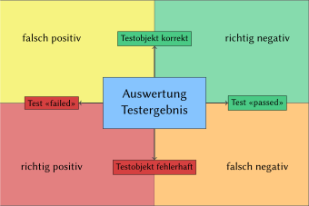
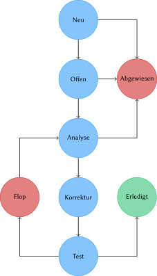

# Einleitung

Software ist heutzutage allgegenwärtig und trägt nicht nur zum Funktionieren unserer Welt bei, von ihr hängt auch immer mehr unsere Sicherheit ab. Nicht nur hängt die Abwicklung von Geschäftsprozessen von Software ab, die Erweiterbarkeit von Software gibt auch vor, wie schnell eine Firma ihre Geschäftstätigkeit ausbauen kann. Die Qualität von Software ist ein entscheidender Faktor für den Erfolg von Produkten und Firmen.

Systematisches Testen von Software hilft Unternehmen dabei, die Qualität ihrer Softwaresysteme zu erhöhen. Das vorliegende Buch stellt das hierzu notwendige Grundlagenwissen bereit. Es richtet sich an Tester und Entwickler ‒ sowie an alle, die im Rahmen der agilen Softwareentwicklung Testaufgaben übernehmen. Es richtet sich an Lehrende und Lernende gleichermassen.

Das _International Software Testing Qualifications Board_ (ISTQB) koordiniert die Zertifizierung im Bereich Software-Qualitätssicherung im Rahmen des ISTQB-Schemas und wird durch länderspezifische Gremien (wie z.B. durch das _Swiss Testing Board_) ergänzt. Die drei Ausbildungsstufen _Foundation_, _Advanced_ und _Expert_ werden dabei um zusätzliche Spezialistenmodule (u.a. fürs Testen im agilen Kontxt) ergänzt.

## Kapitelübersicht

Das vorliegende Buch deckt den Stoff bis zur ersten Stufe (_Foundation_) ab und behandelt in den folgenden Kapiteln diese Themen:

- **Kapitel 2** erörtert die Grundlagen des Softwaretests. Neben dem _Warum_, dem _Wann_, dem _Wozu_ und dem _Wie_ wird auf das Konzept des Testprozesses und auf die notwendigen Kompetenzen beim Testen eingegangen.
- **Kapitel 3** erläutert die Rolle des Testens in verschiedenen Entwicklungsmodellen (sequentiell, agil), die verschiedenen Teststufen und -arten, die Unterschiede zwischen funktionalen und nicht-funktionalen Tests, Regressionstests und Ansätze zur Verbesserung der Testautomatisierung.
- **Kapitel 4** behandelt statische Testverfahren, bei denen das Testobjekt nicht ausgeführt wird.
- **Kapitel 5** erörtert dynamische Tests und deren Einordnung in _Blackbox_- und _Whitebox_-Verfahren mit den dazugehörigen Testverfahren und -methoden.
- **Kapitel 6** behandelt die Organisation des Testprozesses und die dazu notwendigen Qualifikationen der involvierten Mitarbeiter. Nebst den Elementen einer Teststrategie werden auch Verfahren zur Aufwands- und Kostenschätzung des Softwaretests erläutert. Risikobasiertes Testen, Fehler- und Konfigurationsmanagement und Wirtschaftlichkeit sind ebenfalls Themen dieses Kapitels.
- **Kapitel 7** stellt verschiedene Arten von Testwerkzeugen vor und gibt Hinweise zu deren Auswahl und Einführung.

# Grundlagen des Softwaretestens

In diesem Kapitel werden die Grundbegriffe des Softwaretestens eingeführt, etablierte Grundsätze des Testens vorgestellt und die Aktivitäten des Testprozesses erläutert.

## Begriffe und Motivation

Industriell hergestellte Produkte werden zumeist durch Stichproben geprüft, was bei Softwareprodukten, die immateriell sind, nicht gleich funktioniert. Fehler in Software kosten nicht nur Zeit und Geld, sondern können auch den Ruf einer Organisation schädigen oder im Extremfall sogar zum Tod von Menschen führen.

Durch das Testen von Software kann ihre Qualität eingeschätzt werden, und das Risiko unentdeckter Fehler, die sonst erst im Produktiveinsatz der Software zutage treten würden, minimiert werden. Beim Testen von Software sollen alle Beteiligten des Projekts involviert sein. Beim ‒ statischen und dynamischen ‒ Testen von Softwarekomponenten werden deren Fehler (genauer: Fehlerzustände bzw. Fehlerwirkungen) erkannt.

Beim _dynamischen_ Testen kommt das _Testobjekt_ (d.h. die Software) zur stichprobenartigen Ausführung, wozu das Testobjekt mit _Testdaten_ versehen und einzelne Testfälle darauf ausgeführt werden, wonach geprüft wird, ob das beobachtete Ergebnis den Anforderungen entspricht.

Der gesamte Testprozess umfasst jedoch noch viele weitere Aktivitäten wie z.B. das Planen des Testvorgangs; das Abschätzen des Testaufwands; Analyse, Design und Umsetzung der Tests; das Erstellen von Berichten über Testfortschritt, Testergebnisse, Qualitätsbeurteilung und Risikobewertung.

Die Aktivitäten und Dokumentationen werden i.d.R. zwischen Auftraggeber und -nehmer ausgehandelt und unterliegen teilweise gesetzlichen Vorgaben oder Standards. Die Testaktivitäten unterscheiden sich im Lebenszyklus der Software; oftmals markieren Tests den Übergang von einer Phase in die nächste (z.B. die Freigabe einer neuen Version).

Obwohl Testaktivitäten von Werkzeugen abhängen, ist das Testen v.a. eine intellektuelle Tätigkeit, die Fachwissen und verschiedene Fähigkeiten erfordert. Neben der ausführbaren Software können im Rahmen von statischen Tests auch andere Artefakte wie z.B. Dokumentation, Anforderungen und Quellcode Testobjekte sein.

Je früher Fehler gefunden werden (z.B. bereits in den Anforderungen), desto besser ist das für den weiteren Entwicklungsprozess. Beim Testen wird auch geprüft, ob sich das System gemäss den Wünschen und Vorstellungen der Benutzer verhält. Es ist sinnvoll aber nicht immer machbar, die Benutzer im Rahmen einer Validierung möglichst im gesamten Entwicklungszyklus zu involvieren.

Ab einer gewissen Komplexität gibt es praktisch keine Softwaresysteme, die völlig fehlerfrei sind, da bei diesen oft Ausnahmen, Randbedingungen und Eingabekonstellationen nicht vollständig berücksichtigt werden können. Dennoch gibt es Software, die über eine lange Zeit zuverlässig funktioniert. Selbst wenn beim Testen keine Fehler mehr zu Tage treten, heisst das noch nicht, dass die Softwre tatsächlich fehlerfrei ist.

### Fehlerbegriff

Anhand der Anforderungen und weiteren Informationen wird die _Testbasis_ bestimmt, welche das erwartete Verhalten beschreibt und als Grundlage für die Entscheidung dient, ob korrektes oder fehlerhaftes Verhalten vorliegt.

Ein _Fehler_ ist somit eine festgestellte Abweichung zwischen dem festgelegten Sollverhalten und dem beobachteten Istverhalten. Solche Fehler entstehen nicht durch Alterung oder Verschliess, sondern sind vom Zeitpunkt der Entwicklung an Teil der Software, auch wenn sie erst später entdeckt werden.

Wird die Fehlfunktion für den Anwender oder Tester sichtbar, spricht man von einer _Fehlerwirkung_ (engl. _failure_). Zwischen Ursache, die ihren Ursprung im _Fehlerzustand_ (engl. _fault_) der Software hat, und dem Auftreten der Fehlerwirkung muss unterschieden werden.

Ein Fehlerzustand kann durch andere Fehlerzustände in der Software kompensiert werden, was als _Fehlermaskierung_ bezeichnet wird. Durch die Korrektur eines maskierenden Fehlers können bisher verborgene Fehlerzustände an den Tag treten. Ein Fehlerzustand kann erst verspätet oder andernorts in der Software zu einer Fehlerwirkung führen, etwa bei der Verfälschung gespeicherter Daten.

Fehlerzustände entstehen durch die _Fehlhandlung_ einer Person (engl. _error_) und können verschiedene Gründe haben:

- Unvollkommenheit des Menschen
- hohe Komplexität von Aufgaben, Architektur, Design und Code
- hoher Zeitdruck
- Missverständnisse und Fehlinterpretationen der Anforderungen
- mangelnde Erfahrung oder Ausbildung der Beteiligten
- Ablenkung, Unkonzentriertheit, Müdigkeit der handelnden Person

Eine Fehlhandlung einer Person führt zu einem Fehlerzustand im Programmcode, der zu einer Fehlerwirkung in der Software führt, die durch das Testen aufgezeigt werden soll.

Wird beim Testen eine Fehlerwirkung festgestellt, ohne dass ein Fehlerzustand im Testobjekt vorliegt, spricht man von einem _falsch positiven Ergebnis_ (engl. _false positive result_). Wird bei vorhandenem Fehlerzustand keine entsprechende Fehlerwirkung entdeckt, liegt ein _falsch negatives Ergebnis_ (engl. _false negative result_) vor. Wird der Fehlerzustand durch eine Fehlerwirkung erkannt, ist das Ergebnis _richtig positiv_; liegt kein Fehlerzustand vor und wird auch keine Fehlerwirkung erkannt, ist das Ergebnis _richtig negativ_.

Durch die Analyse der zugrundeliegenden Fehlhandlungen zu aufgedeckten Fehlerzuständen können Erkenntnisse gewonnen werden, womit der Entwicklungsprozess verbessert und die Wiederholung der Fehlhandlung vermieden werden kann.

Da zunächst nur die Fehlerwirkung und nicht der ihr zugrundeliegende Fehlerzustand bekannt ist, muss die fehlerhafte Stelle in der Software zuerst lokalisiert werden. Diesen Vorgang bezeichnet man als _Debugging_. Beim Testen werden also Fehlerwirkungen aufgedeckt, beim Debugging werden die zugrundeliegenden Fehlerzustände lokalisiert.

Durch die Behebung des Fehlerzustands wird die Qualität der Software verbessert ‒ sofern bei dieser Korrektur keine neuen Fehlerzustände eingebaut werden. Ein erneuter Test nach der Fehlerkorrektur wird als _Fehlernachtest_ bezeichnet. Da bei der Fehlerkorrektur aber auch neue Fehler eingebaut werden können, die unter anderen Eingabekonstellationen eine Fehlerwirkung erzeugen, müssen noch weitere Tests durchgeführt werden, und nicht nur derjenige, der die Fehlerwirkung ursprünglich provozierte.

### Testbegriff

Beim Testen werden verschiedene Ziele verfolgt:

- qualitative Bewertung von Arbeitsergebnissen
- Nachweis der Anforderungserfüllung
- Bereitstellen von Informationen zur Einschätzung der Qualität des Testobjekts
- Verringerung der Risiken durch Aufdeckung und Beschreibung von Fehlerwirkungen
- Analyse der Artefakte zur Vermeidung und Erkennung von Fehlerwirkungen
- Erhalten von Informationen zum Testabdeckungsgrad

Diese Ziele unterscheiden sich je nach Entwicklungsmodell (klassisch, agil) und Teststufe. Geht es etwa beim Komponententest um das Aufdecken von Fehlerwirkungen, steht beim Abnahmetest die Erfüllung der Nutzererwartungen im Vordergrund, und ob das Produkt zur Nutzung freigegeben werden kann.

Die _Testbasis_ legt das Sollverhalten des Testobjekts fest und umfasst neben Anforderungsdokumenten, User-Stories oder Spezifikationen auch voraussetzbares Fachwissen und den gesunden Menschenverstand. Das Ausführen des Testobjekts mit bestimmten Testdaten bezeichnet man als _Testfall_. Nach einem solchen _Testlauf_ wird geprüft, ob eine Fehlerwirkung ‒ eine Abweichung des beobachteten vom erwarteten Ergebnis ‒ vorliegt. Aus einer Testbasis werden _Testbedingungen_ abgeleitet, welche je von einem oder mehreren Testfällen überprüft werden.

Ein Testobjekt kann nicht als Ganzes sondern nur unterteilt in verschiedene Testelemente geprüft werden. (Testfälle prüfen einzelne Testelemente.) Testfälle werden in _Testsuiten_ zusammengefasst und so in einem _Testzyklus_ ausgeführt. Der _Testausführungsplan_ legt die zeitliche Ausführung der Testsuiten fest. Ein _Testskript_ automatisiert die Ausführung einer Testsuite und kümmert sich dabei um die Einhaltung der Vor- und Nachbedingungen bzw. Vorbereitungs- und Aufräumarbeiten. Bei manuellen Tests wird ein entsprechender schriftlicher Testablauf zur Verfügung gestellt.

Die Ergebnisse der Testläufe werden im _Testprotokoll_ gesammelt und im _Testbericht_ zusammenfassend dokumentiert. Zu Beginn werden Auswahl von Testobjekten und -verfahren sowie Teilziele und Testberichtserstattung im _Testkonzept_; die Koordination der Testaktivitäten im _Testzeitplan_ festgelegt.

Je nach Art des Projekts kann der Aufwand für das Testen einen mehr oder weniger grossen Anteil am Gesamtaufwand ausmachen. Konnte man bei klassischen Projekten das Verhältnis von Testern zu Entwicklern zur Einschätzung des Testaufwands beiziehen, fällt dies in agilen Projekten mit weniger starren Rollenverteilung schwer und kann höchstens anhand der Backlog-Aktivitäten grob abgeschätzt werden. Der Testaufwand muss ins Verhältnis zum Schadensausmass nicht gefundener Fehlerwirkungen und deren Eintretenswahrscheinlichkeit gestellt werden. (_Fehlerkosten = Auftretenswahrscheinlichkeit × Schadensausmass_)

An das Testen sollte in einem Projekt so früh wie möglich gedacht werden (_Shift-Left_-Ansatz: die Testaktivitäten werden auf der Zeitachse nach links verlegt). Bereits beim Überprüfen von Anforderungen und beim Refinement von User Stories können beteiligte Personen mit Testwissen früh mögliche Fehler erkennen und so vermeiden.

Das Risiko grundsätzlicher Konstruktionsfehler kann durch Beteiligung von Testern in der Designphase reduziert werden. In der Umsetzungsphase können Tester beim Vermeiden fehlerhafter Testfälle behilflich sein. Durch die Verifikation vor der Freigabe kann die Wahrscheinlichkeit erhöht werden, dass der Kunde ein Produkt erhält, das seinen Anforderungen entspricht.

### Grundsätze des Testens

Beim Testen haben sich in den letzten Jahrzehnten die folgenden Grundsätze etabliert:

1. Das Testen zeigt die Anwesenheit von Fehlerzuständen, kann aber nicht deren Abwesenheit beweisen, selbst wenn keine Fehlerwirkungen gefunden werden.
2. Ein vollständiges Testen ist nicht bzw. nur bei den trivialsten Testobjekten möglich; Tests sind immer nur Stichproben.
3. Frühes Testen spart Zeit und Geld, da früh erkannte Fehler oft einfacher zu beheben sind als solche, die sich erst etwa im Produktivbetrieb auswirken.
4. Fehler sind nicht gleichmässig über das ganze System verteilt sondern treten gehäuft in wenigen Komponenten auf.
5. Testfälle müssen laufend erweitert werden, um neue Fehlerwirkungen erkennen zu können. Wiederholtes Ausführen bestehender Testfälle kann nur Regressionsfehler aufdecken.
6. Testen ist kontextabhängig und muss dem zu prüfenden System angepasst werden. Keine zwei Systeme können genau gleich geprüft werden.
7. Ein System kann unbrauchbar sein, selbst wenn keine Fehler darin gefunden werden. Es müssen auch Benutzbarkeit und Akzeptanz des Benutzers gegeben sein, am besten indem man diese früh in die Entwicklung miteinbezieht.

## Softwarequalität: Qualitätsmanagement und Qualitätssicherung

Das _Qualitätsmanagement_ umfasst organisatorische Tätigkeiten und Massnahmen der Lenkung und Leitung einer Organsiation in Qualitätsfragen. Das Qualitätsmanagement ist Sache des Managements. Dieses legt Arbeitsprozesse fest, deren Einhaltung im Rahmen der _Qualitätssicherung_ durch die jeweiligen Projektbeteiligten geprüft wird.

Testen wird oft mit Qualitätssicherung gleichgesetzt, ist aber nur eine Massnahme davon. Die Qualitätssicherung umfasst alle Tätigkeiten, womit die Qualität einer Komponente oder eines Systems bewertet wird.

Zur _Qualitätssteuerung_ gehört auch die Analyse der Ursachen von Fehlern. In der Qualitätssicherung dienen Testergebnisse dazu, Verbesserungspozential im Prozess zu ermitteln; in der Qualitätssteuerung dienen sie zur Behebung von Fehlerzuständen.

## Der Testprozess

Unabhängig vom gewählten Entwicklungsmodell müssen Testarbeiten in kleinere Arbeitsschritte gegliedert werden. Ein Testprozess besteht aus verschiedenen _Testaktivitäten_, welche unabhängig vom konkreten Projekt in einer _Teststrategie_ festgelegt werden.

Die im folgenden beschriebenen Testaktivitäten müssen nicht streng sequenziell aufeinander folgen, sondern können sich zeitlich überlappen. Die Testüberwachung und -steuerung findet parallel zu den anderen sechs Testaktivitäten statt. In der agilen Softwareentwicklung finden diese Testaktivitäten kontinuierlich und iterativ statt.

### Testplanung

Die Testarbeiten werden von Beginn des Softwareentwicklungsprojekts an geplant, im weiteren Verlauf regelmässig überprüft und wenn nötig angepasst. Auf Basis einer Teststrategie wird ein _Testkonzept_ erarbeitet, welches den _Testprozess_ beschreibt.

Neben den Testobjekten und den nachzuweisenden Qualitätsmerkmalen wird festgehalten, welche Testaktivitäten welche Testziele nachweisen sollen. Auch benötigte Ressourcen und eine Zeitplanung sind Teil der Testplanung. Es werden Kriterien festgelegt, wann mit dem Testen angefangen werden kann (_Definition of Ready_) und wann eine Testaktivitäten als abgeschlossen gilt (_Definition of Done_).

Wie in jedem Konzept müssen auch mögliche Risiken aufgeführt werden. Informationen über die Testbasis und wie Änderungen daran sich auf die Testaktivitäten auswirken, gehören auch ins Testkonzept. Für die verschiedenen Tests sind die jeweiligen Teststufen aufzuführen. Im _Testzeitplan_ werden Akivitäten mit Start- und Endtermin sowie mögliche Abhängigkeiten zwischen diesen Tätigkeiten festgehalten.

### Testüberwachung und Teststeuerung

Die laufenden Testaktivitäten werden kontinuierlich im Vergleich zur Planung beobachtet. Abweichungen werden gemeldet, damit Gegenmassnahmen ergriffen werden können um das Erreichen der Testziele zu gewährleisten. Die Testplanung wird dabei aktualisiert.

Die Überwachung orientiert sich an den festgelegten Endkriterien zu den einzelnen Testaktivitäten. Können die durchgeführten Tests die Endkriterien nicht erfüllen, müssen zusätzliche Tests entworfen und durchgeführt werden.

Im _Testfortschrittsbericht_ wird der Testfortschritt im Vergleich zur Planung an die Stakeholder gemeldet. Beim Erreichen von Meilensteinen können auch _Testabschlussberichte_ angefertigt werden. Alle Testberichte sollen zielgruppengerecht über den Testfortschritt mit allen relevanten Details informieren, wobei auch geplante und tatsächliche Aufwände und Ressourcennutzung ausgewiesen werden. Als Grundlage hierzu dienen Berichte von Mitarbeitern aber auch erhobene Zahlen sowie durch Werkzeuge erstellte Auswertungen.

### Testanalyse

Hier wird ermittelt, _was_ zu testen ist. Dazu werden aus der Testbasis testbare Merkmale des Testobjekts ermittelt und daraus _Testbedingungen_ abgeleitet. Dabei orientiert man sich am gefordeten _Überdeckungsgrad_ (_Wie viel muss abgedeckt werden?_) und an den Risiken (_Wie soll priorisiert werden?_).

Die Testbasis soll hierzu genau überprüft werden, denn aus einer fehlerhaften oder widersprüchlichen Testbasis können keine sinnvollen Testbedingungen abgeleitet werden. Die durchzuführenden Tests müssen dann nachweisen, ob das Testobjekt diese Bedingungen erfüllt. Das Testobjekt muss über eine diesen Tests zugängliche Schnittstelle verfügen.

Es muss zwecks Nachverfolgbarkeit _bidirektional_ (d.h. in beide Richtungen) festgehalten werden, welche Testbedingungen welche Anforderungen prüft bzw. welche Anforderungen durch welche Testbedingungen geprüft werden. Gedanken über zu verwendende Testverfahren können in dieser Phase auch hilfreich sein.

### Testentwurf

In dieser Phase wird ermittelt, _wie_ zu testen ist. Aus den Testbedingungen werden _Testfälle_ abgeleitet. Ein _abstrakter Testfall_ verwendet dazu Bedingungen, denen die Eingabewerte genügen müssen (z.B. $1000 \le x < 1500$), während ein _konkreter Testfall_ exakte Eingabewerte festlegt (z.B. $x=1250$). Abstrakte Testfälle müssen vor der Testdurchführung konkretisiert werden, sind dafür aber besser für spätere Testzyklen wiederverwendbar.

Pro Testfall sind Ausgangssituation (Vorbedingung), einzuhaltende Randbedingungen (Invariante) und erwartete Ergebnisse (Endbedingung) inkl. erwarteter Seiteneffekte, wie z.B. veränderte persistente Daten, zu definieren. Für Testdaten müssen Anforderungen festgelegt werden. Die Sollwerte können aus der Testbasis abgeleitet oder teilweise auch anhand einer Umkehrfunktion (z.B. Test der Verschlüsselung durch Entschlüsselung) festgelegt werden.

Die Priorisierung und Verfolgbarkeit aus der Testanalyse kann nun auf einzelne Testfälle heruntergebrochen werden. Die _Testinfrastruktur_ bestehend aus Testumgebung, Testwerkzeugen und evtl. Testarbeitsplätzen muss ermittelt und bereitgestellt werden. Die _Testumgebung_ umfasst neben dem Testobjekt auch die dazu notwendige Hardware und teilweise auch weitere Hilfsmittel.

Anhand von _Überdeckungselementen_ ‒ aus Testbedingungen abgeleitete Eigenschaften unter Verwendung eines Testverfahrens ‒ werden Kriterien festgelegt, ab wann ausreichend getestet worden ist ‒ z.B. mindestens 50% durch Unit Tests abgedeckte Codezeilen.

### Testrealisierung

Diese Phase wird oft mit dem Testentwurf kombiniert. Hier sind alle Aktivitäten soweit vorzubereiten, dass die Testfälle in der nächsten Phase ausgeführt werden können.

Testmittel und Testinfrastruktur müssen bereitgestellt und geprüft werden. Testdaten müssen in die Testumgebung übernommen und ebenfalls überprüft werden. Testfälle müssen konkretisiert, zu Testsuiten gruppiert und in eine sinnvolle Reihenfolge gebracht werden, sodass die Nachbedingung eines Testfalls möglichst als Vorbedingung seines Nachfolgers genutzt werden kann. Auch die Priorisierung der Testfälle ist dabei zu beachten.

Eine Testsuite soll auch die Aufräumarbeiten nach den durchgeführten Testfällen berücksichtigen. Testskripte können diese Schritte automatisieren. Im Testausführungsplan werden die definierten Abläufe festgehalten.

### Testdurchführung

Nun gelangen die Testfälle gemäss _Testausführungsplan_ zur Ausführung. Zunächst empfiehlt es sich, die Hauptfunktionen des Testobjekts im Rahmen eines _Smoke-Tests_ zu überprüfen; sind diese bereits fehlerhaft, lohnt sich ein Weitertesten i.d.R. nicht.

Die ausgeführten Testfälle sind zu protokollieren, wozu folgende Angaben festgehalten werden: Testergebnis (bestanden, fehlgeschlagen oder blockiert, d.h. kann nicht ausgeführt werden), Tester, Testzeitpunkt und allenfalls Gründe für das Auslassen eines Testfalls.

Durch dieses Protokoll wird der Testvorgang für andere Parteien nachvollziehbar und die Umsetzung der gewählten Teststrategie kann damit nachgewiesen werden. Abweichungen zwischen erwarteten und tatsächlichen Testergebnissen werden ebenfalls protokolliert. Bei der Auswertung des Protokolls kann dann entschieden werden, ob eine Fehlerwirkung vorliegt. Beim Testen sollen auch die _Überdeckungsgrade_ gemessen und protokolliert werden; bei Bedarf auch der Zeitverbrauch.

Mithilfe der Verfolgbarkeit ‒ Testbasis, Testbedingungen, Testfälle, Testergebnisse ‒ kann nun nachvollzogen werden, welche Anforderungen erfüllt, teilweise erfüllt oder nicht erfüllt sind.

### Testabschluss

Der Zeitpunkt des Testabschlusses hängt vom verwendeten Entwicklungsmodell ab und kann auf die Freigabe einer Software oder eines Wartungsreleases, auf das Ende einer Iteration, auf den Abschluss eines Testprojekts oder auf einen sonstigen Meilenstein fallen.

Daten werden zusammengetragen, Erfahrungen ausgewertet und Testmittel zur Ablage gesichert (z.B. als Container-Images). Offene Fehler sind vollständig als Fehlerberichte gemeldet und werden in die nächste Iteration übernommen.

Die Testaktivitäten und deren Ergebnisse werden im _Testabschlussbericht_ zusammengefasst und so den Stakeholdern zur Verfügung gestellt. Je nach Branche muss von Gesetzes wegen ein Nachweis über die durchgeführten Tests erbracht werden.

In den Testaktivitäten gemachte Erfahrungen (z.B. Abweichungen zwischen Plan und Umsetzung) werden zwecks Erkenntnisgewinn für spätere Iterationen oder andere Projekte analysiert, wodurch der Testprozess an Reife gewinnt.

# Testen im Softwareentwicklungslebenszyklus

Ein Softwareentwicklungsprojekt orientiert sich an einem im Voraus festgelegten Vorgehensmodell. Damit werden die Aufgaben in eine logische Reihenfolge gebracht und auf Phasen oder Iterationen verteilt. Auch werden die Arbeiten auf verschiedene Rollen verteilt.

Verschiedene Vorgehensmodelle machen unterschiedliche Vorgaben zum Testen. Grundsätzlich unterscheidet man zwischen sequenziellen, iterativ-inkrementellen und agilen Entwicklungsmodellen.

## Sequenzielle Entwicklungsmodelle

Der Prozess wird als ein sequenzieller Ablauf von Aktivitäten verstanden, nach deren Durchlauf am Ende das gewünschte Produkt in der geforderten Qualität fertig bereitsteht. Ein zeitliches Überschneiden der einzelnen Aktivitäten ist nicht vorgesehen. Zwischen Projektstart und Auslieferung können Monate oder Jahre vergehen.

### Das Wasserfallmodell

Nach diesem Modell sind die einzelnen Phasen ‒ _System Requirements_, _Software Requirements_, _Analysis_, _Program Design_, _Testing_ und _Operation_ ‒ zeitlich streng voneinander getrennt. Das Testen wird als einmalige und den Entwicklungsarbeiten nachgelagerte Aktivität verstanden, nicht als projektbegleitende Tätigkeit.

{width=100%}

### Das V-Modell

Hier wird das Wasserfallmodell um ein erweitertes Verständnis der Testaktivitäten ergänzt. Zu jeder Entwicklungsarbeit ‒ _Anforderungsdefinition_, _funktionaler Systementwurf_, _technischer Systementwurf_, _Komponentenspezifikation_ ‒ gibt es eine korrespondierende Testaktivität ‒ _Abnahmetest_, _Systemtest_, _Integrationstest_, _Komponententest_.

{width=100%}

Die Entwicklungsarbeiten bilden die absteigende Flanke, die Testarbeiten die aufsteigende ‒ und unten in der Mitte steht das _Programmieren_. Geht man bei den Entwicklungsarbeiten vom Groben ins Feine («top-down»), setzt man bei den Testaktivitäten die einzelnen Teile wieder zu einem Ganzen zusammen («bottom-up»). Die Ergebnisse aus den Entwicklungsarbeiten werden dabei sukzessive integriert und folgendermassen getestet:

- _Komponententest_: Erfüllt der Baustein seine Spezifikation?
- _Integrationstest_: Spielen die Komponenten wie gewünscht zusammen?
- _Systemtest_: Erfüllt das System als Ganzes die spezifizierten Anforderungen?
- _Abnahmetest_: Erfüllt das System aus Kundensicht die vereinbarten Leistungsmerkmale?

Diese Testaktivitäten sind nicht als eine blosse zeitliche Unterteilung zu verstehen, sondern verfolgen unterschiedliche Testziele auf verschiedenen Abstraktionsebenen. Dabei werden unterschiedliche Testmethoden und Testwerkzeuge von für die jeweilige Testaktivität spezialisiertem Personal angewendet.

Die Testaktivitäten sind von unterschiedlichem Charakter:

- _Verifizierende_ Tests prüfen, ob ein Testobjekt seine Aufgabe gemäss Spezifikation erfüllt.
- _Validierende_ Tests prüfen, ob ein Testobjekt für seinen Einsatzzweck geeignet ist.

Mit steigender Teststufe nimmt der verifizierende Charakter der Testaktivitäten ab und der validierende zu.

Die vorbereitenden Testaktivitäten (Testplanung, Testanalyse, Testentwurf) können im V-Modell parallel zu den Entwicklungsarbeiten in der absteigenden Flanke erfolgen. Entwicklungs- und Testarbeiten werden einander in diesem Modell als gleichwertig gegenübergestellt. Auf jeder Teststufe wird gegen die korrespondierende Entwicklungsstufe getestet.

## Iterativ-inkrementelle Entwicklung

In der Praxis trifft man kaum rein sequenzielle Entwicklungsprojekte an, die etwa nach einem Durchlauf des V-Modells abgeschlossen wären. Stattdessen werden solche Vorgehensmodelle oder Teile davon iterativ durchlaufen, woraus ein Produkt inkrementell entsteht.

### Klassische iterativ-inkrementelle Entwicklung

Das Produkt wird schrittweise verbessert, wobei man sich auf Rückmeldungen des Kunden abstützt, dessen Bedürfnisse nach jeder Iteration besser erfüllt werden sollen. Erfahrungen aus vorhergehenden Iterationen dienen ebenfalls zur Verbesserung des Produkts.

Durch das schrittweise Vorgehen mit häufigen Releases wird die _Time to Market_ verkürzt und vermieden, an den Bedürfnissen des Kunden vorbei zu entwickeln. Klassisch iterativ-inkrementelle Modelle wie z.B. der _Rational Unified Process_ (RUP) sind heute nur noch sehr wenig verbreitet.

### Agile Softwareentwicklung

In der agilen Softwareentwicklung wird das vorausplanende Projektmanagement durch eine adaptive Projektsteuerung ersetzt, womit schnell auf angepasste oder neue Kundenwünsche reagiert werden kann, ohne dabei Zeit zum Nachtragen der Projektdokumentation zu verlieren.

In Abgrenzung zu den klassischen schwergewichtigen und dokumentlastigen Modellen gelten agile Methoden wie _Extreme Programming_, _Kanban_ und das am meisten verbreitete _Scrum_ als leichtgewichtig, wobei Projekt- und Prozessdokumentation minimiert werden. Scrum zeichnet sich aus durch:

- _Sprints_: kurze Iterationen fester Länge
- _Product- & Sprint Backlog_: Priorisierungen der Kundenanforderungen
- _Timeboxing_: begrenzte Zeitfenster für Aufgaben und Besprechungen
- _Transparenz_: Offensichtlichmachung des Sprint-Fortschritts durch regelmässige Besprechungen (_Daily Scrum_) und jederzeit einsehbare Taskboards

Auf Basis des «Whole Team»-Ansatzes werden Aufgaben und Probleme bevorzugt gemeinsam von mehreren Teammitgliedern angegangen, wobei jedes Mitglied seine Stärken und sein Fachwissen einbringen kann. Anstelle einer starren Rolleineinteilung ‒ Programmierer, Tester ‒ unterstützen sich die Teammitglieder gegenseitig, auch bei Testaufgaben.

Für die Qualität des resultierenden Produkts sind alle im Team gleichermassen verantwortlich. Es gibt jedoch Projekte, in denen dieser Ansatz beispielsweise aus regulatorischen Gründen nicht gangbar ist, etwa wenn Entwicklungs- und Testteam aus sicherheitstechnischen Überlegungen voneinander getrennt agieren müssen.

Freigaben können mehrmals pro Jahr bis im Extremfall mehrmals täglich erfolgen. Damit eine so hohe Taktung der Releases mit der notwendigen Qualität überhaupt möglich ist, müssen die Testfälle grösstenteils automatisch bereitgestellt werden, sodass die Inkremente früherer Releases automatisch durch Regressionstests mitgeprüft werden können.

Dadurch nimmt die Anzahl der Testfälle von Iteration zu Iteration laufend zu. Nur dank hoher Testautomatisierung kann die wachsende Testmenge bei gleichbleibender Sprintdauer konsequent durchgeführt werden. Zur Beschleunigung der Testdurchläufe können Tests geringerer Priorität auch von der Ausführung ausgenommen werden.

In einem agilen Projekt werden die Anforderungen in einem iterativ-inkrementellen Prozess aufgenommen. Dabei steigt nicht nur die Menge der Anforderungen mit jeder Iteration an, sondern auch deren Detailgrad. Durch eine enge Zusammenarbeit der Stakeholder untereinander wird sichergestellt, dass beim Verständnis der Anforderungen keine Missverständnisse auftreten.

Dieses gemeinsame Verständnis soll über die Form der _User Story_ erreicht werden, mit welcher Anforderungen folgendermassen beschrieben werden. (In der Praxis sind leicht unterschiedliche Satzschablonen in Gebrauch):

> Als _ROLLE_ möchte ich, dass _ZU ERREICHENDES ZIEL_, damit _RESULTIERENDER NUTZEN_.

Die Qualität der User Stories wird mit den sogenannten _INVEST_-Kriterien sichergestellt. Demnach soll eine User Story folgendes sein:

- **I**ndependent: _unabhängig_ von anderen User Stories
- **N**egotiable: _verhandelbar_ durch Spielraum bei der Umsetzung
- **V**aluable: _wertvoll_/_nützlich_ für den Anwender bzw. Kunden
- **E**stimable: _abschätzbar_ im Aufwand durch ausreichende Beschreibung
- **S**mall: _klein_ genug für eine Umsetzung ohne weitere Aufteilung
- **T**estable: _testbar_ durch hinreichende Akzeptanzkriterien

Teammitglieder mit Testwissen können durch die Erfüllung des letztgenannten Kriteriums viel dazu beitragen, die Testkosten für eine Story tief zu halten.

Beim Erstellen einer User Story empfiehlt sich das _3C-Schema_:

1. **C**ard: Die User Story wird auf einer physischen oder virtuellen Story-Karte festgehalten.
2. **C**onversation: In einem Dialog, der von Releaseplanung bis zur Umsetzung andauern kann, klären die Stakeholder die User Story inhaltlich.
3. **C**onfirmation: Die korrekte Umsetzung der User Story wird explizit aufgrund der festgelegten Abnahmekriterien bestätigt.

_Abnahmekriterien_ sind nichts weiteres als Testbedingungen, die beim Abnahmetest einer User Story zur Anwendung kommen. Diese tragen dazu bei, dass

- bei den Stakeholdern Konsens über die Interpretation der User Story herrscht,
- der Umfang der User Story klar eingegrenzt ist, und
- der Arbeitsaufwand einschätzbar und planbar ist.

Bei der _abnahmetestgetriebenen Entwicklung_ (ATDD: engl. _acceptance test-driven development_) werden die Abnahmetestfälle bereits vor der Implementierung umgesetzt. Zuerst werden die Abnahmekriterien an einem Spezifikations-Workshop gemeinsam unter den Stakeholdern geklärt. Anschliessend setzt das Team daraus die Abnahmetestfälle um.

Die Testfälle sollten dabei nicht über die jeweilige User Story hinaus gehen und auch keine Überschneidungen untereinander haben, aber nicht nur den Normalfall, sondern alle möglichen Sonderfälle behandeln. Schwierigkeiten bei der Erarbeitung der Abnahmekriterien deuten auf eine unklare User Story hin. Das Team ist selber dafür verantwortlich, zusätzliche nicht-funktionale Test umzusetzen, wenn es diese als angebracht sieht.

## Softwareentwicklung im Projekt- und Produktkontext

Je nach umzusetzendem Produkt oder Projekt unterscheiden sich die Anforderungen an Nachvollziehbarkeit und Planung, was einen Einfluss auf das auszuwählende Entwicklungsmodell hat. Hierbei können verschiedene Kriterien eine Rolle spielen:

- die angestrebte _Time to Market_
- das Einsatzgebiet (intern, bei Kunden) und die geplante Lebensdauer (vorübergehend, langfristiges Kundenangebot)
- das technische Umfeld (zentrale Web-Anwendungen, auf Offline-Geräten vorinstallierte Software)
- identifizierte Produktrisiken (geringe bei Unterhaltungsanwendungen, sehr hohe bei Medizinalsoftware)
- organisatorische und kulturelle Aspekte (eingespieltes lokales Team, geografisch verteilte Einzelkämpfer)

Vorgehensmodelle können miteinander kombiniert und auf die jeweiligen Bedürfnisse zugeschnitten werden (engl. «Tailoring»). Dies kann auch die Testaktivitäten betreffen, welche aber in jedem Fall folgenden Anforderungen genügen sollten:

- Testaktivitäten sollen schon früh im Projekt angegangen werden (Spezifikation von Testfällen, Aufbau der Testumgebung).
- Für jede Entwicklungsaktivität muss eine passende Testaktivität vorgesehen sein.
- Die Testaktivitäten müssen auf jeder Teststufe den Testzielen entsprechend ausgerichtet sein (z.B. mehr oder weniger Fokus auf die Validierung oder Verifizierung).
- Testanalyse und Testentwurf erfolgen bereits während der Entwicklung und nicht nachgelagert.
- Tester sind bereits beim Aufnehmen der Anforderungen und bei deren Prüfung (Review) involviert.

## Teststufen

Die Architektur eines Softwaresystems legt fest, aus welchen Teilsystemen das Gesamtsystem, und aus welchen Komponenten die verschiedenen Teilsysteme bestehen. Entsprechend muss beim Testen jede dieser Ebenen als separate _Teststufe_ betrachtet werden.

Beim sequenziellen Vorgehen sind die Endkriterien einer unteren Teststufe oftmals Teil der Einangskriterien der nächsthöheren Teststufe; es wird «von unten nach oben» getestet. Im agilen Vorgehen kommt es zu einer zeitlichen Verschmelzung der unterschiedlichen Teststufen.

Die Anzahl und Benennung der Teststufen kann sich dabei je nach Vorgehensmodell unterscheiden. Gebräuchlich sind vier Teststufen (mit alternativen Bezeichnungen):

1. Komponententest (Unittest, Modultest)
2. Integrationstest (Komponentenintegrationstest)
3. Systemtest (Systemintegrationstest)
4. Abnahmetest (Akzeptanztest)

Je nach Teststufe unterscheiden sich Testobjekt, Testziele, Testmethoden und Verantwortlichkeiten für die Testaufgaben.

### Komponententest

Beim _Komponententest_ werden die Softwarebausteine auf tiefster Architekturebene ‒ Module, Klassen, «Units» ‒ getestet. Entsprechende Tests bezeichnet man als Modultests, Klassentests bzw. Unittests. Als Testbasis dient die jeweilige Spezifikation einer solchen Komponente, d.h. deren Anforderungen. Auch Skripte, Konfigurationen oder Datenbankinhalte können Testobjekte eines Komponententests sein.

Die Komponente wird auf dieser Stufe isoliert betrachtet, um externe Einflüsse durch andere Komponenten auf mögliche Fehlerwirkungen auszuschliessen. Eine beobachtete Fehlerwirkung kann dank dieser isolierten Betrachtung der jeweiligen Komponente zugeordnet werden. Ist eine Komponente aus mehreren Bausteinen zusammengesetzt, kann diese trotzdem als einzelne Komponente getestet werden, solange dabei nicht Wechselwirkungen zu anderen Komponenten geprüft werden. 

Diese Teststufe ist sehr entwicklungsnah, zumal das Testobjekt direkt vom Entwickler stammt. Dementsprechend erfordert der Komponententest auch Programmierkenntnisse, da Tests auf dieser Stufe ausprogrammiert werden. Dabei wird der Testcode von einem Testtreiber ausgeführt, welcher das Testobjekt aufruft, das Ergebnis entgegennimmt, protokolliert und gegenüber einer formulierten Erwartung überprüft.

Da der Testcode und das Testobjekt oft von der gleichen Person geschrieben werden, spricht man beim Komponententest von einem Entwicklertest. Komponententests verfolgen das Ziel, die vollständige und im Hinblick auf die Spezifikation korrekte Funktionsweise einer Komponente zu überprüfen, wozu verschiedene Testfälle bestimmte Ein- und Ausgabekombinationen abdecken.

Da Komponenten mit anderen Komponenten interagieren, können diese unter Umständen falsch angesprochen d.h. mit unsinnigen Testdaten verwendet werden. Solche Konstellationen dürfen nicht zu einem Systemabsturz führen, sondern müssen abgefangen und sinnvoll behandelt werden.

Verwendet man die Komponente mit Testdaten, die ihrer Spezifikation gemäss unzulässig sind, spricht man von einem _Negativtest_. Oftmals gibt es mehr Negativ- als Positivtests, da der Wertbereich an falschen Testdaten praktisch unbegrenzt ist. Nicht selten macht die Eingabeprüfung über die Hälfte der Programmlogik aus.

Nicht funktionale Eigenschaften einer Komponente, z.B. deren Effizienz, können bereits auf dieser Stufe getestet werden, was in der Praxis jedoch (zu) selten passiert. Aspekte wie Klarheit und Wartbarkeit einer Komponente können im Rahmen eines statischen Tests (d.h. Reviews) vorgenommen werden.

Da der Entwickler eines Komponententests Zugriff auf den Quellcode des Testobjekts hat, spricht man von einem Whitebox-Testverfahren. Beim Testen einer Komponente kann der Entwickler somit Gebrauch von seinem Wissen über den internen Aufbau der Komponente machen, indem er z.B. Testfälle entwirft, um die Ausführung bestimmter Programmpfade zu überprüfen. In der Praxis wird der Komponententest jedoch oftmals als reiner Blackbox-Test durchgeführt, wobei die Testfälle ohne den Blick auf die innere Struktur der Komponente erstellt werden.

Beim iterativen «Test-First»-Vorgehen wird zuerst ein automatischer Testfall erstellt und erst dann die gewünschte Komponente umgesetzt. Dieses Vorgehen wird wiederholt, bis die umgesetzte Komponente allen Anforderungen genügt ‒ und alle Testfälle fehlerfrei durchlaufen. Dieses Vorgehen bezeichnet man auch als «testgetriebene Entwicklung» bzw. als «Test-Driven Development» (TDD).

### Integrationstest

Der _Integrationstest_ oder _Komponentenintegrationstest_ prüft das Zusammenspiel zweier oder mehrerer Komponenten. Hierzu müssen diese Komponenten zuerst von den Entwicklern integriert werden, d.h. es muss Code vorhanden sein, der die jeweiligen Komponenten verwendet. Beim Integrationstest sollen Fehlerzustände ermittelt werden, welche in den Schnittstellen zwischen den Komponenten bzw. in ihrem Zusammenspiel auftreten.

Als Testbasis dienen v.a. Schnittstellenspezifikationen, aber auch Sequenzdiagramme, Anwendungsfälle und Flussdiagramme. Integrationsfehler können auch dann auftreten, wenn bei den Komponententests keine Fehler ermittelt worden sind. Schliesslich können fehlerfreie Komponenten falsch verwendet werden, oder sie können Gebrauch unterschiedlicher, inkompatibler Datenstrukturen machen und dadurch inkompatibel zueinander sein.

Integrationstests können auf verschiedenen Ebenen zum Einsatz kommen: Von der Integration einzelner Komponenten über die Integration untereinander bereits integrierter Komponentengruppen bis zur Integration von Teilsystemen, wobei man im letzten Fall von einer _Systemintegration_ spricht.

Ein Integrationstest empfiehlt sich überall da, wo (bereits getestete) Systemteile neu integriert, d.h. miteinander ins Zusammenspiel gebracht werden. Neben Schnittstellen können auch Konfigurationsprogramme und -daten sowie Datenbankanbindungen und andere Infrastrukturkomponenten Testobjekt sein. Dabei ist es sinnvoll, wenn der gleiche Testtreiber wie bei den Komponententests zum Einsatz kommt. Zusätzliche Testwerkzeuge, die den Datenverkehr an den Schnittstellen aufzeichnen und protokollieren, können dabei sehr hilfreich sein.

Das Testziel von Integrationstests ist es, Schnittstellenfehler zu finden. Im einfachsten Fall wird dies bereits bei der Kompilierung erkannt; schwer zu findende Probleme mit einer Ursache im Datenaustausch zwischen den Komponenten erfordern jedoch dynamische Tests. Dabei unterscheidet man grob zwischen den folgenden Arten von Fehlerzuständen:

- _Inkompatibilität_: Die eine Komponente liefert Daten in einer Form, mit der die andere Komponente nicht umgehen kann.
- _Fehlinterpretation_: Die Komponenten interpretieren die Daten unterschiedlich, sodass es zu Widersprüchen in deren Verarbeitung kommt.
- _Synchronisationsproblem_: Die Komponenten übergeben einander Daten zum falschen Zeitpunkt (Empfangspunkte sind nicht bereit, Timeout) oder in falschen Zeitintervallen (zu schnell, zu langsam).

Diese Arten von Fehlern können unmöglich in den Komponententests gefunden werden, sondern erst in ihrer Wechselwirkung. Auch nicht-funktionale Aspekte wie Performance und Sicherheit können auf der Stufe der Komponentenintegration getestet werden. Da Integrationstests die betroffenen Komponenten mittesten, wird oftmals auf Komponententests verzichtet, was aber gravierende Nachteile haben kann:

- Die Fehlerzustände sind in der Komponente zu finden, die aber über den Integrationstest nur indirekt zugänglich sind.
- Durch diesen indirekten Zugang können nur eine eingeschränkte Menge an Eingebedaten der Komponente übergeben werden. Dadurch wird es schwierig bis unmöglich, bestimmte Fehlerwirkungen zu provozieren, wodurch nicht alle vorhandenen Fehlerzustände aufgespürt werden können.
- Eine Fehlerwirkung im Integrationstest hat ihre Ursache in einer bestimmten Komponente, es ist aber schwierig, diese Fehlerwirkung ihr auch zuzuordnen.

Die vermeintliche Zeitersparnis beim Verzicht auf Komponententests lohnt sich selten, da so nur mehr Zeit mit dem Lokalisieren von Fehlern aufgewendet wird.

Mit der Integration der Komponenten kann erst begonnen werden, wenn diese soweit fertig sind. Möchte man trotz unfertiger Komponenten bereits mit deren Integration anfangen, kann man Platzhalter entwickeln, die das Verhalten der fehlenden Komponenten simulieren. Je mehr Zeit in die Entwicklung solcher Platzhalter investiert wird, desto höher fallen die vermeidbaren Aufwände aus, die durch die Verzögerung einer Komponente entstehen.

Die Integration der Komponenten unterliegt verschiedenen Rahmenbedingungen:

- Die Systemarchitektur legt die Komponenten und deren Zusammenspiel fest.
- Der Projektplan gibt den Zeitpunkt für die Integration der Teilsysteme und Komponenten vor.
- Das Testkonzept bestimmt die Testintensität und die Teststufe für die verschiedenen Systemaspekte.

Durch eine sinnvolle Reihenfolge der Integration kann frühzeitig mit den Testaktivitäten begonnen werden, ohne dass hierzu hohe Aufwände zur Entwicklung von Platzhaltern nötig werden. (Es ist sinnvoller, alle Komponenten eines Teilsystems fertig zu haben als vereinzelte Komponenten aus verschiedenen Teilsystemen.) Zur Integration der Komponenten gibt es verschiedene Strategien:

- _Top-Down-Integration_: Die Tests beginnen auf oberster Systemebene, wobei fehlende, tieferliegende Komponenten vorerst durch Platzhalter ersetzt werden. Dieses Vorgehen ist einfach aber aufwändig.
- _Bottom-Up-Integration_: Die Tests beginnen auf tiefster Systemebene, wobei man sich stetig nach oben vorarbeitet. Es sind dadurch keine Platzhalter für tieferliegende Komponenten nötig, doch muss der Integrationscode durch Testcode simuliert werden.
- _Ad-hoc-Integration_: Die Komponenten werden in der (zufälligen) Reihenfolge ihrer Fertigstellung integriert. So wird jede Komponente frühstmöglich integriert, was jedoch viele Platzhalter erfordert.
- _Backbone-Integration_: Es wird vorab ein Programmskelett erstellt, in welchs die fertiggestellten Komponenten nach und nach eingebunden werden. Dadurch wird die Integrationsreihenfolge beliebig. Die Entwicklung eines solchen Backbones ist jedoch sehr aufwändig.

In der Praxis trifft man Mischformen dieser Strategien an. Eine «Big-Bang»-Integration, bei der alle Komponenten auf einmal integriert werden, ist nicht sinnvoll, weil hierdurch zu lange mit den Integrations- und Testaktivitäten gewartet wird, und dann alle Fehlerwirkungen auf einmal geballt auftreten, was deren Lokalisierung erschwert.

### Systemtest

Im _Systemtest_ wird das integrierte Gesamtsystem darauf geprüft, ob es die spezifizierten Produktanforderungen erfüllt. Trotz erfolgreicher Komponenten- und Integrationstests ist das nötig, weil diese tieferen Testarten die Erfüllung technischer Anforderungen überprüfen (_Verifizierung_), während der Systemtest aus Perspektive des Anwenders bzw. Kunden deren Anforderungen prüft (_Validierung_). Ausserdem können gewisse Funktionen und Systemeigenschaften nur anhand des Gesamtsystems überprüft werden.

Als Testbasis dienen alle Informationen, welche die Funktionsweise des Gesamtsystems beschreiben (Anforderungen, Spezifikationen, Benutzerhandbücher usw.) Getestet wird auf einer produktionsnahen Umgebung mit vergleichbarer Hardware- und Softwarekonfiguration ‒ und nicht mehr mithilfe eines Testtreibers. Dabei wird die Dokumentation und Konfiguration des Systems mitgeprüft.

Der Systemtest darf jedoch nicht auf dem Produktivsystem des Kunden durchgeführt werden, da der Testbetrieb durch provozierte Fehlerwirkungen den Produktivbetrieb beeinträchtigen kann (z.B. durch Systemausfälle oder Datenverluste) und weil ein Produktivsystem nicht zu Testzwecken beliebig umkonfiguriert werden kann (etwa um performantere Einstellungen zu finden).

Der Systemtest ist sehr aufwändig. Gemäss Faustregel markiert der Beginn des Systemtests ca. die Hälfte der Testaufwände. Die Qualität der Datenbestände wird im Rahmen des Systemtests mitgeprüft, gerade bei datenbankgestützten Anwendungen: auch die Daten selber werden so zum Testobjekt mit Testkriterien wie Konsistenz, Vollständigkeit, Aktualität.

Beinhaltet der Systemtest auch die Überprüfung von Schnittstellen zu externen Systemen und die Interaktion mit der Systemumgebung, spricht man oft von einem _Systemintegrationstest_. (Der Integrationstest betrifft nur die eigens entwickelten Komponenten. Die Abgrenzung zwischen Integrations- und Systemintegrationstest ist nicht immer messerscharf und erfolgt projektspezifisch.)

Solche Systemintegrationstests erfordern ebenfalls eine produktionsnahe Testumgebung der relevanten Umsysteme. Oft werden Systemintegrationstests erst durchgeführt, wenn die Systemtests einigermassen fortgeschritten sind, da sonst die Unterscheidung des Ursprungs von Fehlerwirkungen (aus dem Eigen- oder einem Umsystem) schwerfällt. Dabei ist zu berücksichtigen, dass die Gegenseite der Schnittstelle nicht unter Kontrolle des Entwicklungsteams steht und dadurch fremdverschuldete Fehlerwirkungen erzeugen kann.

### Abnahmetest

Die bisher betrachteten Teststufen werden in der Verantwortung des Herstellers der Software durchgeführt. Vor der Inbetriebnahme der Software beim Kunden erfolgt nur noch der abschliessende _Abnahme-_ bzw. _Akzeptanztest_. Hier steht das Urteil des Anwenders bzw. des Kunden im Vordergrund. Der Umfang der Abnahmetests ist projektabhängig und orientiert sich an den ermittelten Risiken.

Bei Individualsoftware sind Abnahmetests umfangreicher als bei Standardsoftware. Als Testbasis dienen alle Informationen, welche das Produkt aus Anwendersicht beschreiben, aber auch Gesetze und regulatorische Vorgaben, welche die Software betreffen. Bei der Abnahme von Individualsoftware empfiehlt es sich, die Abnahme vertraglich zu regeln und schriftlich bestätigen zu lassen. In einem solchen Vertrag werden die Abnahmekriterien vorgegeben, wozu diese klar und eindeutig formuliert sein müssen.

Diese Abnahmetests kann der Anbieter schon intern durchführen, um diese dann zwecks eigentlicher Abnahme beim Kunden durch diesen wiederholen zu lassen. Hierbei ist es wichtig, dass der Kunde die Abnahmekriterien ausformuliert oder zumindest einem Review unterzieht. Abnahmetests werden in einer Umgebung des Kunden durchgeführt, jedoch nicht in einer Produktivumgebung. Dadurch wird auch die Installation bzw. Aktualisierung und Konfiguration der Software mitgeprüft.

Verwenden auf Kundenseite mehrere unterschiedliche Gruppen von Anwendern die Software, sollen im Rahmen eines _Benutzerakzeptanztests_ Tester aus verschiedenen Gruppen beigezogen werden. Diese Auswahl von Testfällen und Testpersonal trifft am besten der Kunde selber. Ein korrekt arbeitendes aber als umständlich zu bedienend empfundenes System kann eine komplette Systemeinführung gefährden, weswegen Benutzerakzeptanz bei den Abnahmetests einen sehr hohen Stellenwert hat.

Gravierende Akzeptanzprobleme sollte man aber bereits früher im Entwicklungsprozess vermeiden, indem man rechtzeitig repräsentative Vertreter des Kunden in die Testaktivitäten einbindet. Abnahmetests können auch den Systembetrieb betreffen, der Aspekte wie Backup, Restore, Datenschutz aber auch Konfiguration und Datenpflege (z.B. die Benutzerverwaltung) sicherstellen muss.

Kommt eine Software auf sehr vielen Systemumgebungen zum Einsatz, können nicht alle möglichen Kombinationen von Konfigurationen getestet werden. In diesem Fall wird ein sogenannter _Feldtest_ durchgeführt, für welchen der Anbieter einem ausgesuchten Benutzerkreis eine Vorabversion der neuen Software zur Verfügung stellt. Der Anbieter kann Vorgaben zu Testfällen machen oder die Anwender die Software durch eigene (realistische und alltägliche) Anwendungsszenarien testen lassen.

Die Anwender melden ihre Feststellungen und Fehlerberichte dem Hersteller, der nun durch Verbesserungen und Fehlerkorrekturen darauf reagieren kann. Ein solcher Feldtest wird oftmals herstellerintern als _Alpha-Test_ und extern als _Beta-Test_ durchgeführt. Für letzteres muss die Software bestimmten Mindestqualitätsstandards genügen, damit sie externen Testern zugemutet werden kann.

## Testarten

Je nach Teststufe liegt der Fokus auf bestimmten Arten von Tests. Einerseits unterscheidet man zwischen _funktionalen_ und _nicht funktionalen_ und andererseits zwischen _anforderungsbasierten_ und _strukturbasierten_ Tests.

### Funktionale Tests

Funktionale Tests umfassen alle Testmethoden und Testverfahren, bei denen das von aussen wahrnehmbare Ein- und Ausgabeverhalten des Testobjekts geprüft wird. Als Testbasis dienen die funktionalen Anforderungen. Diese beschreiben die Funktionsweise und das Verhalten des gewünschten Systems.

Zu jeder funktionalen Anforderung soll zumindest ein Testfall formuliert werden, in der Regel jedoch mehrere. Laufen diese Testfälle fehlerfrei durch, gilt die entsprechende Anforderung als erfüllt.

Funktionale Tests kommen auf allen Teststufen zum Einsatz. Beschreiben die Anforderungen einen Geschäftsprozess, werden die Tests als Szenarien mit unterschiedlichen Prioritäten definiert. Häufigkeit, Relevanz und Risiko sind für diese Priorisierung ausschlaggebend. Solche Szenarien umfassen oft mehrere hintereinandergeschaltete Tests.

### Nicht funktionale Tests

Nicht funktionale Anforderungen beschreiben, wie gut ein System oder Teilsystem seine Arbeit erfüllen soll. Solche Eigenschaften beeinflussen die Zufriedenheit des Anwenders bzw. des Kunden stark. Diese Kriterien unterscheiden sich je nach Perspektive: Für den Anwender sind Bedienbarkeit und Performanz wichtig, während der Anbieter Wert auf Änderbarkeit und Wartbarkeit legt.

Nicht funktionale Anforderungen werden meist auf Stufe Systemtest mit folgenden Testarten überprüft:

- _Lasttest_: Messung des Systemverhaltens unter hoher Last
- _Performanztest_: Messung der Verarbeitungsgeschwindigkeit und Antwortzeit
- _Volumentest/Massentest_: Beobachtung des Systemverhaltens in Abhängigkeit zur Datenmenge
- _Stresstest_: Beobachtung des Systemverhaltens bei Überlastung
- _Sicherheitstest_: Prüfung auf unerlaubten Systemzugang und Datenzugriff
- _Stabilitäts- und Zuverlässigkeitstest_: Prüfung auf Ausfälle im Dauerbetrieb
- _Robustheitstest_: Verhalten bei Fehlerfällen (Bedienung, Programmierung, Hardware) und Wiederanlaufverhalten (Recovery)
- _Kompatibilitätstest_: Verträglichkeit mit Umsystemen, Import/Export von Datenbeständen, Portierung auf andere Plattformen
- _Konfigurationstest_: Verhalten unter verschiedenen Betriebssystemen; mit verschiedenen Lokalisierungs- und Spracheinstellungen; auf verschiedenen Hardware-Plattformen
- _Usability-Test_: Benutzerfreundlichkeit, Erlernbarkeit, Verständlichkeit im Bezug auf bestimmte Anwendergruppen (Akzeptanz)
- _Dokumentationsprüfung_: Übereinstimmung der Dokumentation mit der Realität (Bedienungsanleitungen, Konfigurationsinstruktionen)
- _Wartbarkeitsprüfung_: Prüfung der Entwicklerdokumentation und Systemstruktur

Solche Anforderungen werden in der Praxis oft zu schwammig definiert («einfach bedienbar», «schnelle Reaktionszeit»), wodurch sie nicht oder nur schwer testbar sind. Darum sollten Tester diese Anforderungen einem Review unterziehen. Manche Anforderungen werden als so selbstverständlich betrachtet, dass ihre Formulierung vergessen geht, was zu Konflikten in der Abnahme führen kann.

Für nicht funktionale Tests können Szenarien von funktionalen Tests wiederverwendet werden, sofern diese nicht funktionale Systemeigenschaften demonstrieren.

### Anforderungs- und strukturbezogene Tests

Anforderungsbasierte Tests gehen von Spezifikationen (funktionale/nicht funktionale) als Testbasis aus und kommen v.a. im System- und Abnahmetest zum Einsatz. Aus Spezifikationen abgeleitete Komponenten- und Integrationstests gelten auch als anforderungsbezogene Tests.

Bei strukturbezogenen Tests wir auch die innere Struktur des Systems als Testbasis beigezogen. Der Fokus liegt darauf, möglichst alle Teile des Systems für Testfälle zugänglich zu machen und genügend Testfälle zu entwefen. Die Testfälle können auf funktionalen und nicht funktionalen Anforderungen basieren. Strukturbezogene Tests kommen v.a. auf Stufe Komponenten- und Integrationstest zum Einsatz.

## Test nach Änderung und Weiterentwicklung

Der erfolgreiche initiale Abnahmetest ist nicht das Ende eines Softwareentwicklungsprojekts, sondern markiert vielmehr den Beginn einer längeren Phase der Anwendung, Korrektur und Erweiterung. Es kann passieren, dass das neue System unter nicht vorgesehenen Bedingungen betrieben und verwendet wird, neue Kundenwünsche geäussert werden, erweiterte Behandlung für neu entdeckte Sonderfälle benötigt wird und dass Probleme und Ausfälle auftreten, die erst nach einer längeren Betriebszeit beobachtbar sind.

Korrekturen und Ergänzungen, die während der Nutzung des Softwaresystems vorgenommen werden, bezeichnet man als _Softwarewartung_ oder _Softwarepflege_. Entsprechende Tests bezeichnet man als _Wartungstests_. Da Software aber nicht wie Hardware verschleisst, haben diese Begriffe hier eine andere Bedeutung: Bei der Softwarewartung werden Fehlerzustände behoben, die schon immer in der Software vorhanden waren. Im Rahmen der Softwarepflege wird diese an neue Einsatzbedingungen angepasst.

Es können also Erweiterungen und Fehlerkorrekturen Grund für die Anpassung bereits im Einsatz stehender Softwareprodukte sein. Es stellt sich die Frage, in welchem Ausmass eine solche neue Softwareversion getestet werden muss, zumal ein grosser Teil der Software durch die vorgenommene Änderung nicht betroffen ist.

Bei der Fehlerkorrektur wird ein Fehlernachtest vorgenommen: Vormals aufgrund des Fehlerzustands gescheiterte Testfälle müssen erneut ausgeführt werden und fehlerfrei durchlaufen. Neue, etwa durch Kundenrückmeldung entdeckte Fehlerwirkungen, müssen durch zusätzliche Testfälle abgedeckt werden.

Oft verändern Fehlerkorrekturen das Verhalten der Software in ihrer jeweiligen Umgebung. Es muss deshalb überprüft werden, ob die Testfälle für die nähere Umgebung der Änderung noch immer durchlaufen. Oftmals erfordern schwere Fehlerwirkungen eine sofortige Korrektur, was einen umfassenden Testlauf verunmöglicht. Dieser ist im Anschluss an die erfolgte Korrektur möglichst bald nachzuholen.

Die vorzeitige Planung von Wartungsreleases erleichtert die Organisation der Testaktivitäten, besonders wenn Art und Umfang der ausgelieferten Korrekturen frühzeitig bekannt sind. Die Gewissheit, dass Wartungsreleases ohnehin nötig sein werden, darf aber keine Ausrede für mangelhaftes Testen sein. Dazu sind die Kosten und Risiken von Fehlerwirkungen im Produktiveinsatz zu hoch.

Da sich selbst kleine lokale Änderungen auf andere Systemteile auswirken können, muss der Umfang der nötigen Testarbeiten mithilfe einer Auswirkungsanalyse ermittelt werden. Im Gegensatz zur Softwarewartung ist bei der Softwarepflege, welche die Software um neue Anwendungsfälle ergänzt, oftmals ein Akzeptanz- bzw. Abnahmetest erforderlich. Eine Migration bestehender Datenbestände muss ebenfalls angemessen auf Korrektheit überprüft werden. Ansonsten ist das Vorgehen beim Testen bei Softwarewartung und -pflege das gleiche.

Bestehende Software kann auch umfassenderen Erweiterungen unterzogen werden, welche durch das Produktmanagement geplant werden. Neben den regelmässigen kleineren Wartungs- und Pflegereleases kann es so zu grösseren funktionalen Updates kommen. Bei der Weiterentwicklung muss nicht nur die Funktionsweise der neu hinzukommenden Features überprüft werden, sondern auch, ob die bestehenden Features weiterhin funktionieren und nicht durch die Weiterentwicklung versehentlich beeinträchtigt worden sind.

Es sind also neue bzw. erweiterte Testfälle wie auch _Regressionstests_ nötig. Ein Regressionstest oder «Test nach Änderung» ist der erneute Test eines Programms nach dessen Modifikation mithilfe bereits bestehender Testfälle. Damit wird geprüft, ob Anpassungen und Erweiterungen unbeabsichtigten Seiteneffekte ‒ Regressionen ‒ erzeugt haben. Der Regressionstest prüft also, ob unveränderte Features der Software wirklich unverändert geblieben sind.

Testfälle, die im Rahmen eines Regressionstests zum Einsatz kommen, müssen wiederverwendbar sein. Hierzu müssen manuell auszuführende Testfälle gut dokumentiert sein. Besser sind jedoch automatisierte Testfälle für Regressionstests geeignet, da der Nutzen der Testautomatisierung durch die wiederholte Ausführung besonders hoch ist.

Beim Regressionstest müssen alle Testfälle herbeigezogen werden, welche die alte Funktionalität betreffen. Hierzu ist die Analyse der Testspezifikation nötig, um zu ermitteln, welche Testfälle sich auf welche Anforderungen beziehen. Automatisierte Testfälle sind an die neue bzw. erweiterte Funktionalität anzupassen, da sie sonst nicht aussagekräftig sind. Scheiternde Testfälle zeigen mögliche Regressionsfehler an ‒ oder wurden noch nicht an die neuen Anforderungen angepasst.

Neue Funktionalitäten erfordern die Entwicklung zusätzlicher Testfälle. Manuelle Regressionstests sind oft teuer und zeitaufwändig. Die Auswahl der Testfälle orientiert sich oft an deren Prioritäten, wobei Sonderfälle oft nicht getestet werden. Auch können Regressionstests auf bestimmte Konfigurationen oder Teilsysteme begrenzt werden.

## Verbesserung und Automatisierung des Softwareentwicklungsprozesses

Die kontinuierliche Verbesserung von Produkten und Dienstleistungen ist Teil des Qualitätsmanagements erfolgreicher Firmen. Entwickeln diese Firmen Software, verbessern sie auch laufend ihren Softwareentwicklungsprozess, was auf der Ebene von Projekten, Teams oder unternehmensweit passieren kann. Dies soll eine Verbesserung der Produktivität (für kürzere Iterationszyklen) und Qualität (zur besseren Fehlervermeidung) zur Folge haben.

Frühes Testen ist eine wichtige Massnahme hierzu. Dabei sollen Qualitätssicherungsmassnahmen möglichst früh nach einem Arbeitsschritt ausgeführt werden, der potenziell einen Fehler produziert, um so ein schnelles Feedback zu erhalten. Reviews stellen hierzu eine wirksame Massnahme dar, wobei Arbeitsergebnisse in einer stabilen Zwischenversion einer Prüfung unterzogen werden. Dabei ist es sinnvoll, wenn Personal mit Testwissen an diesem Vorgang beteiligt ist.

Statische Quallcodeanalyse, nicht funktionale Tests auf tieferen Ebenen, die testgetriebene Entwicklung (TDD) sowie _Continuous Integration_ (CI) und _Continuous Delivery_ (CD) sind weitere sinnvolle Massnahmen des frühen Testens. Die Einführung solcher Massnahmen ist v.a. wegen der Schulung der Mitarbeiter oft mit hohen Kosten verbunden, was sich aufgrund des daraus resultierenden Qualitäts- und Produktivitätsgewinns aber durchaus längerfristig lohnen kann. Ohne solche Massnahmen ist es auf Dauer gar nicht möglich, kurze Iterationen in der Entwicklung durchzuhalten.

### Testgetriebene Entwicklung

Unter testgetriebener Entwicklung versteht man ein Vorgehen, bei dem Entwurf und Umsetzung von Testfällen der Entwicklung des Produktivcodes vorausgehen. Diese automatisierten Testfälle stehen so vor und nach jeder Veränderung zur Ausführung bereit und zeigen an, ob die jeweilige Änderung einen Fehlerzustand eingeführt und eine Fehlerwirkung hervorgebracht hat.

Diese Testfälle können weiter als ausführbare Spezifikation des Sollverhaltens betrachtet werden. Die Bezeichnung «testgetriebene Entwicklung» kommt daher, dass die Tests und ihr Ergebnis steuernden Einfluss auf die Entwicklungsaktivitäten haben.

Dabei unterscheidet man zwischen der ursprünglichen Form von TDD (_Test-Driven Development_) auf Stufe der Komponententests und ATDD (_Acceptance Test-Driven Development_) auf Stufe der Abnahmetests. Bei letzterem werden zu jedem Abnahmekriterium automatisierte Testfälle entwickelt. Diese stellen sicher, dass die beteiligten Stakeholder ein gleiches Verständnis der umzusetzenden Anforderung haben.

Beim BDD (_Behaviour-Driven Development_, d.h. verhaltensgesteuerte Entwicklung) wird das Sollverhalten mithilfe von Beispielen oder Szenarien in natürlicher Sprache formuliert und anschliessend mithilfe von speziellen Werkzeugen in automatische Testfälle übersetzt, sodass auch Nicht-Entwickler automatische Testfälle erstellen können.

### Continuous Integration, Continuous Delivery, Continuous Deployment

_Continuous Integration_ (CI) ist eine Entwicklungsstrategie, bei der Codeänderungen häufig, d.h. mindestens einmal täglich, integriert werden. Dadurch werden nicht am Ende einer Iteration verschiedenste Änderungen auf einmal zusammengenommen, sondern kontinuierlich ins bestehende System integriert.

Hierzu empfiehlt sich die Automatisierung dieses häufig durchgeführten Vorgangs, was als _Continuous Delivery_ (CD) bezeichnet wird. Diesen integrierten Prozess bezeichnet man häufig als CI/CD.

Das frühe Testen wird dabei durch das automatische Ausführen von statischen und dynamischen Tests (Codeanalyse, Komponenten- und Integrationstests) unterstützt. Dadurch erhält man ein sehr schnelles Feedback, sofern sich die Ausführungsdauer der Testsuiten in einem praktikablen Ausmass bewegt.

Das _Continuous Deployment_ (CD) ist ein konsequenter Folgeschritt, bei dem auch die Auslieferung der neuen Version automatisch stattfindet, wenn alle automatisierten Tests erfolgreich durchlaufen worden sind.

### DevOps

Die Integration der Entwicklungs- («Development», _Dev_) und Betriebsprozesse («Operations», _Ops_) bezeichnet man als _DevOps_. Diese Integration kann nicht alleine mithilfe von Werkzeugen bewerkstelligt werden, sondern erfordert auch kulturelle Veränderungen, damit die beteiligten Teams und Abteilungen besser miteinander kooperieren.

Dabei wird der CI/CD-Ansatz über die Entwicklung hinaus auf den Betrieb der Anwendung ausgedehnt, was nicht nur kürzere Iterationen beim Betrieb ermöglicht, sondern dem Entwicklungsteam auch wertvolle Informationen aus dem Betrieb der Anwendung gibt, etwa zur Performanz oder zur tatsächlichen Systemauslastung.

### Retrospektiven und Prozessverbesserung

Eine Retrospektive ist eine Teamsitzung, in welcher die Zielerreichung einer abgeschlossenen Iteration reflektiert wird. Dabei soll es darum gehen, mögliche Verbesserungen der Arbeitsweise vorzuschlagen und zu diskutieren. Auch Themen des Testens ‒ Verbesserung der Testbasis, Steigerung der Effektivität und Effizienz beim Testen, Einsatz der Testmittel ‒ sind Thema einer Retrospektive, wie auch Weiterbildungsmassnahmen der Teammitglieder sowie kulturelle Themen.

Retrospektiven können nicht nur am Ende einer Iteration (z.B. in Scrum nach einem Sprint) sondern auch nach Abschluss eines Projekts, beim Erreichen eines Meilensteins oder einfach bei Bedarf durchgeführt werden. Wichtig ist das Festhalten der Entscheidungen und die Überprüfung der Massnahmenumsetzung nach der Retrospektive.

# Statischer Test

Der _statische Test_ (bzw. die _statische Analyse_ oder _statische Prüfung_) kann manuell oder werkzeuggestützt erfolgen. Das Testobjekt ist nicht ein ausführbares Programm wie beim dynamischen Test, sondern ein für die Erstellung der Software relevantes Arbeitsergebnis (Dokument, Quellcode).

Im Gegensatz zum dynamischen Test erfordert der statische Test keine Formulierung von Testfällen. Der statische Test ist darum weniger aufwändig und kann Fehlerzustände früher feststellen. Im Sinne der Prävention sollen mit statischen Tests Fehler erkannt werden, bevor sie sich auf den weiteren Entwicklungsprozess auswirken können.

## Das Review

Im Rahmen eines _Reviews_ werden Qualitätskriterien wie Lesbarkeit, Vollständigkeit, Korrektheit, Konsistenz und Testbarkeit geprüft, woran schliesslich auch die Wartbarkeit bewertet werden kann. Reviews dienen sowohl der Verifikation als auch der Validierung.

Beim Review kann jegliche Art von Spezifikation geprüft werden: Geschäftsanforderungen, funktionale und nicht funktionale Anforderungen, Sicherheitsanforderungen usw. Entsprechende Fehler sollen gefunden und behoben werden, bevor sie in den Quellcode gelangen.

Im agilen Vorgehen sind v.a. Epics und User Stories Gegenstand von Reviews. Es wird geprüft, ob diese der Definition of Ready genügen, vollständig und verständlich sind und über sinnvolle Abnahmekriterien verfügen. Dabei können Fehler wie Inkonsistenz, Mehrdeutigkeit, Widersprüchlichkeit, Lücken, Ungenauigkeit, Redundanz aber auch Rechtschreibefehler aufgedeckt werden.

Auch Testkonzepte, Testfälle und Testpläne sowie Verträge, Projekt- und Zeitpläne und Benutzeranleitungen können Gegenstand eines Reviews sein. Mit den Ergebnissen eines Reviews können nicht nur die Arbeitsergebnisse selber, sondern auch deren zugrundeliegende Arbeitsprozesse verbessert werden, indem man etwa aus häufig festgestellten Fehlern Schulungsmassnahmen ableitet.

Das Review basiert auf der menschlichen Analyse- und Denkfähigkeit, womit komplexe Sachverhalte überprüft und bewertet werden. Das Review ist also ein intensives Nachdenken über Arbeitsergebnisse, wozu der Reviewer mit den Inhalten der jeweiligen Artefakte vertraut sein und sie nachvollziehen können muss.

Für viele Arten von Arbeitsergebnissen stellt das Review die einzige Möglichkeit zu deren Prüfung dar, wobei es unterschiedliche Vorgehensweisen gibt. Reviews können mehr oder weniger formell sein, d.h. sich stärker oder schwächer an einem vorgegebenen Prozess orientieren.

Beim formellen Review sind die am Review beteiligten Personen, das dabei einzuhaltende Vorgehen sowie die zu dokumentierenden Informationen festgelegt. Das gewählte Vorgehen hängt auch vom Entwicklungsmodell (sequenziell, agil), von der Reife des Entwicklungsprozesses, von der Komplexität der zu prüfenden Inhalte und von allfälligen gesetzlichen Vorgaben ab.

Wie das Review durchgeführt werden soll, hängt davon ab, welche Ziele man damit verfolgt. Möchte man Fehler aufdecken, ein gemeinsames Verständnis schaffen oder eine Entscheidungsgrundlage für die weitere Entwicklung erarbeiten?

### Der Reviewprozess

Der Reviewprozess besteht aus mehreren Schritten und kann für umfassende Reviews mehrmals durchgespielt werden. Diese Schritte oder Hauptaktivitäten sind:

1. **Planung**: Die Projektleitung entscheidet, welches Arbeitsergebnis welcher Art von Review unterzogen wird. Je nach Art des Reviews unterscheiden sich die zu besetzenden Rollen und die auszuführenden Aktivitäten. Die zu bewertenden Qualitätsmerkmale sowie der Zeitrahmen und der Aufwand werden auch in der Planung festgelegt. Die Rollen werden mit geeigneten Personen besetzt. In Zusammenarbeit mit dem Autor des zu prüfenden Artefakts vergewissert man sich, dass sich dieses in einem stabilen Zustand befindet. Bei einem formalen Review werden auch eingangs- und Ausgangskriterien für die einzelnen Arbeitsschritte festgelegt. Werden umfassende Arbeitsergebnisse einem Review unterzogen, kann eine Auswahl der zu prüfenden Inhalte getroffen werden.
2. **Initiierung**: Die am Review beteiligten Personen werden über ihre Rollen informiert und mit allen notwendigen Informationen versorgt. Dies kann im Rahmen einer Besprechung oder rein schriftlich vonstatten gehen. Neben dem zu prüfenden Arbeitsergebnis müssen auch sämtliche Informationen bereitgestellt werden, womit der Soll-Zustand des Artefakts eingeschätzt werden kann. Solche _Basisdokumente_ («Baseline») können Standards, Designdokumente, Richtlinien usw. sein. Auch Checklisten oder Vorlagen für das Festhalten der Befunde können hilfreich sein und den Arbeitsaufwand reduzieren. Beim formalen Review wird geprüft, ob die Eintrittskriterien eingehalten werden. Das Review kann abgebrochen werden, wenn das zu prüfende Arbeitsergebnis hierzu noch nicht stabil oder reif genug ist.
3. **Individuelles Review**: Die Reviewer (oder «Gutachter») unterziehen das Arbeitsergebnis einer intensiven Prüfung, wozu sie Gebrauch von den relevanten Basisdokumenten machen und Abweichungen sowie potenzielle Fehlerzustände festhalten. Dieser Schritt gilt als Vorbereitung für die folgende Phase.
4. **Reviewsitzung**: Die Ergebnisse aus dem individuellen Review werden im Rahmen einer gemeinsamen Besprechung oder mithilfe einer Kollaborationsplattform zusammengeführt. Anschliessend werden diese Befunde besprochen und analysiert. Die Zuständigkeit für deren Behebung wird festgelegt und eine evtl. nötige Nachkontrolle geplant. Das Erreichen der festgelegten Qualitätskriterien wird gemeinsam eingeschätzt und dokumentiert. Am Ende steht die Entscheidung über das Arbeitsergebnis: Wird dieses (evtl. mit geringfügigen Änderungen) akzeptiert, zu einer umfangreichen Überarbeitung zurückgewiesen oder gar verworfen?
5. **Behebung und Berichterstattung**: Wird ein detailliertes Reviewprotokoll erstellt, erübrigt sich die Anfertigung einzelner Fehlerberichte. Der Autor des Arbeitsergebnisses kann die Anpassungen direkt durch das Abarbeiten dieses Protokolls vornehmen. Anhand der gesammelten Reviewprotokolle ist es möglich, den Arbeitsprozess zu verbessern, indem man aus häufig auftretenden Fehlern Schulungsmassnahmen ableitet.

### Rollen im formalen Review

Das formale Review sieht verschiedene Rollen vor, die aber nicht alle besetzt werden müssen bzw. bei Bedarf zusammengelegt werden können. Diesen Rollen kommen folgende Aufgaben zu:

- **Management**: Auswahl der zu prüfenden Arbeitsergebnisse, Planung des Reviews, Bereitstellung der Ressourcen, Überwachung und Steuerung des Vorgangs
- **Reviewleiter**: Planung, Vorbereitung, Durchführung, Nachbereitung, Terminplanung, Auswahl der beteiligten Personen
- **Moderator**: diplomatische Leitung der Reviewsitzung, unnütze Diskussionen unterbinden, Untertöne heraushöhren und darauf reagieren, die persönliche Meinung zurückhalten, Metriken sammeln, Protokoll führen
- **Autor**: zu prüfendes Arbeitsergebnis erstellen und in stabilen Zustand bringen, aufgedeckte Fehlerzustände beheben, Kritik auf das Arbeitsergebnis (und nicht auf sich selber) beziehen, über erfolgte Nachbearbeitung informieren
- **Reviewer**: Vorbereitung im Rahmen des individuelles Reviews, problematische Stellen im Arbeitsergebnis identifizieren und beschreiben, verlangte Perspektive auf das Arbeitsergebnis einnehmen, Konzentration auf relevante Aspekte, positive Aspekte hervorheben, unzulängliche Aspekte dokumentieren
- **Protokollant**: bestehende Unklarheiten dokumentieren, getätigte Aussagen unverfälscht festhalten, Protokoll den relevanten Stakeholdern zur Verfügung stellen

### Arten von Reviews

Arbeitsergebnisse können unterschiedlichen Arten von Reviews unterzogen werden:

- Beim **informellen Review** wird ein Arbeitsergebnis ohne formalen Prozess einer Prüfung unterzogen, um darin Fehlerzustände erkennen und dem Autor eine Rückmeldung darauf geben zu können. Dieses Review wird oft vom Autor selber angestossen, wobei er Reviewer und Termin selber bestimmt. Oft wird auf eine Reviewsitzung verzichtet; die Rückmeldung erfolgt rein schriftlich. Die Qualität der Rückmeldungen hängt oft von der Auswahl der Reviewer und deren verfügbaren Ressourcen ab.
- Das **Walkthrough** ist eine Reviewsitzung, in der einzelne Anwendungsszenarien anhand eines Arbeitsergebnisses durchgespielt werden. Die Reviewer untersuchen diesen mental durchgespielten Ablauf auf mögliche Fehlerzustände, welche hierzu den Ablauf durch Nachfragen unterbrechen können. Oft spricht man hierbei auch von einem «Trockenlauf» («dry run»). Üblicherweise führt der Autor selber durch die Reviewsitzung, wozu keine individuelle Vorbereitung der Reviewer nötig ist. Dabei ermittelte Probleme und im Konsens gefundene Verbesserungsvorschläge werden vom Autor selber protokolliert, der sein Arbeitsergebnis im Anschluss einer Nachbereitung unterzieht.
- Das **technische Review** stellt die Entscheidungsfindung im Konsens in den Vordergrund. Dieses Review wird von Fachspezialisten durchgeführt, wobei auch der unverstellte Blick Aussenstehender willkommen ist. Bei der Reviewsitzung, die eine gewissenhafte Vorbereitung erfordert, sollen auch alternative Lösungsansätze diskutiert werden. Am Ende steht ein zusammenfassender Bericht der Reviewergebnisse.
- Die **Inspektion** ist die formalste Art des Reviews, wobei Rollenverteilung, Planung, Checklisten sowie die Erfüllung der Eingangs- und Ausgangskriterien der einzelnen Schritte eine wichtige Rolle spielen. Hierbei soll einerseits die Qualität des Arbeitsergebnisses eingeschätzt und Vertrauen darin geschaffen werden. Andererseits sollen Fehlerzustände und Unklarheiten aufgedeckt werden. Zusätzlich soll der Arbeitsprozess verbessert werden, der zur behandelten Art von Arbeitsergebnissen führt, um vergleichbare Fehlerzustände in Zukunft vermeiden zu können. Bei der Reviewsitzung tragen alle Reviewer der Reihe nach ihre Erkenntnisse vor, wozu der Autor jeweils Stellung nimmt. Die gefundenen Fehlerzustände werden protokolliert und am Schluss diskutiert. Am Ende steht eine Bewertung, die ausschlaggebend für Nacharbeiten ist. In diesem Prozess können auch Metriken erhoben werden, womit der Arbeitsprozess weiter verbessert werden kann.

### Das Review im Entwicklungsprozess

Reviews sind ein Mittel des frühen Testens und finden am besten möglichst bald nach der Erstellung des Arbeitsergebnisses statt. Ein Review beseitigt nicht nur die Fehlerzustände in einem Dokument, sondern auch überall im weiteren Entwicklungsprozess, wo das betreffende Dokument als Arbeitsgrundlage dient.

Eine Nachbesserung macht (im Gegensatz zu einer Fehlerkorrektur nach einem dynamischen Test) keinen Regressionstest nötig, sofern es sich um eine Anpassung an einem Dokument handelt.

Ein Review kann auch widersprüchliche Kundenwünsche identifizieren und so deren Implementierung verhindern, was nicht nur Korrekturaufwand sondern auch initiale Entwicklungskosten spart.

Eine Codebasis, die regelmässigen Reviews unterzogen wird, ist auf Dauer besser wartbar und erweiterbar, was die Weiterentwicklungskosten senkt. Reviews fördern zudem den Wissensaustausch innerhalb einer Organisation und ermöglichen Verbesserungen im Arbeitsprozess.

Die Durchführung eines Reviews erfordert eine klare Darstellung des behandelten Sachverhalts, wobei der Vorgang der Klärung oft interessante Einsichten ermöglicht. Weiter steigert das Review das Veranwortungsbewusstsein aller Beteiligter für die Qualität und sorgt für ein gemeinsames Verständnis der Anforderungen.

Damit diese Vorteile zum Tragen kommen können, müssen einige Erfolgsfaktoren gegeben sein:

- Management und Projektleitung müssend ausreichend Ressourcen für Reviews zur Verfügung stellen.
- Lernen und ständiges Verbessern sind Teil der Firmenkultur.
- Reviews verfolgen klar definierte Ziele.
- Kommen Checklisten zum Einsatz, müssen diese die relevanten Risiken abbilden.
- Beim Review kommen geeignete Personen mit dem nötigen Fachwissen zum Einsatz.
- Tester sollen am Review beteiligt sein, um möglichst früh mit der Testbasis in Kontakt zu kommen ‒ und um diese auf das Kriterium der Testbarkeit zu überprüfen.
- Die Effizienz eines Reviews hängt stark von einem Moderator ab, der die zu besprechenden Befunde sinnvoll zu priorisieren und gewichten weiss.
- Das Review muss von allen Beteiligten als konstruktive Kritik am Arbeitsergebnis und nicht als Bewertung des Autors verstanden werden.
- Reviewsitzungen sollen kurz und fokussiert durchgeführt werden, damit die Aufmerksamkeit der Beteiligten dabei nicht erschöpft wird. Grosse Arbeitsergebnisse erfordern eine Auswahl der zu behandelnden Inhalte oder aber mehrere Reviewsitzungen.

## Werkzeuggestützte Analyse

Triviale Fehlerzustände in Dokumenten wie etwa Rechtschreibefehler können mithilfe von Werkzeugen sehr effektiv und effizient ermittelt und korrigiet werden. Arbeitsergebnisse, die in einer formalen Sprache vorliegen (z.B. Quellcode oder Konfigurationsdateien), können ebenfalls mithilfe von Werkzeugen automatisch geprüft und verbessert werden.

Spezialisierte Werkzeuge zur sprachlichen Analyse von Dokumenten können Metriken wie die Komplexität der verwendeten Sprache oder die Länge der Sätze automatisch ermitteln und bewerten. Werkzeuge, die heuristisch arbeiten und bestimmte vorgegebene Muster im Programmcode erkennen können, helfen beim Ermitteln bekannter Probleme, z.B. bei üblichen Sicherheitslücken (Verkettung von SQL-Befehlen ermöglicht _SQL Injection_; fehlende Eingabeprüfungen führen zu undefiniertem Verhalten).

Eine solche statische Analyse kann zwar nicht verhindern, dass übliche Fehlerzustände Einzug in den Programmcode finden (z.B. eine Division durch null), aber darauf hinweisen, dass solche Fehlerzustände möglicherweise bestehen (z.B. weil der Divisor nicht auf den Wert null geprüft wird). Hier kann es auch falsch positive Befunde geben, da oftmals erst der dynamische Test zuverlässig aufzeigt, welche Programmpfade tatsächlich ausgeführt werden.

## Abgrenzung zum dynamischen Test

Eine umfassende Teststrategie erfordert eine Kombination aus statischer und dynamischer Prüfung. Gelangt ein Quellcodeabschnitt sehr selten zur Ausführung, kann es sehr lange dauern, bis ein dynamischer Test einen Fehlerzustand darin aufdecken kann. Wird der Code hingegen auch statisch überprüft, kann der Fehlerzustand unter Umständen schnell gefunden werden.

Aspekte wie Erweiterbarkeit und Lesbarkeit des Programmcodes können nur mit statischen Tests ermittelt werden. Metriken, die das Laufzeitverhalten des Codes betreffen, z.B. Performanz und Ressourcenverbrauch, erfordern hingegen dynamische Tests.

Statische Tests können v.a. die folgenden Arten von Fehlerzuständen ermitteln:

- **Anforderungsfehler**: Anforderungen sind mehrdeutig, inkonsistent, widersprüchlich oder ungenau.
- **Entwurfsfehler**: Komponenten weisen eine hohe Kopplung oder schwache Kohäsion auf und sind deswegen schwer zu testen. Entworfene Datenstrukturen können ungeeignet und Schnittstellen umständlich anzusprechen sein.
- **Programmierfehler**: Variablen werden nicht initialisiert, Eingaben nicht geprüft.
- **Abweichungen von Standards**: Richtlinien werden verletzt, missbilligte Programmierkonstrukte verwendet.
- **Unpassende Schnittstellen**: Komponenten lasen sich aufgrund inkompatibler Schnittstellen nicht integrieren.

Viele Aspekte der Wartbarkeit können (nur) mithilfe der statischen Analyse überprüft werden. Je länger ein Softwaresystem im Einsatz ist und weiterentwickelt wird, desto eher lohnt sich eine ‒ möglichst frühe ‒ statische Prüfung.

# Dynamischer Test

Testdaten und Testfälle lassen sich mithilfe verschiedener Testverfahren ableiten. Die Menge der Testfälle wird dabei so gewählt, dass ein ausreichender Überdeckungsgrad erreicht wird. Im Rahmen solcher Testfälle gelangt das Testobjekt (bzw. gelangen Teile davon) bei dynamischen Tests zur Ausführung. Fehlende Programmteile bzw. deren Ein- und Ausgabeverhalten werden (vorerst) auf tieferen Teststufen durch Platzhalter (sogenannte «Test Doubles») ersetzt bzw. deren Verhalten durch solche emuliert. Der zu prüfende Programmteil wird von einem Testtreiber aufgerufen und hierzu mit den Platzhaltern und Testdaten ausgestattet. Diese Umgebung bestehend aus Testtreiber und Platzhalter bezeichnet man als _Testrahmen_.

Die Erfüllung der Anforderungen soll anhand möglichst weniger Testfälle nachgewiesen werden, was ein systematisches Vorgehen bei der Erstellung der Testfälle erfordert. Hierzu sind folgende Schritte nötig:

1. Bedingungen, Voraussetzungen und verfolgte Ziele des Tests festlegen
2. Testfälle spezifizieren
3. Reihenfolge der Testausführung festlegen

Diese Schritte können je nach Projektkontext mehr oder weniger formal erfolgen und dokumentiert werden. Für jeden Testfall müssen die Eingabewerte festgelegt werden, was mithilfe verschiedener Testverfahren (bzw. Testentwurfsverfahren oder Testmethoden) erfolgen kann. Auch Vor- und Nachbedingungen sowie erwartete Rückgabewerte bzw. Ergebnisse gehören zur Spezifikation eines Testfalls, woran eine Fehlerwirkung erkannt werden kann.

Tests werden i.d.R. nicht einzeln sondern gemäss Testausführungsplan zu Testreihen gruppiert gemeinsam in einer bestimmten oder zufälligen Reihenfolge durch ein Testskript ausgeführt. Die einzelnen Testfälle können anhand verschiedener Entwurfsverfahren erstellt werden, wobei man zwischen Blackbox-, Whitebox- und erfahrungsbasierten Verfahren unterscheidet:

- **Blackbox-Testverfahren** (spezifikationsorientierte Verfahren) sehen das Testobjekt als «schwarzen Kasten» an, über dessen Aufbau und innere Struktur nichts bekannt ist. Die Testfälle werden rein anhand der Spezifikation des Testobjekts und unabhängig von dessen Implementierung erstellt. Das Verhalten des Testobjekts wird von aussen beobachtet ‒ der _Point of Observation_ (PoO) liegt ausserhalb des Testobjekts. Die Steuerung des Testobjekts ist nur anhand der Vorbedingungen und Eingebadaten möglich ‒ der _Point of Control_ (PoC) liegt ebenfalls ausserhalb des Testobjekts. Blackbox-Testfälle konzentrieren sich auf die Ein- und Ausgaben des Testobjekts und funktionieren (bei gleichbleibender Spezifikation) auch nach geänderter Implementierung des Testobjekts. Dieses Verfahren ist für funktionale und nicht funktionale Tests auf allen Teststufen geeignet. Die Überdeckung wird anhand der behandelten Anforderungen gemessen.
- **Whitebox-Testverfahren** (strukturbasierte Verfahren) orientieren sich an der inneren Struktur des Testobjekts. Solche Testfälle können erst erstellt werden, wenn bereits eine Implementierung des Testobjekts vorliegt. Die Testausführung beobachtet den inneren Ablauf im Testobjekt ‒ der PoO liegt innerhalb des Testobjekts ‒ und kann bei Bedarf vom Testfall beeinflusst werden ‒ der PoC liegt dann auch innerhalb des Testobjekts. Neben Ausgaben und Ergebnissen kann auch der innere Zustand des Testobjekts zur Überprüfung auf Fehlerwirkungen herangezogen werden. Dieses Verfahren kommt auf den tieferen Teststufen Komponenten- und Integrationstests zum Einsatz. Die Überdeckung kann auf Stufe Quellcode gemessen werden.
- **Erfahrungsbasiertes Testen** nutzt das Erfahrungswissen involvierter Personen zum Ableiten der Testfälle, Testdaten und Testbedingungen. Dabei werden Kenntnisse über die erwartete Nutzung der Software, über die Umgebung und über wahrscheinliche Fehlerzustände sowie über deren Verteilung im Testobjekt genutzt. Überdeckungsgrade werden hiebei selten festgelegt, da dieses Verfahren v.a. ergänzend zu anderen Verfahren zum Einsatz kommt.

In der Praxis kommen die drei Verfahren kombiniert zum Einsatz, wobei auch einzelne Testfälle Elemente verschiedener Verfahren als sogenannte «Greybox-Tests» kombinieren können.

## Blackbox-Testverfahren

Ein vollständiger Test, der alle möglichen Eingabewerte und deren Kombinationen behandelt, ist nicht realistisch oder gar unmöglich. Zur Auswahl sinnvoller Testfälle gibt es verschiedene Verfahren, die im Folgenden genauer betrachtet werden.

### Äquivalenzklassenbildung

Eine Menge von Eingabeparametern, bei deren Übergabe sich ein Testobjekt gleich verhält, bezeichnet man als _Äquivalenzklasse_. Pro Äquivalenzklasse ist nur ein Testfall festzulegen, da sich das Testobjekt für die anderen Repräsentanten derselben Äquivalenzklasse gleich verhält. Man unterscheidet zwischen «Äquivalenzklassen gültiger Werte», welche gültige Werte umfassen, und «Äquivalenzklassen ungültiger Werte», welche vom Testobjekt durch eine Ausnahmebehandlung zurückgewiesen werden müssen. (Die Bezeichnungen «gültige Äquivalenzklasse» und «ungültige Äquivalenzklasse» sind irreführend.)

Testfälle können anhand von Äquivalenzklassen folgendermassen systematisch hergeleitet werden:

1. Für jeden Eingabeparameter des Testobjekts wird der Definitionsbereich bestimmt. Werte innerhalb dieses Bereichs bilden die Äquivalenzklasse der gültigen Werte. Mit diesen Werten als Eingabeparameter kann das Testobjekt sinnvolle Ausgabewerte produzieren.
2. Die Äquivalenzklassen werden aufgestellt, sodass Werte, die das Testobjekt auf Basis unterschiedlicher Anforderungen verarbeiten muss, in neue (Unter-)Äquivalenzklassen gruppiert werden. Aus jeder Äquivalenzklasse soll nun ein Wert als Repräsentant seiner Äquivalenzklasse ausgewählt werden.
3. Zu jedem Repräsentant einer Äquivalenzklasse soll ein Testfall mit erwartetem Ergebnis und (falls nötig) zusätzlichen Vorbedingungen definiert werden.

Die Testfälle können auch anhand einer Äquivalenzklassenbildung und -zerlegung der erwarteten Ausgabewerte hergeleitet werden, was jedoch meist aufwändiger ist, da zu den Ausgabewerten zuerst die Eingabewerte ermittelt werden müssen.

Äquivalenzklassen können nicht nur für Eingabeparameter, sondern für allen möglichen Werte gebildet werden, welche die Verarbeitung durch das Testobjekt beeinflussen (z.B. Konfigurationseinstellungen, Datenbankeinträge usw.).

Äquivalenzklassen müssen überschneidungsfrei sein, d.h. jeder Wert darf nur zu einer Äquivalenzklasse gehören. Äquivalenzklassen dürfen unterschiedlich gross aber nicht leer sein.

Lohnende Testfälle ergeben sich oft an der Grenze zweier Äquivalenzklassen, zumal hier Missverständnisse auftreten können, wenn Anforderungen ungenau formuliert oder falsch verstanden werden. Verwendet eine Anforderung die Formulierung «bis zu zehn», ist die Äquivalenzklasse gültiger Werte als $x \leq 10$ und diejenige ungültiger Werte als $x > 10$ definiert. Ein Test mit dem Grenzwert $x=10$ dürfte eher eine Fehlerwirkung hervorrufen als eine mit dem Wert $x=5$, da ein Fehlerzustand beim Grenzwert und dessen Behandlung vorliegen könnte. (In einem solchen Fall sind auch mehrere Testfälle pro Äquivalenzklasse denkbar: an den Grenzen benachbarter Äquivalenzklassen und mit einem anderen Wert.)

Da ein Testobjekt selten nur über einen einzigen Eingabeparameter verfügt, müssen Repräsentanten aus Äquivalenzklassen der verschiedenen Eingangsparameter miteinander zu Eingabedatensätzen kombiniert werden, was folgendermassen erfolgt: Die Repräsentanten aller Äquivalenzklassen…

1. …gültiger Werte werden zu Testfällen kombiniert, wobei alle möglichen Kombinationen zu berücksichtigen sind. (Bei drei Eingabeparametern mit je zwei Äquivalenzklassen gültiger Werte sind dies bereits $2 \times 2 \times 2 = 8$ Testfälle!)
2. …ungültiger Werte werden mit einem Repräsentanten einer beliebigen Äquivalenzklasse gültiger Werte der anderen Eingabeparameter kombiniert, wodurch sich pro ungültigem Wert nur ein einziger Testfall ergibt. (Ein ungültiger Wert genügt zur Auslösung der Ausnahmebehandlung.)

Die Menge gültiger Testfälle kann mittels Priorisierung (z.B. gemäss Nutzerhäufigkeit oder Risiko), durch eine paarweise Kombination (anstelle einer vollständigen) oder einer sonstigen Auswahl (z.B. Bevorzugung von Grenzwerten) eingeschränkt werden, wobei als Mindestanforderung ein Repräsentant jeder Äquivalenzklasse mindestens in einem Testfall vorkommen soll.

Die Testüberdeckung wird anhand des Verhältnisses von getesteten Äquivalenzklassen zur Gesamtzahl existierender Äquivalenzklassen ermittelt. Ein akzeptabler Überdeckungsgrad ist als Testziel bzw. Endkriterium des Tests festzulegen. Gehen beim Ausarbeiten der Testfälle Äquivalenzklassen vergessen, ist diese Metrik nicht mehr aussagekräftig, da Tests in diesem Fall tendenziell eher als abgeschlossen betrachtet werden, obwohl der nötige Überdeckungsgrad nicht erreicht worden ist. Eine korrekte Äquivalenzklassenbildung sorgt dafür, dass ausreichend aber nicht ausufernd getestet wird.

### Grenzwertanalyse

Die Grenzwertanalyse ist eine Ergänzung zur Äquivalenzklassenbildung, womit Fehlerzustände bei Fallunterscheidungen im Grenzbereich der Äquivalenzklassen festgestellt werden können. Das Minimum und das Maximum einer Äquivalenzklasse sind deren unterer bzw. oberer Grenzwert. Eine Grenzwertanalyse lässt sich nur für geordnete Daten durchführen, denn für ungeordnete Daten (wie beispielsweise kategorische Daten) lassen sich keine Grenzwerte ermitteln.

Die beiden Grenzwerte einer Äquivalenzklasse und deren benachbarten Werte, die bereits zu den angrenzenden Äquivalendklassen gehören, werden einer Prüfung unterzogen. (Der benachbarte Wert des Maximums der einen Äquivalenzklasse ist das Minimum der benachbarten Äquivalenzklasse.) Bei Fliesskommazahlen ist ein geeignetes Inkrement zu wählen, z.B. $+0.01$ bei Anwendungen, die mit Geldbeträgen arbeiten.

Man unterscheidet zwischen der 2-Wert-Grenzwertanalyse und der 3-Wert-Grenzwertanalyse. Bei der 2-Wert-Grenzwertanalyse wird der Grenzwert und der benachbarte Wert der angrenzenden Äquivalenzklasse geprüft. Bei der 3-Wert-Grenzwertanalyse prüft man beide benachbarten Werte des Grenzwerts, wobei der eine Nachbar innerhalb der gleichen Äquivalenzklasse liegt, und der andere zur benachbarten Äquivalenzklasse gehört.

Pro Grenzwert ergeben sich zwei bzw. drei Testfälle. An der Grenze zweier Äquivalenzklassen sind, von den benachbarten Grenzwerten ausgehend, insgesamt vier Testfälle nötig. Für kategorische Daten ohne definierte Ordnung erübrigt sich eine Äquivalenzklassenbildung und dadurch auch eine Grenzwertanalyse.

Die Qualität der abgeleiteten Testfälle steht und fällt mit der Äquivalenzklassenbildung. Vergessene Unterteilungen führen zu mangelhaften Überdeckungsgraden. Unnötig unterteilte Äquivalenzklassen erhöhen den Testaufwand, ohne damit andere Fehlerwirkungen entdecken zu können.

Die Überdeckung wird anhand des Verhältnisses der getesteten zur Anzahl der vorhandenen Grenzwerte ermittelt. (Die benachbarten Werte werden hiebei auch als Grenzwerte mitgezählt.)

Bei nicht-numerischen aber geordneten Daten, wie z.B. bei Zeichenketten, ist die Äquivalenzklassenbildung und Grenzwertanalyse oftmals nicht trivial. Das Entwerfen der entsprechenden Testfälle erfordert einiges an Kreativität.

### Zustandsbasierter Test

Oftmals haben nicht nur die Eingabewerte sondern die bisher ausgeführten Aktionen Einfluss auf das Verhalten eines Systems. Solche Systeme werden mithilfe von _Zustandsmodellen_ getestet. Von einem Startzustand ausgehend lösen Ereignisse Zustandsübergänge aus, die schliesslich in einen Endzustand münden. 

Dieses Verhalten wird mithilfe von _Zustandsautomaten_ und/oder _Zustandstabellen_ modelliert. Solche Zustandsmodelle sind einerseits _deterministisch_ (nach jedem Ereignis für einen gegebenen Ausgangszustand befindet sich das System in einem eindeutig definierten Folgezustand) und andererseits _vollständig_ (für jeden Ausgangszustand ist der Folgezustand für alle möglichen Ereignisse definiert). Dabei kann der Folgezustand auch ein Fehlerzustand sein, was in Zustandsautomaten häufig nicht modelliert wird, aber in der entsprechenden Zustandstabelle ersichtlich ist.

Das folgende Beispiel zeigt die Zustände eines Computers an, an den sich nach dem Start Benutzer an- und abmelden sowie ihre Sitzung sperren können:


| **Ereignis/Zustand** | Start      | abgemeldet | angemeldet | gesperrt   | Ende |
|----------------------|------------|------------|------------|------------|------|
| einschalten          | abgemeldet | -          | -          | -          | -    |
| anmelden             | -          | angemeldet | -          | -          | -    |
| abmelden             | -          | -          | abgemeldet | -          | -    |
| sperren              | -          | -          | gesperrt   | -          | -    |
| entsperren           | -          | -          | -          | angemeldet | -    |
| ausschalten          | -          | Ende       | Ende       | Ende       | -    |

Ein zustandsbasierter Testfall wird folgendermassen modelliert:

- **Vorbedingung**: Das System befindet sich in einem bestimmten Ausgangszustand.
- **Ereignis**: Es wird ein zulässiges oder unzulässiges Ereignis ausgelöst.
- **Sollrekation**: Das System geht zu einem bestimmten Folgezustand über.
- **Nachbedingung**: Das System befindet sich in einem bestimmten Zustand.

Die Testintensität kann unterschiedlich abgestuft werden. Die Mindestforderung ist, dass die Tests alle möglichen Zustände mindestens einmal erreichen. Eine erweiterte Forderung ist, dass sämtliche Ereignisse einmal durchgespielt werden. Zusätzlich können auch die in der Zustandstabelle festgelegten unzulässigen Ereignisse pro Zustand getestet werden, was zu einem Fehler führen muss. Dies ist v.a. bei kritischen Systemen nötig.

Ein zustandsbasierter Test ist immer dann angebracht, wenn das Verhalten des Systems durch vorherige Ereignisse beeinflusst wird. Sie eignen sich auf Stufe Komponenten- und Integrationstests für objektorientiert implementierte Systembestandteile und auf Stufe Systemtest beispielsweise für grafische Benutzeroberflächen.

Die Testüberdeckung kann anhand verschiedener Kriterien gemessen werden: Werden alle Zustände einmal erreicht? Werden sämtliche gültigen Zustandsübergänge einmal ausgeführt? Werden auch die ungültigen Zustandsübergänge berücksichtigt (Negativtest)? Weiter ist es möglich, wenn auch oftmals nicht praktikabel, verschiedene Reihenfolgen für das Erreichen der Zustände zu testen.

### Entscheidungstabellentest

Betrachten die bisherigen Verfahren die Eingabeparameter in Isolation voneinander, werden im _Entscheidungstabellentest_ auch deren Kombinationen berücksichtigt. Damit können Fehlerwirkungen aufgedeckt werden, die sich aus den einzelnen möglichen (wenn auch unwahrscheinlichen oder widersprüchlichen) Kombinationen von Eingabeparametern bzw. deren zu prüfenden Bedingungen ergeben.

Eine Entscheidungstabelle hat einen oberen Bereich für Ursachen (Eingabeparameter und deren Bedingungen) und einen unteren Bereich für Wirkungen (Ergebnisse und deren Eintreten). Sie wird folgendermassen erstellt:

1. Oben links werden die einzelnen Bedingungen zeilenweise aufgelistet, die jeweils den Zustand «ja» oder «nein» bzw. «wahr» oder «falsch» haben können.
2. Oben rechts werden alle Kombinationen der Bedingungen spaltenweise aufgelistet und mit den zeilenweisen Bedingungen von links zu einer Wahrheitsmatrix kombiniert.
3. Unten links werden die einzelnen Ergebnisse zeilenweise aufgelistet.
4. Unten rechts wird die Wahrheitsmatrix der Bedingungen von oben rechts mit den Ergebnissen von unten links zu einer Wirkungsmatrix kombiniert.

Dieses Beispiel zeigt eine Entscheidungstabelle, welche Regeln für Lohnabzüge abbildet:

- Abzüge für AHV, IV und EO sind ab dem 18. Altersjahr fällig.
- Abzüge für ALV und NBU sind ab einem Jahreslohn von 2500.- fällig.
- Abzüge für PK sind ab einem Jahreslohn von 22'680.- fällig.

| **Bedingung**         | K1 | K2 | K3 | K4 | K5 | K6 | K7 | K8 |
|-----------------------|:--:|:--:|:--:|:--:|:--:|:--:|:--:|:--:|
| 18. Altersjahr        |  w |  w |  w |  w |  f |  f |  f |  f |
| Jahreslohn \geq 2500  |  w |  w |  f |  f |  w |  w |  f |  f |
| Jahreslohn \geq 22680 |  w |  f |  w |  f |  w |  f |  w |  f |
| **Ergebnis**          |    |    |    |    |    |    |    |    |
| AHV                   |  x |  x |  x |  x |  - |  - |  - |  - |
| IV                    |  x |  x |  x |  x |  - |  - |  - |  - |
| EO                    |  x |  x |  x |  x |  - |  - |  - |  - |
| ALV                   |  x |  x |  ! |  - |  x |  x |  ! |  - |
| NBU                   |  x |  x |  ! |  - |  x |  x |  ! |  - |
| PK                    |  x |  - |  ! |  - |  x |  - |  ! |  x |

Die Erfüllung der Bedingungen ist oben rechts mit «w» (wahr) und «f» (falsch) angegeben. Die erwarteten Ergebnisse sind unten rechts mit «x» (erwartet), «-» (nicht erwartet) und «!» (widersprüchliche Bedingungen) angegeben.

Pro Spalte der Wirkungsmatrix soll ein Testfall erstellt werden, der überprüfen soll, ob die Ergebnisse der jeweiligen Zeile korrekterweise eintreten bzw. nicht eintreten. Für widersprüchliche Bedingungen können die Testfälle weggelassen bzw. als Negativtests (Ausnahmebehandlung) formuliert werden. Die Tabelle kann weiter konsolidiert werden, indem man redundante Kombinationen eliminiert.

Die Testüberdeckung ergibt sich aus dem Verhältnis der erstellten Testfälle zur Anzahl Spalten in der Wirkungsmatrix. Entscheidungstabellen sind ein systematisches Verfahren zur Ermittlung der Testfälle. Deren Anzahl wächst dabei exponentiell zur Anzahl der zu prüfenden Bedingungen an. Nach der Eliminierung redundanter Kombinationen kann und sollte die Anzahl der Testfälle durch Reduktionen (z.B. risikobasiert) weiter verkleinert werden.

## Whitebox-Testverfahren

Bei Whitebox-Testverfahren werden die Testfälle aus der Struktur des Quellcodes abgeleitet, der hierzu bereits geschrieben sein muss. Der Programmcode soll bis zu einem angestrebten Grad durch Testfälle überdeckt werden. In der Praxis wird zunächst der Überdeckungsgrad der Blackbox-Tests gemessen und dann gezielt durch ergänzende Whitebox-Tests erhöht.

Whitebox-Tests kommen v.a. auf der Stufe der Komponententests zum Einsatz. Neben dem Quellcode dient auch die Spezifikation der zu prüfenden Komponente als Testbasis, welche zur Festlegung der Erwartungswerte und zum Erkennen fehlerhaften Verhaltens herangezogen wird. 

Man unterscheidet beim Whitebox-Test u.a. zwischen _Anweisungstest_ und _Zweigtest_ (oder _Entscheidungstest_). Diese beiden Verfahren werden anhand eines Programmbeispiels zur Berechnung der Fakultät (engl. «factorial») demonstriert, wobei der folgende Programmcode (in JavaScript) auch als Flussdiagramm veranschaulicht ist:

```javascript
function factorial(x) {
  if (typeof x === "number") {
    if (x == 0) {
      return 1;
    } else if (x > 1) {
      let i = x - 1;
      do {
        x *= i;
        i -= 1;
      } while (i > 0);
    }
  }
  return x;
}
```


### Anweisungstest und Anweisungsüberdeckung

Beim Anweisungstest geht es darum, möglichst viele Anweisungen im Programmcode durch Testfälle erreichen zu können. Dabei wird ein bestimmtes Mindestverhältnis von überdeckten Anweisungen zur Gesamtzahl von Anweisungen angestrebt.

Im Flussdiagramm sind die Anweisungen als Knoten und der Programmfluss als Kanten dargestellt, wobei zwischen Verzweigungen (Kreise) und sonstigen Instruktionen (Rechtecke) unterschieden wird.

Im vorliegenden Beispiel sind zwei Testfälle nötig, um einen Überdeckungsgrad von 100% zu erreichen: Der erste muss der Bedingung $x=0$ und der zweite der Bedingung $x>0$ genügen, was beispielsweise mit den Eingabeparametern $0$ und $3$ erreicht werden kann: Der erste Testfall erreicht die Anweisung `return 1`, während der zweite die `do`/`while`-Schleife erreicht und (mehrmals) durchlaufen lässt.

Der Testfall darf sich dabei nicht mit dem Durchlaufen der Anweisungen begnügen, sondern muss auch das Ergebnis gemäss Spezifikation überprüfen (z.B. `factorial(0) == 1` und `factorial(3) == 6` gemäss der mathematischen Definition $0!=1$ und $3!=6$).

Ein Überdeckungsgrad von 100% ist ‒ mit Ausnahme von trivialen Beispielen, wie der vorliegenden Fakultät-Berechnung ‒ in der Praxis oft schwer zu erreichen, da Anweisungen zur Ausnahmebehandlung teilweise sehr umständlich zur Ausführung gebracht werden können.

Gar nicht zu erreichende Anweisungen sind ein Hinweis auf «toten Code» (engl. «dead code»), dessen Entfernung geprüft werden soll. Das Erreichen der `else`-Zweige, die im vorliegenden Beispiel über keine Anweisungen verfügen, ist nicht Gegenstand des Anweisungstests.

### Zweigtest und Zweigüberdeckung

Stehen beim Anweisungstest die Anweisungen (Knoten im Flussdiagramm) im Fokus, sind es beim Zweigtest die Verzweigungen (Kanten im Flussdiagramm). Bei Abfrage- (`if`/`else if`/`else`, `switch`/`case`) und Schleifenanweisungen (`do`/`while`, `for`) sind die dort getroffenen Entscheidungen über den weiteren Kontrollfluss die Grundlage der Überlegungen.

Im Gegensatz zum Anweisungstest sind auch «leere» Zweige ohne Anweisungen zu überdecken; es müssen sämtliche Kanten im Flussdiagramm durchlaufen werden! Genügen beim Anweisungstest noch zwei Testfälle ($x=0$ und $x=3$) um einen Überdeckungsgrad von 100% zu erreichen, müssen im Zweigtest auch die beiden «leeren» Zweige geprüft werden. (Diese werden ausgeführt, wenn `x` nicht numerisch ist bzw. den Wert `1` hat.)

Die Zweigüberdeckung ist das Verhältnis der ausgeführten Zweige zur Gesamtzahl der vorhandenen Zweige. Hierbei ist darauf zu achten, dass im Flussdiagramm ersichtliche Zweige teilweise (wie im vorliegenden Beispiel) nicht im Programmcode ersichtlich sind.

Eine Zweigüberdeckung von 100% garantiert auch eine Anweisungsüberdeckung von 100% ‒ was umgekehrt jedoch nicht gilt! Bei beiden Testverfahren ‒ Anweisungstest und Zweigtest ‒ sind Werkzeuge zur Messung der Codeüberdeckung eine unverzichtbare Unterstützung zur effizienten Ermittlung des erreichten Überdeckungsgrades.

## Erfahrungsbasierte Testfallermittlung

Die erfahrungsbasierte Testfallermittlung nutzt die Kenntnisse und die Intuition der Tester und ist eine sinnvolle Ergänzung zu den systematischen Testverfahren. Überdeckungsgrade sind dabei sekundär bzw. kaum messbar.

Neben dem Erfahrungs- und Fachwissen aus dem Softwaretest sind auch Kenntnisse aus vergleichbaren Vorgängerprojekten und Erfahrungen mit dort eingesetzten Programmiersprachen und Technologien hilfreich. Dieses Vorgehen ist wenig methodisch und basiert darauf, in früheren Projekten aufgedeckte Fehlerwirkungen erneut zu provozieren sowie auf Erfahrungswerten, welche Fehlhandlungen oft im jeweiligen Umfeld zu beobachten sind, wie z.B. fehlende Eingabeprüfungen oder falsche Formatierungen von Werten.

Die auf der Intuition basierte Testfallermittlung wird oft auch als «error guessing» bezeichnet. Dieses Vorgehen kann etwas methodischer ausgestaltet werden, wenn die beobachteten Fehlerwirkungen und ihre Ursachen systematisch gesammelt und beim Testen abgearbeitet und ergänzt werden.

Der _checklistenbasierte Test_ basiert auf einer Sammlung von Aspekten, die beim Testen berücksichtigt werden sollen. Solche Checklisten können laufend ‒ erfahrungsbasiert ‒ ergänzt werden. Auf automatisch testbare Aspekte soll dabei verzichtet werden, da die manuelle Abarbeitung solcher Tests ineffizient ist und zuverlässiger mithilfe von Testskripts vonstatten geht.

Checklisteneinträge sind oft als Fragen formuliert, welche sich auf verschiedene Qualitätskriterien beziehen. Checklisten können auch in funktionale und nicht funktionale Aspekte aufgeteilt werden. Aufgrund hinzugefügter bzw. entfernter Funktionalität im Testobjekt oder aufgrund häufiger bzw. seltener auftretender Fehlhandlungen sollen Checklisten laufend um neue Einträge ergänzt bzw. um obsolete Einträge gekürzt werden.

Die generische Formulierung der Checklisteneinträge führt zu einer hohen Variabilität in der Testausführung ‒ und damit zu einer höheren Abdeckung bei geringerer Wiederholbarkeit. Eine Überdeckung kann als Verhältnis abgearbeiteter zur Gesamtzahl vorhandener Checklisteneinträge angegeben werden.

Ist die Testbasis veraltet bzw. gar nicht vorhanden, oder ist die zum Testen verfügbare Zeit sehr knapp bemessen, muss man sich oftmals mit einem rein _explorativen Test_ begnügen. Dieses Verfahren basiert auf der Intuition und profitiert von fachspezifischen Kenntnissen wie auch allgemeinen Fähigkeiten (Kreativität, Neugier, analytische Fähigkeiten) der involvierten Tester.

Beim explorativen Test werden sämtliche Testaktivitäten parallel ausgeführt; eine Testplanung ist nicht vorgesehen. Das Testobjekt wird intuitiv erforscht und dabei dessen zu Beginn unbekanntes Verhalten schrittweise ergründet. Dieses Verfahren kann auch als Grundlage für nachfolgende systematische Testaktivitäten dienen, sofern hierfür Ressourcen zur Verfügung stehen.

Das explorative Testen wird oft zeitlich begrenzt im Rahmen einzelner Sitzungen (von i.d.R. maximal zwei Stunden) durchgeführt und dabei pragmatisch dokumentiert, wobei ergänzend eine Nachbesprechung (auch in einem erweiterten interessierten Personenkreis) zum Verbreiten des erlangten Erfahrungswissens sinnvoll sein kann.

Ein explorativer Test wird vorgängig sinnvollerweise mit einer «Test-Charta» auf zu testende Aspekte wie angestrebte Testziele, relevante Teile des Testobjekts, zu suchende Fehlerwirkungen usw. eingegrenzt. Beim explorativen Test ergibt sich ein «mentales Modell» von der Funktionsweise des Testobjekts, das im weiteren Verlauf der Testaktivitäten verfeinert wird.

Diese beschriebenen erfahrungsbasierten Testverfahren lassen sich nicht eindeutig den Blackbox- oder Whitebox-Verfahren zuordnen und kommen v.a. ergänzend auf den höheren Teststufen zum Einsatz. Überdeckungselemente und Endkriterien lassen sich dabei nur angeben, wenn die Testaktivitäten durch abzuarbeitende Listen eingegrenzt sind. Die Effektivität dieser Verfahren hängt stark vom eingesetzten Testpersonal und von dessen Erfahrung und Kenntnissen ab.

# Testmanagement

In diesem Kapitel geht es um die organisatorischen Voraussetzungen für effizientes Testen.

## Testorganisation

Es ist zwar verlockend einfach, die Entwickler ihre Software gleich selber testen zu lassen. Durch eine personelle Trennung von Umsetzung und Testen kann jedoch die «Blindheit gegenüber eigenen Fehlhandlungen» vermieden werden.

Ein unabhängiger Tester ist dem Testobjekt gegenüber weniger voreingenommen und findet dadurch mehr oder andersartige Fehlerwirkungen. Auch ist ein unabhängiger Testen weniger von impliziten Annahmen befangen, die ein Programmierer womöglich bei der Umsetzung trifft.

Andererseits kann eine solche Trennung die Zusammenarbeit und Kommunikation zwischen Testern und Entwicklern erschweren. Tester sind teilweise mit dem Testobjekt wenig vertraut und werden aufgrund knapper Ressourcen oft als Flaschenhals wahrgenommen. Ausserdem kann das Qualitätsbewusstsein der Entwickler leiden, wenn das Auffinden von Fehlerwirkungen an Tester abdelegiert wird.

Die folgenden fünf Modelle, angeordnet nach ansteigender Unabhängigkeit der Tester, soll obengenannte Vorteile mitbringen und dabei die genannten Nachteile reduzieren:

1. _Entwicklertest_: Ähnlich wie beim _Pair Programming_ arbeiten zwei Entwickler zusammen, indem sie ihre Umsetzungen wechselseitig testen, wodurch die Blindheit gegenüber eigener Fehlhandlungen entfällt.
2. _Unabhängige Tester_: Es gibt separate, spezialisierte Tester im Team, welche die Testarbeiten ausführen.
3. _Unabhängige Testteams_: Die Organisation verfügt über dedizierte Testteams, die von Mitarbeitern anderer Teams zeitweise verstärkt werden können.
4. _Testspezialisten_: Aus einem Pool von Mitarbeitern mit spezialisiertem Testwissen kann von Projekten zeitweise Unterstützung angefordert werden.
5. _Testdienstleister_: Die Testarbeiten werden von einem externen Dienstleiter ausserhalb (Outsourcing) oder innerhalb (Insourcing) des Unternehmens ausgeführt.

Die Wahl des Modells ist dabei je nach Teststufe zu beurteilen: Bei Komponententests sollte entwicklungsnah nach den Modellen 1 oder 2 gearbeitet werden. Bei Integrations- und Systemtests ist eine höhere Perspektive sinnvoll, die man nach den Modellen 3, 4 und 5 erhält. Diese Modelle eignen sich auch beim V-Modell, nach welchem Entwicklungs- und Testarbeiten voneinander getrennt sind.

Bei agilen Vorgehensweisen wird oft Modell 1 bevorzugt. Andere Modelle gelten dort gar als der Agilität abträglich, was jedoch ein Trugschluss ist: Auf Testautomatisierung spezialisierte Teammitglieder oder Dienstleister können dabei helfen, die ständig wachsenden Anforderungen an die Testautomatisierung (etwa durch verbesserte _Continuous Integration_-Pipelines) besser zu bewältigen. Externe Spezialisten können als Coaches für Testaufgaben fungieren. Der Product Owner, unterstützt durch Mitarbeiter aus Fachabteilungen, kann als Spezialist für Abnahmetests angesehen werden.

Die Ausführung der Testarbeiten erfordert verschiedene Rollen mit Spezialwissen:

- Der _Testmanager_ ist für die Testaktivitäten von Entwicklungsprojekten verantwortlich. In kleinen agilen Projekten kann das ein Teammitglied mit dem entsprechenden Testwissen sein. In grösseren Projekten und Organisationen ist dies ein Testexperte, teilweise mit Personal- und Führungsverantwortung. Ein Testmanager erarbeitet eine Teststrategie, fördert und entwickelt Tester, unterstützt Entwicklungsteams bei Testaufgaben, erstellt Testkonzepte in Zusammenarbeit mit Projekt-Stakeholdern, bereitet Tests vor und stellt die dazu nötigen Ressourcen zur Verfügung; realisiert, überwacht und steuert Testaktivitäten; unterstützt bei der Beschaffung und Einführung von Testwerkzeugen und führt unterstützende Prozesse zu den Testaktivitäten ein und begleitet diese.
- Der _Tester_ ist für Testtätigkeiten zuständig und führt diese aus. Je nach Teststufe ist diese Rolle anders ausgeprägt: Als Entwickler für Komponenten- und Integrationstests oder als Business Analyst für Abnahmetests. Neben IT-Fachwissen ist auch Vertrautheit mit dem Testobjekt und Wissen über Testwerkzeuge erforderlich. Tester führen Reviews von Testdokumenten und -artefakten durch, stellen Testdaten bereit, wenden Testwerkzeuge an, führen manuelle Tests durch, protokollieren Testergebnisse und verfassen Fehlerberichte. Dazu benötigen Tester auch soziale Kompetenz und zahlreiche weitere «Soft Skills» wie etwa eine gute Kommunikationsfähigkeit.

Testteams müssen oft (zeitweise) durch weitere Spezialisten für Datenbanken, Netzwerke oder durch bestimmte Fachexperten ergänzt werden. Fehlen solche Ressourcen intern, können auch externe Dienstleister beigezogen werden.

## Teststrategie

Ein Softwareprojekt erfordert eine darauf zugeschnittene Teststrategie. Hierzu muss der Testmanager folgende Aufgaben durchführen, indem er Antworten auf die entsprechenden Fragen findet:

- Testobjekte festlegen: Aus welchen Teilsystemen, Komponenten und Schnittstellen besteht das zu testende System, und welche davon müssen getestet werden?
- Testziele formulieren: Für welche Testobjekte und für das Gesamtsystem sind welche Qualitätskriterien zu prüfen?
- Testprozess anpassen: Welche zu den Testzielen und Testobjekten passenden Teststufen soll es geben? Wie erfolgt das Zusammenspiel mit den anderen Projektaktivitäten?
- Testverfahren auswählen: Welche Testverfahren sollen zum Erreichen der Testziele zum Einsatz kommen? Müssen Mitarbeitende allenfalls noch in diesen Testverfahren ausgebildet werden?
- Testinfrastruktur festlegen: Welche Testumgebungen und Testwerkzeuge werden benötigt? Welche davon sind bereits vorhanden?
- Testmetriken definieren: Welche Metriken sollen wie erhoben und ausgewertet werden? Wie soll auf die Testergebnisse reagiert werden, und wie lauten die Kriterien für den Testabschluss?
- Berichtswesen festlegen: Welche Dokumente und Berichte sollen bei welchen Ereignissen durch wen erstellt werden? An wen müssen die (Zwischen)ergebnisse gemeldet und wie sollen die Berichte archiviert werden?
- Kosten und Aufwand planen: Wie hoch ist der voraussichtliche Testaufwand und wann müssen welche Ressourcen bereitgestellt werden?

Diese strategischen Überlegungen werden im _Testkonzept_ festgehalten. Die Entscheidungen sollen darin zwecks Nachvollziehbarkeit gut begründet werden. Das Testkonzept wird im Verlauf des Projekts ergänzt und präzisiert. Basierend auf den damit gemachten Erfahrungen kann das Konzept ‒ mit den nötigen Anpassungen ‒ für weitere Projekte wiederverwendet werden.

Beim Finden einer Teststrategie unterscheidet man zwischen verschiedenen grundlegenden Ansätzen. In der zeitlichen Dimension unterscheidet man zwischen:

1. _vorbeugend_: Tester sind ab Projektbeginn involviert und wirken bereits bei den Anforderungen (im Rahmen vom Testentwurf) mit. Bereits Zwischenergebnisse werden getestet und Fehlerwirkungen dadurch früh erkannt.
2. _reaktiv_: Tester werden erst zu einem späteren Zeitpunkt im Projekt involviert und müssen auf die vorgefundene Situation reagieren. Oftmals wird das Testobjekt _explorativ_ getestet, d.h. Tester erkunden es interaktiv, wobei Entwurf, Durchführung und Auswertung der Tests in die gleiche zeitliche Phase fallen.

Der vorbeugende Ansatz ist in jedem Fall empfehlenswert, meist kostengünstiger und je nach Projekt (z.B. bei sicherheitskritischer Software) sogar verbindlich.

Eine weitere Dimension betrifft die verfügbaren Informationen und das vorhandene Wissen. Hier unterscheidet man ebenfalls zwischen zwei verschiedenen Ansätzen:

1. _analytisch_: Die Strategie wird aufgrund von Daten und deren Analyse festgelegt. Relevante Einflusskriterien werden ermittelt und mathematisch modelliert.
2. _heuristisch_: Man stützt sich auf Erfahrungswissen und auf Faustregeln, weil keine belastbaren Daten vorhanden sind bzw. das Entwickeln mathematischer Modelle nicht praktikabel ist (zu aufwändig, kein entsprechendes Wissen vorhanden).

Diese Ansätze können gemischt und zu verschiedenen konkreten Strategien kombiniert werden:

- _kostenorientiert_: Testverfahren werden auf Kosten optimiert; Tests, die mit wenig Aufwand viel abdecken werden bevorzugt. Es wird eher in die Breite als in die Tiefe getestet.
- _risikobasiert_: Tests werden anhand ihres Risikos bzw. anhand des Risikos ihrer Anforderungen priorisiert.
- _modellbasiert_: Tests werden anhand abstrakter Modelle für das jeweilige Testobjekt organisiert, z.B. mithilfe von Zustandsautomaten, anhand statistischer Modelle für die Fehlerverteilung oder basierend auf der Häufigkeit der Anwendungsfälle.
- _methodisch_: Es wird mit vordefinierten Sets von Testbedingungen gearbeitet, womit wahrscheinliche Fehlerwirkungen provoziert werden sollen.
- _wiederverwendungsorientiert_: Testfälle und Testinfrastruktur sollen so weit wie möglich von einem vorherigen Projekt übernommen werden.
- _checklistenorientiert_: Es werden Fehlerlisten aus früheren Projekten/Iterationen und Listen potenzieller Fehler und Risiken abgearbeitet.
- _prozess- und standardkonform_: Man orientiert sich an branchenspezifischen Vorgaben oder an sonstigen Standards und testet dabei «nach Rezept».
- _expertenorientiert_: Es werden Experten zum Testen beigezogen, welche das Testobjekt auf Basis ihres Fachwissens und «Bauchgefühls» überprüfen.
- _leistungserhaltend_: Ein Rückgang der bestehenden Leistung soll durch das erneute Ausführen bestehender Testfälle überprüft und vermieden werden, z.B. mittels Regressions- und Performancetests.

### Risiken

Risiko, definiert als Schadensausmass multipliziert mit Schadenswahrscheinlichkeit, ist ein wichtiges Kriterium zur Auswahl und Priorisierung von Testzielen, Testverfahren und Testfällen. Die Schadenswahrscheinlichkeit ist davon abhängig, wie die jeweilige Software genutzt wird.

Da eine exakte numerische Beurteilung von Schadensausmass und Schadenswahrscheinlichkeit in der Praxis schwer zu ermitteln ist, begnügt man sich oft mit Risikoklassen wie «gering», «mittel», «hoch» und evtl. «sehr hoch». Die Kombination der Risikofaktoren von Schadensausmass und Schadenswahrscheinlichkeit erlaubt eine zweidimensionale Einteilung in Risikostufen, etwa nach «A», «B» und «C».

{width=60%}

Grundsätzlich unterscheidet man zwischen zwei Arten von Risiken:

1. _Projektrisiken_: Risiken, die den Projekterfolg beeinträchtigen oder verhindern
    - _organisatorische_: mangelnde Ressourcen, Verzögerungen aufgrund zu optimistischer Schätzungen, mangelnde Zusammenarbeit zwischen Involvierten
    - _personalbezogene_: fehlendes Fachwissen, Ausfälle durch Krankheit, geringe Produktivität aufgrund von Konflikten
    - _technische_: Leistungsmerkmale aufgrund Änderungen des Projektumfangs (engl. _scope creep_) nicht erreicht, schlechte Qualität von Zwischenergebnissen aufgrund unzureichender Prozesse, unerwartet komplizierte Lösungen aufgrund veralteter/ungeeigneter Werkzeuge und Bibliotheken, Testmittel mangelhaft oder verzögert bereitgestellt
    - _lieferantenseitige_: schlechte Leistungen, Ausfälle, Streitigkeiten
2. _Produktrisiken_: Risiken, die aus dem ausgelieferten Produkt entstehen; auch als «Qualitätsrisiken» bezeichnet
    - _verfehlte Erwartungen_: Erwartungen von Markt und Anwendern nicht erfüllt, Produkt unbrauchbar
    - _mangelnde Leistungsmerkmale_: Features funktionieren nicht oder fehlen ganz
    - _schlechte nicht-funktionale Eigenschaften_: schwere Bedienbarkeit, schlechte Performanz, fehlende Skalierbarkeit, mangelhafte Kompatibilität
    - _schlechte Datenqualität_: aufgrund fehlerhafter Migration oder Konvertierung
    - _verletzte Regularien/Gesetze_: Datenschutz und Sicherheit mangelhaft, Zulassungskriterien nicht erfüllt
    - _mangelnde Produktsicherheit (Safety)_: Schäden an Mensch und Material beim Produkteinsatz

Das Eintreten von Produktrisiken kann für den Hersteller gravierende Folgen haben: von unzufriedenen Kunden über verminderte Einnahmen und höheren Wartungskosten bis zu Schäden an dritten und straftrechtlichen Sanktionen.

### Risikomanagement

Schäden können vermieden oder vermindert werden, indem man ein professionelles Risikomanagement betreibt. Dieser Prozess sieht die folgenden Aktivitäten vor:

1. _Risikoanalyse_: Risiken identifizieren und bewerten
2. _Risikosteuerung_: Risiken mindern und überwachen

Zu den im ersten Schritt ermittelten Risiken sind im zweiten Schritt passende Massnahmen zu definieren, umzusetzen und auf deren Wirksamkeit zu überprüfen. Mit der Risikoanalyse soll möglichst früh im Projekt begonnen werden. Im agilen Vorgehen ist der Prozess für jede Iteration zu wiederholen. Es müssen dabei sowohl Projektrisiken als auch Produktrisiken berücksichtigt werden.

Bei der Risikosteuerung gibt es verschiedene Möglichkeiten:

- _Akzeptanz_: Das Risiko wird samt Auswirkung hingenommen.
- _Transfer_: Das Risiko wird an den Kunden oder an Dritte abgewälzt.
- _Notfallplan_: Für das Risiko werden keine vorbeugenden Massnahmen definiert, dafür wird aber ein Plan erarbeitet, was beim Eintreten des Risikos passieren soll.
- _Testen_: Das Risiko wird durch Testen minimiert, indem Fehler bereits vor dem Produktiveinsatz gefunden werden.

Testen erlaubt eine bessere Risikobeurteilung, indem es Risiken sichtbar macht und die Wahrscheinlichkeit unentdeckter Fehler vermindert. Durch das Testen werden einerseits Produktrisiken minimiert, andererseits Projektrisiken kompensiert.

Beim risikobasierten Testen wird die Teststrategie entlang der identifizierten und bewerteten Risiken festgelegt. Kritische Programmteile werden dabei intensiver (tiefer) und umfassender (breiter) getestet als weniger kritische.

### Testkosten und Fehlerkosten

Zwecks Budgetierung der Testkosten müssen die Aufwände der geplanten Testaktivitäten vorab geschätzt werden. Testkosten und Fehlerkosten müssen dabei in einem Verhältnis stehen, das durch die Risikoabschätzung gerechtfertigt wird: Wo hohe Risiken zu vermeiden sind, soll ausführlicher getestet werden. Die Testkosten hängen von verschiedenen Faktoren ab:

- Reifegrad des Entwicklungsprozesses: Änderungs- und Fehlerrate, Stabilität, Planbarkeit
- Qualität und Testbarkeit der Software: Anzahl und Schwere der Fehlerwirkungen
- Testinfrastruktur: Verfügbarkeit, Vertrautheit, Anschaffungs- und Unterhaltskosten
- Team und Mitarbeiter: Erfahrung, Können, Zusammenarbeit
- Qualitätsziele: angestrebte Testabdeckung und Zuverlässigkeit, zulässige Fehlermenge
- Teststrategie: Testziele, Testumfang, Testverfahren, Planung

Die Schätzung der Aufwände kann auf verschiedenen Verfahren basieren:

1. _metrikbasiert_: Der Aufwand wird aufgrund aus anderen Projekten gemachter Erfahrungen geschätzt, etwa auf Basis eines ermittelten Verhältnis von Entwicklungs- zu Testaufwand.
2. _expertenorientiert_: Der Aufwand wird in einem Dialog einer Expertengruppe abgeschätzt, bis daraus ein Konsens entsteht (z.B. Breitband-Delphi, Planungspoker). Bei der Drei-Punkt-Schätzung wird ein schlechtester (pessimistisch), bester (optimistisch) und daraus gemittelter Normalfall (realistisch) geschätzt.

Je grösser die einzuschätzende Aufgabe ist, desto ungenauer fällt in der Regel deren Schätzung aus. Da Schätzfehler unvermeidbar sind, sollen Annahmen möglichst gut dokumentiert werden, womit die Schätzungsmethodik in Zukunft verfeinert werden kann.

Fehlen Erfahrungswerte und Expertenwissen, kann man von einem Testaufwand im Umfang von ca. 25%-50% der Entwicklungskosten ausgehen.

Durch reduzierte Testaktivitäten eingespartes Geld wirkt sich oftmals durch höhere Folgekosten aus:

- _direkte Fehlerkosten_: Mehrkosten, die beim Kunden durch Fehlerwirkungen entstehen
- _indirekte Folgekosten_: Umsatzeinbussen und Mehrkosten, die beim Hersteller aufgrund des geschädigten Rufs bzw. durch höhere Supportaufwände entstehen
- _Fehlerkorrekturkosten_: Kosten, die bei der Fehleranalyse, Fehlerkorrektur und beim Ausliefern der aktualisierten Version entstehen

Je früher ein Fehler erkannt wird, desto günstiger fällt seine Korrektur in der Regel aus.

## Testplanung, Teststeuerung und Testüberwachung

Das Testmanagement ist ein Prozess, der sich in vier Schritte gliedert:

1. Teststrategie festlegen und anpassen
2. Testausführung planen
3. Testausführung initiieren und steuern
4. Testergebnisse auswerten und berichten

Dieser Prozess wird für jede neue zu testende Softwareversion, für jede zu durchlaufende Teststufe (teilweise parallel) und für jede Iteration (im agilen Vorgehen) wiederholt durchlaufen.

### Testplanung

In der Testplanung konkretisiert der Testmanager die projektunabhängige Teststrategie für das vorliegende Projekt. In agilen Projekten unterscheidet man zwischen Iterationen, die nur einen internen Release zum Ziel haben, und solchen, deren Ergebnisse an den Kunden ausgeliefert werden sollen.

Bei der Releaseplanung legt der Product Owner im Product Backlog fest, welche User Stories in welcher Priorität umzusetzen sind. Die Risiken der einzelnen User Stories werden von den Testern eingeschätzt. Im Testkonzept legen diese dann fest, wie die einzelnen User Stories angemessen zu testen sind (passende Teststufen, Anzahl Testfälle, voraussichtlicher Testaufwand). Die Anzahl der Iterationen bis zu einem Release kann vorgegeben sein, muss aber je nach Fortschritt möglicherweise angepasst werden.

In der Iterationsplanung legt das Team im Sprint Backlog fest, welche User Stories mit welcher Priorität umzusetzen sind. Die Abnahmekriterien für die umzusetzenden Stories müssen spätestens jetzt festgelegt werden. Nun können die Testaufgaben (erforderliche funktionale und nicht-funktionale Tests; notwendige Regressionstests) anhand der Risiken der einzelnen User Stories geplant werden. Dadurch entsteht für jede Iteration ein massgeschneiderter Testansatz.

Das Testen findet in jeder Iteration statt, nicht nur bei Release-Iterationen, wo es naturgemäss noch umfassender vorgenommen wird. Der Testplan muss dabei für jede Iteration aktualisiert werden, sodass er den tatsächlichen Entwicklungsstand, die ermittelten Testergebnisse und auch die jeweils verfügbaren Ressourcen berücksichtigt.

Je nach Testfortschritt können geplante Tests niederer Priorität oder Regressionstests an unveränderten Komponenten weggelassen werden. Der Fokus der Tests kann sich im Verlauf eines Releasezyklus auch verschieben: von automatisierten Komponententests über Integrationstests bis zu manuellen Abnahmetests; und von funktionalen zu nicht-funktionalen Tests. Häufig durchgeführte manuelle Tests können allmählich automatisiert werden.

Bei der Ausführungsreihenfolge der Tests sind neben deren Vor- und Nachbedingungen auch deren Prioritäten zu berücksichtigen. Hierbei können folgende Aspekte relevant sein:

- Produktrisiko: Wie schlimm wäre ein Schaden beim Kunden aufgrund einer Fehlerwirkung?
- Testabdeckung: Welche Tests decken den grössten Teil der Software mit dem geringsten Testaufwand ab?
- Anforderungspriorität: Welche Tests beziehen sich auf wichtige Anforderungen?
- Nutzungshäufigkeit: Welche Funktionen werden häufig benutzt, sodass deren Fehlerwirkungen sehr grosse Auswirkungen hätten?
- Wahrnehmung: Welche (möglicherweise geringfügigen) Fehlerwirkungen könnten Benutzer verunsichern?
- Nicht-funktionale Qualitätsmerkmale: Legt der Kunde besonderen Wert auf Performance, Barrierefreiheit oder Optik?
- Systemarchitektur: Gibt es Komponenten, deren Ausfall die Funktionalität des Gesamtsystems gefährden könnten?
- Komplexität: Bei welchen Komponenten sind aufgrund ihrer Komplexität Fehlerzustände wahrscheinlich?
- Korrekturaufwand: Welche Fehlerwirkungen müssen möglichst früh erkannt werden, damit sie bis zum Release noch korrigiert werden könnten?

Welche dieser Kriterien berücksichtigt werden, legt der Testmanager im Testkonzept fest. Die Testfälle sollen auf jeden Fall so priorisiert werden, dass bei einem vorzeitigen Abbruch der Testdurchführung das bestmögliche Ergebnis für das Projekt erreicht wird.

Die Testfälle sollten so auf die verschiedenen Teststufen verteilt werden, dass eine _Testpyramide_ entsteht: Eine breite Basis automatischer und schneller Komponententests (Unit Tests), darüber ebenfalls automatisierte aber etwas aufwändigere Komponentenintegrationstests, dazu einige automatische und manuelle Systemtests und schliesslich eine dünne Spitze manueller Abnahmetests.

{width=80%}

Neben der Testpyramide kann die Verteilung der Testfälle auf die verschiedenen Testarten anhand der agilen _Testquadranten_ erfolgen. Auf zwei Achsen ‒ teamunterstützende und produkthinterfragende Tests auf der x-Achse, technologieorientierte und geschäftsprozessorientierte Tests auf der y-Achse ‒ werden die Testarten in den folgenden Quadranten angeordnet:

- Q1 (teamunterstützend/technologieorientiert): automatische Unit Tests und Integrationstests
- Q2 (teamunterstützend/geschäftsprozessorientiert): manuelle und automatische Tests auf Systemebene
- Q3 (produkthinterfragend/geschäftsprozessorientiert): manuelle explorative, Usability- und Abnahmetests
- Q4 (produkthinterfragend/technologieorientiert): Performance-, Sicherheits-, Migrations- und Infrastrukturtests

{width=80%}

Ähnlich zur Definition of Ready und Definition of Done, die bei einer User Story die Kriterien für den Anfang und das Ende der Implementierung festlegen, gibt es auch bei der Testdurchführung _Eingangs-_ und _Endkriterien_.

Mit der Testausführung wird begonnen, wenn:

1. die notwendigen Ressourcen (Personal, Infrastruktur, Budget),
2. die Testbasis sowie Testentwürfe,
3. die Testmittel wie Testfälle und Testdaten
4. sowie die Informationen zum Testobjekt und dessen Qualität vorhanden sind.

Sind die Eingangskriterien nicht erfüllt, dürfte die Testdurchführung die angestrebten Testziele wohl nicht oder nur teilweise erreichen können.

Die Testdurchführung sollte nicht vorzeitig aufgrund Zeitmangels, sondern erst nach dem Eintreten der Endkriterien als abgeschlossen gelten. Dies ist der Fall, sobald:

1. Tests zu einem bestimmten Mindestumfang (Anzahl Testfälle, verwendete Teststufen und Testarten, angestrebter Automatisierungsgrad) durchgeführt und Test- sowie Fehlerberichte dazu ausgestellt worden sind.
2. Ein bestimmter Mindestabdeckungsgrad (durch Testfälle abgedeckte Anforderungen, durch automatische Tests ausgeführte Codezeilen) erreicht worden ist.
3. Bestimmte Produktqualitätskriterien erreicht worden sind, z.B. Anzahl gefundener aber nicht behobener Fehler; Fehlerdichte (Anzahl Fehlerzustände nach Codemenge); Zuverlässigkeit (Anzahl Fehlerwirkungen nach Betriebsdauer); Anzahl fehlgeschlagener Testfälle.
4. Das Restrisiko aufgrund nicht durchgeführter Testfälle tolerierbar ist.

Diese Kriterien müssen im Projektverlauf anhand gemessener Metriken eingeschätzt und womöglich an geänderte Anforderungen angepasst werden. Die Entscheidung über die Freigabe trifft der Projektleiter bzw. Product Owner anhand dieser Einschätzung. Je nach Kritikalität der Software kann ein Release auch erfolgen, wenn einige dieser Kriterien nicht erfüllt sind.

### Teststeuerung

Die Teststeuerung umfasst Massnahmen, die unternommen werden um die vorgesehenen Testaktivitäten für einen Testzyklus vorzunehmen. Diese Steuerungsmassnahmen können einzelne Tests oder übergeordnete Aktivitäten der Entwicklung betreffen:

- geplante Testaufgaben an Mitarbeiter übertragen und deren Ausführung überprüfen
- auf geänderte Situationen reagieren, etwa durch das Bereitstellen weiterer Ressourcen
- die eingeleiteten Korrekturmassnahmen bzw. deren Erfolg überprüfen

Die Korrekturmassnahmen müssen teilweise während eines laufenden Testzyklus umgesetzt werden oder können gar zusätzliche Testzyklen zur Folge haben, was bis zu einer Verschiebung von Releaseterminen führen kann. Stösst ein Testmanager auf Risiken und Probleme, die er nicht selber tragen bzw. lösen kann, muss er diese entsprechend dokumentieren und dem Projektverantwortlichen melden.

### Testüberwachung

Bei der Testüberwachung werden ‒ automatisch und manuell ‒ Informationen zu den Testaktivitäten gesammelt und ausgewertet. Damit kann das Erreichen der Testziele, der Testfortschritt und das Eintreten der Testendkriterien überprüft werden.

Hierbei orientiert man sich an den Testmetriken, die im Testkonzept festgelegt worden sind; etwa zur angestrebten Produktqualität, zur tolerierbaren Fehlermenge und -schwere, zum erwarteten Testfortschritt, zu einzuhaltenden Kosten und vertretbarem Risiko. Dabei sollte sich der Testmaanger auf aussagekräftige und mit vertretbarem Aufwand korrekt erhebbare Metriken begrenzen.

### Testberichte

Mithilfe von Testberichten informiert der Testmanager verschiedene Stakeholder des Projekts zusammenfassend über den Verlauf, den Fortschritt und die Ergebnisse der Testaktivitäten. Dies geschieht beim Abschluss eines Testzyklus oder einer Iteration, kann aber auch als Reaktion auf bestimmte Ereignisse (z.B. bei unvorhergesehenen Problemen) geschehen.

Dabei wird oft zwischen _Teststatusbericht_, der knapp ist und sich meist auf eine bestimmte Iteration bezieht, und _Testabschlussbericht_, der als Grundlage für die Entscheidung zu einer Freigabe dient, unterschieden. In letzterer gibt der Testmanager seine subjektive Einschätzung als Experte ab, ob ein Release mit vertretbarem Risiko erfolgen kann.

Ein Testbericht führt i.d.R. die folgenden Informationen auf:

- Testobjekte: _was_ wurde getestet?
- Zeitraum: _wann_ wurde getestet?
- Zusammenfassung: _wie_ (Teststufen & -arten) wurde getestet?
- Testfortschritt: _wie viel_ wurde getestet?
- Qualität: _welche_ Fehler wurden entdeckt?
- Risiken: _worin_ bestehen die Risiken bei einer Freigabe?
- Planerfüllung: _wie stark_ weicht man vom Plan ab?
- Ausblick: _woran_ arbeitet man als nächstes?
- Gesamtbewertung: _inwiefern_ vertraut man dem Testobjekt?

Je nach Art des Projekts und Industrie unterscheiden sich die Anforderungen an solche Testberichte, wobei auch allfällige regulatorische Vorgaben zu berücksichtigen sind.

In agilen Projekten empfiehlt sich die Integration des Fortschrittberichts in Taskboards und Burn-Down-Charts.

Testberichte sind in Umfang und Inhalt zielgruppenorientiert zu verfassen und können so einen Fokus auf technische oder betriebswirtschaftliche Aspekte haben.

## Fehlermanagement

Damit entdeckte Fehler auch korrigiert werden können, müssen diese zunächst erfasst und dann verwaltet werden. Dies bezeichnet man als _Fehlermanagement_. Hierzu muss die Form der gemeldeten Fehler und ihr Verarbeitungsprozess festgelegt werden, damit alle Beteiligten wissen, wer welchen Fehler zu welchem Zeitpunkt bearbeitet. Wie umfassend dieser Prozess festgelegt wird, kann sich von Organisation zu Organisation unterscheiden. Innerhalb eines Projekts sollte dem festgelegten Prozess aber diszipliniert gefolgt werden.

### Fehlerbericht und Fehlerklassifikation

Ein Fehler soll gemeldet werden, wenn ein Anwender eine Fehlerwirkung feststellt, oder ein Entwickler einen Fehlerzustand entdeckt. Das Testprotokoll dokumentiert eine allfällige Abweichung vom Istverhalten eines Testobjekts zu dessen Sollverhalten. Für jede solche Abweichung ist zu prüfen, ob wirklich ein Fehler vorliegt. Dabei unterscheidet man zwischen vier Fällen der Fehlerklassifikation:

{width=80%}

1. _richtig positiv_: Das Testobjekt ist fehlerhaft, und ein entsprechender Testfall scheitert (ist «rot»).
2. _falsch negativ_: Das Testobjekt ist fehlerhaft, aber kein Testfall zeigt dies an, da ein entsprechender Testfall fehlt, mangelhaft konzipiert bzw. umgesetzt oder nicht (korrekt) ausgeführt worden ist.
3. _falsch positiv_: Das Testobjekt verhält sich korrekt, ein entsprechender Testfall scheitert jedoch, da dieser fehlerhaft konzipiert bzw. umgesetzt, veraltet oder falsch ausgeführt worden ist.
4. _richtig negativ_: Das Testobjekt verhält sich korrekt, und ein entsprechender Testfall läuft durch (ist «grün»).

Im ersten Fall (richtig positiv) wird der Fehler gemeldet, sofern er noch nicht bereits gemeldet worden ist. Ist dieser bereits bekannt, kann ein bestehender Fehlerbericht um neue Informationen ergänzt werden. Im dritten Fall (falsch positiv) ist die Ursache für den scheiternden Test zu klären: Ist diese der Testinfrastruktur geschuldet oder in einem anderen Bereich innerhalb des Testobjekts zu suchen?

Aus Zeitgründen können oftmals nicht alle im Testprotokoll festgehaltenen Abweichungen korrekt klassifiziert werden. Im Zweifel soll besser eine vermeintliche Fehlerwirkung zu viel als zu wenig berichtet werden.

Ein Entwicklungsprojekt soll über eine zentrale Datenbank für Fehlerberichte verfügen. Diese unterscheidet sich vom Ticketsystem, in welchem Supportanfragen von Kunden verwaltet werden, wobei sinnvollerweise Bezüge zwischen den Vorgängen der verschiedenen Systeme festgehalten werden. (Kunden melden Supportanfragen, die zu Fehlerberichten führen; ein korrigierter Fehler soll dem Kunden zurückgemeldet werden.)

Ein Fehlerbericht soll nicht auf die möglichen Ursachen der beobachteten Fehlerwirkung eingehen und auch keine Lösungen vorschlagen, sondern die Fehlerwirkung nur mitsamt Kontext, Schritten zu deren Reproduktion und festgestellten Auswirkungen beschreiben. Dabei soll das Problem präzise und prägnant beschrieben werden, damit es gedanklich schnell nachvollzogen und einfach am Testobjekt reproduziert werden kann. Neben der Problembeschreibung werden auch Informationen zur Version und Identifikation des Testobjekts und zur Klassifizierung des Fehlers angegeben.

Das Schema für die Fehlerberichte wird vom Testmanager in Absprache mit den Stakeholdern projektweit festgelegt. Neben dem Fehlerbericht sind auch Statusinformationen zum jeweiligen Vorgang festzuhalten. Die Bearbeitungsreihenfolge eines Fehlers hängt u.a. von dessen _Schwere_ ab, die sich beispielsweise folgendermassen einordnen lässt:

- _schwer_: Systemabsturz, Datenverlust ‒ das Testobjekt ist nicht einsetzbar.
- _mittel_: Fehlfunktion ‒ das Testobjekt ist nur beschränkt einsetzbar.
- _leicht_: Geringe Abweichung ‒ das Testobjekt ist dennoch voll einsetzbar.

Die Dringlichkeit der Fehlerbehebung hängt auch von weiteren Faktoren ab, etwa vom Korrekturaufwand oder von der jeweiligen Projektplanung, wobei die Schwere des Fehlers und dessen Korrekturpriorität als separate Attribute verwaltet werden.

### Fehlerkorrekturvorgang

Der Testmanager muss nicht nur die korrekte Erfassung und Verwaltung der Fehlerberichte sicherstellen, sondern auch deren Korrektur. Der Fortschritt dieses Vorgangs wird mit einem Statusattribut pro Fehlerbericht festgehalten, wobei beispielsweise folgendes Schema zum Einsatz kommen kann:

{width=60%}

- _Neu_: Der Fehlerbericht wurde erfasst und vom Verfasser nach Gutdünken klassifiziert.
- _Offen_: Der Testmanager hat den Fehlerbericht überprüft, akzeptiert und einem Entwickler zur Korrektur zugewiesen.
- _Abgewiesen_: Der Testmanager hat den Fehlerbericht überprüft und zurückgewiesen, da es sich um ein Duplikat, um eine falsch positive Meldung oder um einen Änderungswunsch (und somit um eine neue bzw. geänderte Anforderung) handelt.
- _Analyse_: Der Entwickler bearbeitet den Fehlerbericht und lokalisiert den Fehlerzustand.
- _Korrektur_: Der Entwickler arbeitet an der Behebung des Fehlerzustands.
- _Test_: Der Entwickler überprüft die Fehlerkorrektur.
- _Erledigt_: Der Tester hat die Fehlerbehebung durch einen Fehlernachtest verifiziert.
- _Flop_: Der Fehlernachtest ist gescheitert; der Fehler muss erneut analysiert werden.

Wichtig ist, dass nur der Tester (und nicht der Entwickler) den Status auf «erledigt» setzen darf, sofern sein Fehlernachtest erfolgreich war.

Eine gut gepflegte Fehlerdatenbank erleichtert nicht nur die Nachverfolgung der einzelnen Korrekturvorgänge, sondern erlaubt auch Auswertungen zur Softwarequalität und Prognosen und kann als Entscheidungsgrundlage für Freigabetermine dienen. Auch der Entwicklungsprozess kann damit verbessert werden, indem man etwa die Anzahl und Schwere der Fehlerberichte den einzelnen Komponenten des Testobjekts zuordnet und diese den jeweiligen Testpraktiken gegenüberstellt.

# Testwerkzeuge

Testwerkzeuge werden eingesetzt, um ihren Anwendern die Erledigung der Testaktivitäten zu erleichtern. Mit ihrem Einsatz werden folgende Ziele und Zwecke verfolgt:

- **Effizienzsteigerung** durch Automatisierung aufwändiger Testtätigkeiten (statische Code-Analyse, automatische Ausführung dynamischer Testfälle)
- **Qualitätsverbesserung** durch Verwaltung vieler Testfälle (Lücken- und Duplikaterkennung mithilfe werkzeuggestützter Verwaltung von Testfällen und Testdaten)
- **Zuverlässigkeitsverbesserung** durch Automatisierung manueller Aufgaben (automatischer Vergleich grosser Datenmengen, automatische Ausführung von Prüfabläufen)
- **Testbewerkstelligung** manuell nicht durchzuführender Aufgaben (Performanz- und Lasttests)
- **Arbeitserleichterung** durch verbesserte Zusammenarbeit der Teams (Kollaborationsplattformen, Testmanagement-Lösungen)

Manche Werkzeuge sind stark spezialisiert und unterstützen einzelne Testaktivitäten sehr geziehlt, während Werkzeugsammlungen oder «Tool-Suiten» den Testprozess umfassend abbilden und unterstützen. (Für letzteres ist auch der Begriff «Application Lifecycle Management»-Suite gebräuchlich.)

Der Begriff «Testframework» hat verschiedene Bedeutungen: eine Programmbibliotheken zur Umsetzung dynamischer Testfälle, das Konzept der Testautomatisierung oder der gesamte Prozess der Testdurchführung.

## Testwerkzeugtypen

Man unterscheidet Testwerkzeuge nach denen von ihnen unterstützten Testaktivitäten oder nach den Phasen im Testprozess, in denen sie zum Einsatz kommen. Je nach Anwendungsbereich gibt es auch spezialisierte Angebote, etwa für Performanz- oder Browsertests. Zwar kommen in einem Projekt selten alle Arten von Testwerkzeugen zum Einsatz, dennoch lohnt es sich, die verschiedenen Möglichkeiten zu kennen.

### Werkzeuge für Management und Steuerung von Tests

Testmanagementwerkzeuge dienen der Verwaltung, Priorisierung und Statusüberwachung (Informationen zur Testausführung und zu deren Ergebnissen) von Testfällen. Solche Werkzeuge helfen bei der Planung von Tests und dabei, den Überblick über hunderte oder gar tausende Testfälle zu behalten.

Anforderungsbasiertes Testen wird mithilfe von Verknüpfungen zu Requirements-Management-Werkzeugen unterstützt, wobei sich Anforderungen und dazugehörige Testfälle idealerweise zwecks besserer Nachverfolgbarkeit verknüpfen lassen. Durch diese Verknüpfung lassen sich auch Lücken und Redundanzen in den Testfällen ermitteln (Anforderungen ohne Testfälle; Testfälle ohne Bezug zu Anforderungen).

Auch Verknüpfungen zu nachgelagerten Fehlerberichts-Datenbanken unterstützen die Nachverfolgbarkeit. Solche Werkzeuge erlauben neben dem Erfassen und Verwalten von Fehlerberichten auch die Verfolgung derer Zustände sowie das Abbilden des Korrekturvorgangs als Prozess, wobei Rückverweise zum Testmanagement-Werkzeug Hinweise auf nach der Korrektur auszuführende Regressions- und Fehlernachtests geben können.

Konfigurationsmanagement-Werkzeuge sind zwar keine eigentlichen Testwerkzeuge, unterstützen aber die Bereitstellung von Testumgebungen mitsamt entsprechender Testdaten und Testobjekten in der richtigen Version.

Ein wichtiger Aspekt von Testmanagement-Werkzeugen sind Schnittstellen zu anderen Systemen:

- Exportschnittstellen zur Bereitstellung von Informationen in gängigen Formaten (z.B. für die Tabellenkalkulation)
- Schnittstellen zu Requirements-Management-Tools zur bidirektionalen Verknüpfung zwischen Anforderungen und Testfällen zwecks Nachverfolgbarkeit
- Schnittstellen zu Testausführungswerkzeugen und CI-Plattformen zum Anstossen von Testdurchläufen und zur Anzeige der Testergebnisse
- Schnittstellen zu Fehlermanagementwerkzeugen zur Planung von Fehlernachtests und zur Verfolgung, welche Fehler für welche Version eines Testobjekts korrigiert werden
- Schnittstellen zu Konfigurationsmanagement-Werkzeugen zur Verknüpfung von Testfällen und Fehlerberichten zu betreffenden Versionen von Testobjekten und Konfigurationen

Berichtsfunktionen erlauben die Generierung und den Export einer kompletten Testdokumentation von Testplan über Testspezifikation bis zum Test(abschluss)bericht. Diese Berichte können mittels Parametrierung an die jeweiligen Bedürfnisse angepasst werden.

Analysefunktionen erlauben quantitative Auswertungen über die Anzahl vorhandener, durchlaufender und scheiternder Testfälle, zu auftretenden Fehlerklassen oder zur Einschätzung des Testfortschritts.

### Werkzeuge zur Testspezifikation

Ein Testfall muss mit Testschritten, Testdaten sowie Vor- und Nachbedingungen definiert werden. Testmanagementwerkzeuge unterstützen diesen Vorgang mithilfe von Vorlagen und Validierungen. Dabei verwenden schlüsselwortbasierte Tests eine tabellarische Notation, während beim _Behaviour-Driven Development_ (BDD) und beim _Acceptance Test-Driven Development_ (ATDD) eine an die natürliche Sprache angelehnte Fliesstextnotation verwendet wird. Die Erzeugung von Testdaten kann durch Testdatengeneratoren unterstützt werden.

Die Spezifikation von Testfällen und Testdaten kann durch Werkzeuge unterstützt aber nicht komplett von ihnen abgenommen werden. Diese Aufgaben erfordern neben einem guten Verständnis des Testobjekts auch analytische und kreative Fähigkeiten.

### Werkzeuge für statischen Test

In natürlicher Sprache abgefasste Dokumente können mithilfe von Werkzeugen automatisch auf sprachliche Aspekte wie Rechtschreibung, Grammatik aber auch auf Lesbarkeit überprüft werden.

Die manuelle statische Prüfung kann durch Planungssoftware unterstützt werden, wozu auch die Verwaltung von Checklisten sowie die Planung und Auswertung von Review-Sitzungen gehört. Auch Online-Kollaborationswerkzeuge und Videokonferenzsoftware, die für die Vorbereitung, die Durchführung und die Nachbereitung von Review-Sitzungen zum Einsatz kommen, können in dieser Verwendung zu den Testwerkzeugen gezählt werden.

Statische Quellcode-Prüfwerkzeuge können nicht nur potenziell fehleranfällige und missbilligte Programmkonstrukte ermitteln, sondern auch die Einhaltung vorgegebener Programmier-Richtlinien überprüfen sowie die Komplexität des Programmcodes anhand verschiedener Metriken messen.

Die automatische Prüfung fehlerhafter Links auf Webseiten gehört ebenfalls zur statischen Prüfung.

### Werkzeuge zur Automatisierung dynamischer Tests

Der Begriff «Testwerkzeug» wird oft mit der automatischen Ausführung dynamischer Testfälle gleichgesetzt. Solche Werkzeuge entlasten von der mechanischen und repetitiven Arbeit des manuellen Durchführens dynamischer Testfälle, indem sie Testobjekte mit Eingabedaten versorgen, deren Reaktion auf Ereignisse aufzeichnen und den Testlauf protokollieren.

Da solche Testwerkzeuge oftmals auf dem gleichen System wie das Testobjekt laufen müssen, beeinflussen sie möglicherweise dessen Laufzeitverhalten. Da sich die Testschnittstellen je nach Teststufe stark voneinander unterscheiden können, unterscheiden sich solche Werkzeuge teilweise auch recht stark je nach ihrem Einsatzgebiet.

Auch Teststreiber, die einen Testrahmen für Komponenten- und Integrationstests bieten (wie verschiedenste xUnit-Frameworks), zählen ebenfalls zu dieser Kategorie von Testwerkzeugen. Testrahmengeneratoren können die Schnittstelle eines Testobjekts automatisch analysieren und dazu einen passenden Testrahmen mitsamt Vorlagen für Testdaten generieren.

Soll das Testobjekt über seine grafische Benutzeroberfläche getestet werden, kommen sogenannte «Testroboter» oder «Capture/Replay»- bzw. «Capture/Playback»-Werkzeuge zum Einsatz. Diese zeichnen alle manuell ausgeführten Bedienschritte (Tastatureingaben, Mausklicks) auf, speichern diese als Testskript ab und spielen diese für einen erneuten Testdurchlauf automatisch gegen das Testobjekt ab.

Solche generierten Testskripte erfordern oft eine manuelle Nachbearbeitung durch einen Programmierer. Mithilfe einer sinnvollen Modularisierung können solche Testskripte bzw. Teile davon wiederverwendbar ausgestaltet werden. Eine Arbeitsteilung zwischen Fachtester und Testautomatisierer kann durch die Auslagerung von Testdaten in Tabellen erreicht werden, wobei der Fachtester die Testdaten in der Tabelle pflegt, während der Testautomatisierer die Testskripte entsprechend parametrisierbar umsetzt. Dieses Vorgehen bezeichnet man auch als «Data-Driven Test».

Sogenannte _Komparatoren_ erlauben das automatische Vergleichen von Soll- und Ist-Ergebnissen anhand verschiedener Dateiformate, wie z.B. Textdateien, Bilddateien, Tabellen usw. Intelligente Vergleichsfunktionen können dabei zwischen relevanten und irrelevanten Abweichungen unterscheiden, wodurch falsch-positive Testergebnisse reduziert werden können. (Beim Vergleich zweier Screenshots der Benutzeroberfläche ist der Unterschied der Systemuhr beispielsweise nicht relevant, der Inhalt von Textfeldern jedoch schon.)

Andere Werkzeuge können den inneren Zustand des Testobjekts wie beispielsweise dessen Speicherbelegung analysieren. Werkzeuge zur Überprüfung von Anweisungen und Zweigen arbeiten mit einer sogenannten _Instrumentierung_ des Programmcodes, wobei dieser um spezielle Messanweisungen ergänzt wird. Diese markieren den betreffenden Programmcode bei ihrer Ausführung als überdeckt. Die erreichte Überdeckung kann nach dem Testdurchlauf statistisch ausgewertet werden.

Debugger sind zwar keine eigentlichen Testwerkzeuge, erlauben es aber dem Entwickler, den inneren Zustand eines Testobjekts zur Laufzeit interaktiv zu analysieren ‒ oder gar zu verändern, etwa um bestimmte, sonst schwer erreichbare Programmpfade ansteuern zu können, ohne zuerst eine entsprechende Konstellation von Eingabeparametern finden zu müssen.

### Werkzeuge für nicht funktionale Tests

Ein Last- und Performanztest überprüft, ob ein System bei der Bewältigung vieler parallel ablaufender Transaktionen (d.h. unter Last) eine bestimmte maximale Antwortzeit nicht überschreitet (d.h. eine gewisse Performanz aufweist). Solche Anforderungen sind besonders bei Echtzeit-Systemen, aber auch allgemein bei Client/Server- sowie bei Cloud-basierten Systemen relevant.

Entsprechende Testwerkzeuge können einerseits die gewünschte Last durch die Generierung synthetischer Anfragen erzeugen und andererseits die dabei resultierende Performanz des Systems messen, auswerten und visualisieren. Neben Antwortzeiten können dabei auch weitere Metriken wie die CPU- und Speicherauslastung gemessen werden. Solche Messvorrichtungen werden als «Monitore» bezeichnet.

Solche Messvorrichtungen können allerdings «intrusiv» arbeiten und dadurch das Laufzeitverhalten der getesteten Anwendung durch die Messung beeinflussen. Diese Effekte sind entsprechend bei der Auswertung der Testergebnisse zu berücksichtigen, was neben analytischen Fähigkeiten auch Erfahrung erfordert. Mithilfe der gewonnenen Erkenntnisse kann das System durch Anpassung der Programmlogik, Erweiterung der Hardware oder Optimierung der Konfiguration zielgerecht beschleunigt werden. 

Weitere Testwerkzeuge können auch die Zugriffs- und Datensicherheit einer Anwendung überprüfen, indem sie deren Verletzlichkeit auf bestimmte Sicherheitslücken (z.B. die _OWASP Top Ten_) überprüfen. Bei Sicherheitsüberlegungen können auch die Protokolle von Firewalls und Anti-Viren-Software zur Auswertung herbeigezogen werden.

Erfordert eine umfassende Erneuerung eines Systems die Konvertierung und/oder Migration bestehender Datenbestände, muss diese Datenübernahme auf Stufe Systemtests auf Vollständigkeit und Korrektheit überprüft werden. Aufgrund der dabei meist grossen verarbeiteten Datenmengen ist die werkzeuggestützte der manuellen Prüfung meist vorzuziehen.

Weitere Testwerkzeuge dienen bei der Überprüfung der Gebrauchstauglichkeit (Usability), der Lokalisierung (vollständige Übersetzung aller Benutzeroberflächen) und der Portabilität (Lauffähigkeit auf verschiedenen Umgebungen) der Software.

Auch die bei einer CI/CD-Pipeline zum Einsatz kommenden Werkzeuge können im weitesten Sinn als Testwerkzeuge verstanden werden, wie auch die Werkzeuge, die zum Bereitstellen der entsprechenden Container und virtuellen Maschinen verwendet werden. Auch die dazu eingesetzten DevOps-Werkzeuge gelten im weiteren Sinne als Testwerkzeuge.

## Nutzen und Risiken der Testautomatisierung

Die Einführung neuer Testwerkzeuge ist mit Kosten für Evaluation, Anschaffung, Wartung, Einführung und Benutzerschulung verbunden. Muss ein Werkzeug pro Arbeitsplatz lizenziert werden, können Testwerkzeuge zu einem erheblichen Kostenfaktor eines Entwicklungsprojekts werden.

Zur Abschätzung, ob sich eine werkzeuggestützte Automatisierung eines Testvorgangs überhaupt lohnt, muss zunächst der manuelle Testaufwand ermittelt werden. Dieser kann anschliessend dem Gesamtaufwand der Testautomatisierung gegenübergestellt werden. Wird diese Bilanz zunächst zuungunsten der Testautomatisierung ausfallen, dürfte sich diese bei jeder wiederholten Testausführung (als Regressionstest) allmählich ins Positive wenden.

Dieser «Break-Even-Point», ab dem sich die Testautomatisierung lohnt, muss vor der Einführung eines Testwerkzeugs ermittelt werden, damit dessen Einführung nicht mit überzogenen Erwartungen an schnelle Effizienzgewinne einhergeht. Weiter ist zu beachten, dass nicht alle Arten von Tests gleichermassen vom Einsatz bestimmter Werkzeuge profitieren.

Der Einsatz von Testwerkzeugen kann verschiedenartigen Nutzen schaffen:

- Reduktion des Testaufwands durch Automatisierung repetitiver Tätigkeiten und dank kürzerer Feedbackzyklen aufgrund kürzerer Testdurchlaufzeiten
- Verbesserung der Testqualität durch bessere Reproduzierbarkeit, gesteigerte Testüberdeckung und verbesserter Testprozeduren
- Verbesserung des Berichtswesens dank aussagekräftiger Messungen und automatisch erstellbarer, zielgruppengerechter Testberichte

Diesem Nutzen stehen aber auch Risiken entgegen:

- Unterschätzter Aufwand der Einführung und Nutzung eines Werkzeugs (Anpassungen am Testprozess, Erstellung und Pflege von Testskripten und Testdaten)
- Unklare Anforderungen und überzogene Erwartungen an den Werkzeugeinsatz (fehlende Kompatibilität zum Einsatzumfeld, mangelnde Erfüllung regulatorischer Anforderungen, Einsatz durch Defizite an bestehendem Testprozess erschwert)
- Unreflektierter Einsatz von Werkzeugen (Verzicht auf punktuell effektiveres manuelles Testen, Wegfall von Kreativität und kritischem Denken aufgrund sturer Verwendung von Werkzeugen)
- Abhängigkeit von Werkzeuganbietern (mangelnde Updates/Fehlerkorrekturen, fehlender Support und fehlende Beratung, eingestellte Weiterentwicklung)

